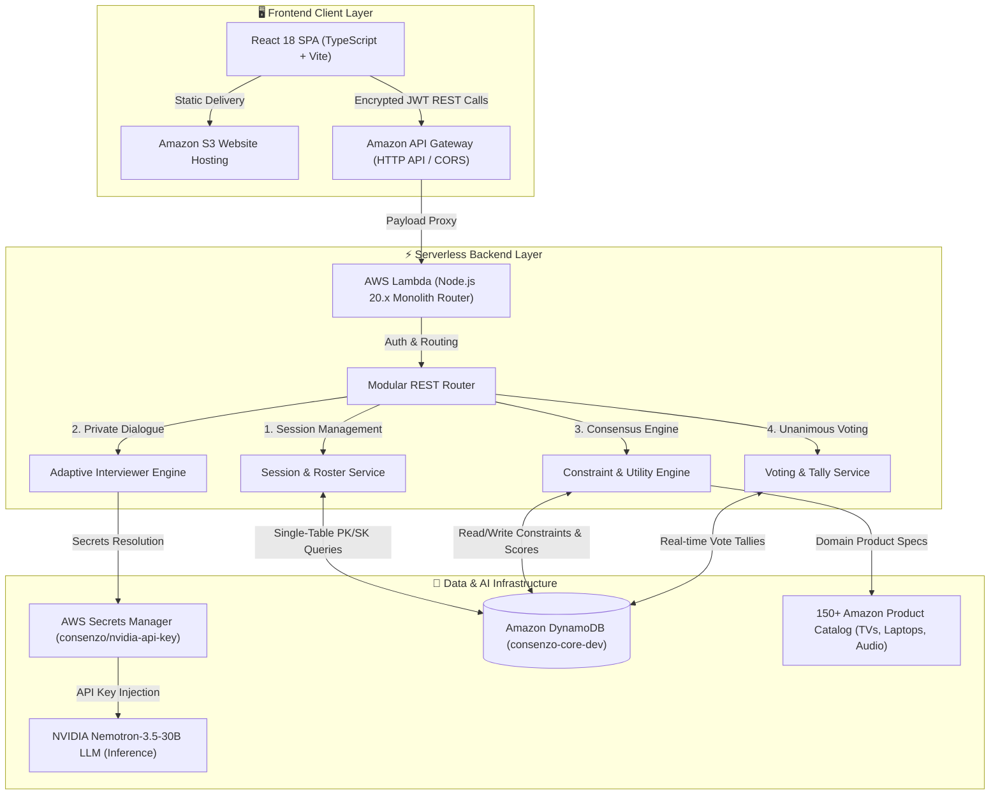

# Consenzo — Group Decision Consensus Engine

<div align="center">


**Multi-agent collaborative purchasing platform powered by NVIDIA Nemotron AI, Amazon Web Services, and Mathematical Consensus Modeling.**

[](https://aws.amazon.com)
[](https://build.nvidia.com)
[](https://reactjs.org/)
[](https://www.typescriptlang.org/)
[](https://aws.amazon.com/dynamodb/)
[](https://www.docker.com/)

[🚀 Live Web App](http://consenzo-frontend-dev-501578625399.s3-website-us-east-1.amazonaws.com) • [📖 Setup Guide](SETUP.md) • [⚡ API Gateway Endpoint](https://0wc5as4rug.execute-api.us-east-1.amazonaws.com/dev/health)

</div>

---

## 📌 Problem & Vision

Group purchasing (e.g. buying a living room Smart TV with family, selecting engineering laptops with coworkers, or choosing home theater soundbars) suffers from:
1. **Asymmetric Social Dynamics**: Dominant personalities silence subtle requirements.
2. **Hidden Conflicting Constraints**: Hard budget ceilings collide with unnegotiated feature wishlists.
3. **Decision Fatigue**: Hours spent manually cross-referencing hundreds of catalog specs.

**Consenzo solves group decision-making through AI-assisted preference extraction and mathematical consensus optimization.** 

Every participant engages in a **private, adaptive AI interview** to discover their true priorities, constraints, and budget limits. Consenzo's **Deterministic Constraint & Consensus Engine** then analyzes all preferences across 150+ real Amazon products, detecting conflicts, applying fairness penalties, and computing unanimous, explainable purchase recommendations.

---

## 🏛️ System Architecture



---

## ✨ Key Features

### 1. 💬 Private Adaptive Discovery Interviewer
* Conversational AI interviews each group member independently so personal budget ceilings and honest feature preferences remain private.
* Powered by **NVIDIA Nemotron-3.5-Lightning-30B** with real-time intent extraction into structured numerical constraints (e.g., `priceInr <= 50000`, `refreshRateHz >= 120`, `ramGb >= 16`).

### 2. ⚖️ Mathematical Consensus & Conflict Engine
* Computes **Pareto-optimal** product recommendations using multi-attribute utility theory with **Nash Bargaining & Fairness Penalties**.
* Automatically detects contradictory hard constraints (e.g. Budget ceiling < Lowest price with required GPU) and generates grounded trade-off rationales.

### 3. 🎯 Transparent Recommendation Board & Unanimous Voting
* Ranked recommendations with transparent match badges (`BEST_CONSENSUS`, `LOWEST_CONFLICT`, `BEST_VALUE`).
* Live participant utility breakdown showing how each person's individual requirements are satisfied.
* Multi-user voting tally with unanimous decision validation.

### 4. 🛒 Multi-Category Amazon Product Catalog
* **Smart TVs & Displays**: 4K/8K, OLED/QLED, 120Hz gaming, Dolby Vision, HDMI 2.1 specs.
* **Laptops & Workstations**: RAM, CPU generations, dedicated GPUs, battery life, display size.
* **Soundbars & Home Audio**: Dolby Atmos, wireless subwoofers, HDMI eARC, multi-channel configurations.

---

## 🛠️ Technology Stack

| Domain | Technology / Service | Role in Consenzo |
| :--- | :--- | :--- |
| **Frontend** | React 18, TypeScript, Vite, Vanilla CSS | Reactive modern dark UI, micro-animations, glassmorphism |
| **Serverless Compute** | AWS Lambda (Node.js 20.x, ZIP package) | High-performance monolithic API handler |
| **API Management** | Amazon API Gateway (HTTP API v2) | Low-latency routing, CORS pre-flight, and security |
| **Database** | Amazon DynamoDB (Single-Table Design) | Pay-per-request session, participant, and vote persistence |
| **AI / LLM** | NVIDIA Nemotron 3.5 Lightning (30B) | Natural language preference extraction & reasoning |
| **Secrets Management**| AWS Secrets Manager | Zero-plaintext key rotation & secure Lambda runtime injection |
| **Cloud Storage** | Amazon S3 Static Website Hosting | Scalable global web asset delivery |
| **Local Containerization** | Docker & Docker Compose | 1-command offline reproducible local environment |

---

## 🚀 Live AWS Deployment Details

| Component | Cloud Identifier / Live URL |
| :--- | :--- |
| **Live Web App** | [http://consenzo-frontend-dev-501578625399.s3-website-us-east-1.amazonaws.com](http://consenzo-frontend-dev-501578625399.s3-website-us-east-1.amazonaws.com) |
| **API Gateway** | `https://0wc5as4rug.execute-api.us-east-1.amazonaws.com/dev` |
| **Health Check** | [https://0wc5as4rug.execute-api.us-east-1.amazonaws.com/dev/health](https://0wc5as4rug.execute-api.us-east-1.amazonaws.com/dev/health) |
| **AWS Region** | `us-east-1` (US East - N. Virginia) |
| **DynamoDB Table** | `consenzo-core-dev` |
| **Lambda Handler** | `consenzo-backend-handler-dev` |

---

## 💻 Quick Start (Local Development)

### Prerequisites
* Node.js 20+
* npm 9+
* *(Optional)* Docker Desktop & AWS CLI

### 1. Clone & Install
```bash
git clone https://github.com/YuvanChaudary/Consenzo.git
cd Consenzo
npm install
```

### 2. Run Locally (Full-Stack Dev Server)
```bash
npm run dev
```
* **Frontend**: `http://localhost:5173`
* **Backend API**: `http://localhost:3001` (health check: `http://localhost:3001/health`)

### 3. Run with Docker Compose
```bash
docker compose up --build
```

For complete deployment and configuration instructions, see [SETUP.md](SETUP.md) and the [AWS Deployment Runbook](docs/98_AWS_DEPLOYMENT_GUIDE.md).

---

## 📄 License
Consenzo is open-source software licensed under the **MIT License**.
