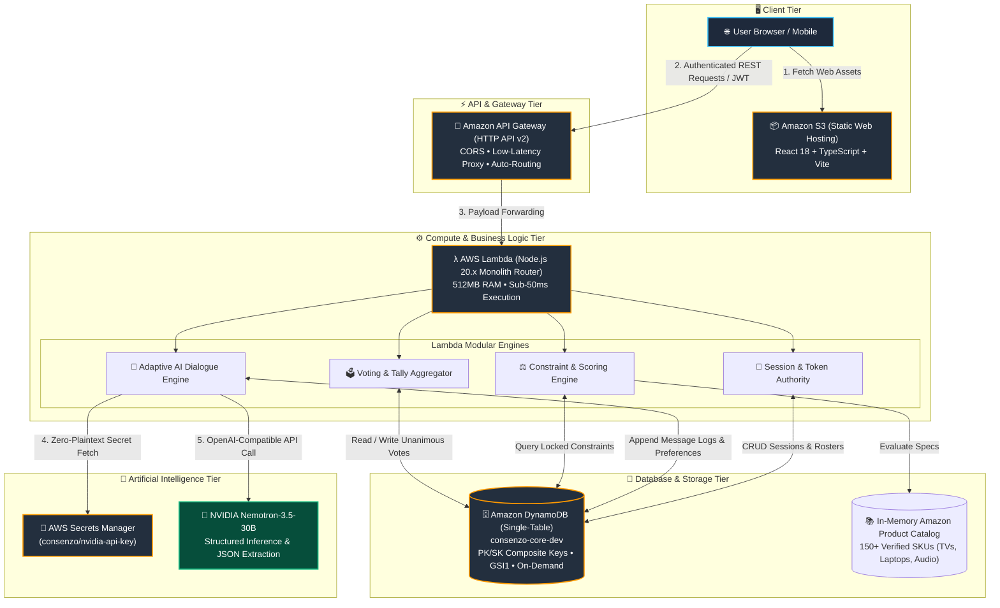
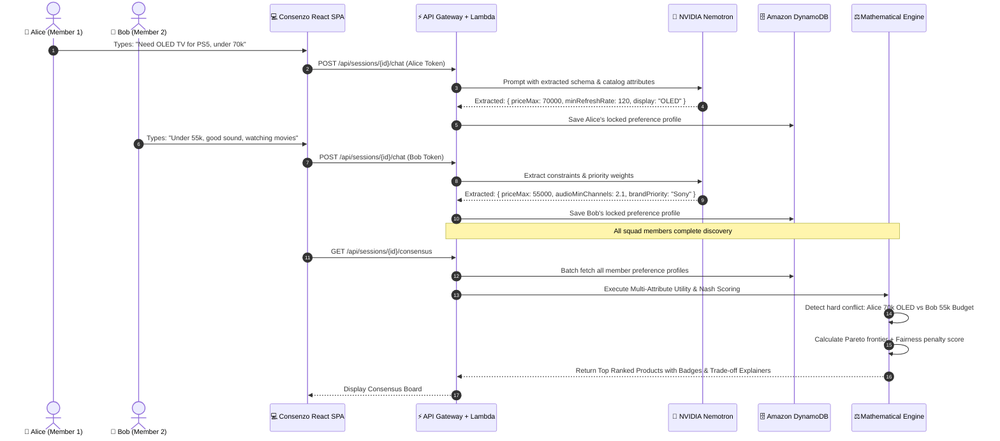

# Consenzo — Multi-Agent Consensus Purchasing Engine

<div align="center">

```
   ______                                        
  / ____/___  ____  ________  ____  ____  ____   
 / /   / __ \/ __ \/ ___/ _ \/ __ \/_  / / __ \  
/ /___/ /_/ / / / (__  )  __/ / / / / /_/ /_/ /  
\____/\____/_/ /_/____/\___/_/ /_/ /___/\____/   
   Mathematical Consensus • Adaptive AI Discovery • AWS Serverless
```

**Next-generation group decision-making engine powered by NVIDIA Nemotron AI, Amazon Web Services Serverless Cloud, and Multi-Attribute Mathematical Consensus Modeling.**

---

[](https://aws.amazon.com)
[](https://build.nvidia.com)
[](https://aws.amazon.com/dynamodb/)
[](https://reactjs.org/)
[](https://nodejs.org/)
[](https://opensource.org/licenses/MIT)

<br/>

[🌐 **Live Web Application**](http://consenzo-frontend-dev-501578625399.s3-website-us-east-1.amazonaws.com) • [⚡ **Live Health Check**](https://0wc5as4rug.execute-api.us-east-1.amazonaws.com/dev/health) • [📖 **Setup Guide**](SETUP.md) • [☁️ **Deployment Runbook**](docs/98_AWS_DEPLOYMENT_GUIDE.md)

---

</div>

## 📑 Table of Contents

- [Executive Summary & Problem Statement](#-executive-summary--problem-statement)
- [How Consenzo Works](#-how-consenzo-works)
- [System Architecture](#-system-architecture)
  - [Cloud-Native AWS Infrastructure](#1-cloud-native-aws-infrastructure)
  - [Multi-Agent Discovery & Consensus Flow](#2-multi-agent-discovery--consensus-flow)
- [Mathematical Consensus Engine](#-mathematical-consensus-engine)
- [DynamoDB Single-Table Schema Design](#-dynamodb-single-table-schema-design)
- [Controlled Amazon Product Catalog](#-controlled-amazon-product-catalog)
- [Cloud Infrastructure Matrix](#-cloud-infrastructure-matrix)
- [Live Deployment Endpoints](#-live-deployment-endpoints)
- [Local Development & Quickstart](#-local-development--quickstart)
- [Project Directory Structure](#-project-directory-structure)
- [Security & Compliance](#-security--compliance)

---

## 🎯 Executive Summary & Problem Statement

Group purchasing (e.g. families buying living room 4K TVs, roommates picking soundbars, or engineering squads standardizing development workstations) inevitably suffers from three core structural dysfunctions:

```
┌──────────────────────────────────────┐     ┌──────────────────────────────────────┐     ┌──────────────────────────────────────┐
│     🗣️ Asymmetric Social Power       │     │     🔒 Hidden Hard Constraints       │     │       🤯 Catalog Overwhelm           │
├──────────────────────────────────────┤     ├──────────────────────────────────────┤     ├──────────────────────────────────────┤
│ Dominant or vocal personalities bias │     │ Personal budgets and unspoken deal-  │     │ Manually cross-referencing 100+ SKU  │
│ collective choices; quieter members  │     │ breakers collide late, causing buyer │     │ specs across reviews, ratings, and   │
│ sacrifice critical requirements.     │     │ remorse and abandoned carts.         │     │ technical attributes exhausts teams. │
└──────────────────────────────────────┘     └──────────────────────────────────────┘     └──────────────────────────────────────┘
```

**Consenzo eliminates group friction through Private AI Discovery and Deterministic Mathematical Consensus.**

Every participant conducts a **private, zero-pressure conversation with an AI interviewer**. The AI extracts implicit needs into numerical constraints, budget envelopes, and utility weights. Consenzo's scoring engine then evaluates the collective dataset against real-world Amazon catalog products, detecting deadlocks, balancing fairness penalties, and computing Pareto-optimal recommendations.

---

## 🔄 How Consenzo Works

```
 1. SQUAD CREATION          2. PRIVATE DISCOVERY         3. CONSENSUS SYNTHESIS        4. UNANIMOUS VOTE
 ┌─────────────────┐       ┌──────────────────────┐     ┌───────────────────────┐     ┌─────────────────┐
 │ 👥 Host creates │       │ 🤖 NVIDIA Nemotron   │     │ ⚖️ Nash Bargaining    │     │ 🗳️ Interactive   │
 │    Squad Room   │ ────► │    interviews each   │ ──► │    Engine ranks 150+  │ ──► │    Voting Board │
 │    & invites    │       │    member in private │     │    Amazon products    │     │    & Final Buy  │
 └─────────────────┘       └──────────────────────┘     └───────────────────────┘     └─────────────────┘
```

1. **Squad Creation & Invitation**: Host provisions an encrypted room session and shares a unique participation link.
2. **Private Adaptive AI Interview**: Powered by **NVIDIA Nemotron-3.5-30B**, each user enters an isolated chat. The interviewer asks clarifying questions without disclosing answers to other members.
3. **Automated Constraint Normalization**: Natural language answers are mapped into strict machine-readable constraints (e.g., `price <= 55000`, `refreshRateHz >= 120`, `oled = true`).
4. **Multi-Attribute Utility & Conflict Detection**: Evaluates hard filter satisfaction, applies fairness variance dampening, and generates explainable compromise rationales.
5. **Consensus Board & Unanimous Voting**: Squad members review collective alignment, explore trade-offs, and cast cryptographic votes to lock in the final selection.

---

## 🏛️ System Architecture

### 1. Cloud-Native AWS Infrastructure

Consenzo is engineered from the ground up on a **100% serverless, zero-maintenance AWS Cloud Architecture**:



---

### 2. Multi-Agent Discovery & Consensus Flow



---

## 🧮 Mathematical Consensus Engine

Consenzo rejects simple "majority vote" heuristics. Majority voting alienates minorities and produces sub-optimal compromises. Instead, Consenzo formulates consensus as a **Multi-Attribute Utility Optimization with Nash Bargaining Fairness**:

$$U_i(P) = \sum_{k} w_{i,k} \cdot f_k(P_{spec}) - \text{Penalty}_{\text{soft}}$$

$$\text{Group Consensus Score}(P) = \left( \prod_{i=1}^{N} \max(0, U_i(P) - d_i) \right)^{\frac{1}{N}} - \lambda \cdot \sigma^2(U)$$

| Mathematical Concept | Function in Consenzo | Real-World Impact |
| :--- | :--- | :--- |
| **Hard Feasibility Filter** | Product $P$ must satisfy all mandatory $C_{i,\text{hard}}$ | Eliminates non-viable options (e.g., TVs too large for wall mount) |
| **Nash Product $(\prod U_i)$** | Multiplicative utility aggregation | Prevents one member from getting $0\%$ satisfaction to give another $100\%$ |
| **Fairness Variance $(\sigma^2)$** | Penalizes high utility dispersion across squad | Prioritizes products where everyone is equally pleased |
| **Conflict Rationale Generator** | Identifies constraint overlap distances | Explains *why* a compromise is recommended in plain English |

---

## 🗄️ DynamoDB Single-Table Schema Design

Consenzo utilizes a high-efficiency **Single-Table Design** pattern in DynamoDB (`consenzo-core-dev`) to achieve $<10\text{ms}$ read/write latencies with zero table joins:

```
┌──────────────────────────────────────┬──────────────────────────────────────┬────────────────────────────────────────────────────────┐
│ Partition Key (PK)                   │ Sort Key (SK)                        │ Entity / Attributes Stored                             │
├──────────────────────────────────────┼──────────────────────────────────────┼────────────────────────────────────────────────────────┤
│ SESSION#<sessionId>                 │ METADATA                             │ Room status, Category, Host ID, CreatedAt, TTL         │
│ SESSION#<sessionId>                 │ PARTICIPANT#<participantId>          │ Display name, Avatar, Join status, Role                │
│ SESSION#<sessionId>                 │ MESSAGE#<participantId>#<msgId>      │ Chat transcript, Speaker role, Timestamp               │
│ SESSION#<sessionId>                 │ PREFERENCE#<participantId>           │ Extracted numeric constraints, weights, lock state     │
│ SESSION#<sessionId>                 │ CONSENSUS#LATEST                     │ Cached scoring results, Pareto rankings, trade-offs    │
│ SESSION#<sessionId>                 │ VOTE#<participantId>                 │ Cast vote, product ID, timestamp, unanimous signature  │
└──────────────────────────────────────┴──────────────────────────────────────┴────────────────────────────────────────────────────────┘
```

* **Global Secondary Index (GSI1)**: `GSI1_PK = PARTICIPANT#<id>`, `GSI1_SK = SESSION#<id>` allows instantaneous reverse lookup of all active sessions for any user.
* **Auto-Expiring Sessions**: Built-in `ttl` attribute automatically garbage-collects completed sessions after 7 days without incurring storage costs.

---

## 🛒 Controlled Amazon Product Catalog

Consenzo ships with a vetted catalog of **150+ Amazon products** with rich parametric specifications:

<div align="center">

| 📺 Smart TVs & Displays | 💻 Laptops & Notebooks | 🔊 Home Theater Soundbars |
| :--- | :--- | :--- |
| • 4K UHD, 8K, OLED, QLED, Mini-LED<br/>• 60Hz, 120Hz, 144Hz VRR<br/>• HDMI 2.1, Dolby Vision, HDR10+<br/>• Brands: Sony, Samsung, LG, TCL | • Apple M-Series, Intel Core Ultra, AMD Ryzen<br/>• RAM: 8GB to 64GB DDR5<br/>• NVIDIA RTX 4050–4090 GPUs<br/>• Brands: Apple, Dell, Lenovo, ASUS | • 2.0 to 9.1.4 Channel Configurations<br/>• Wireless Subwoofers & Satellite Speakers<br/>• Dolby Atmos, DTS:X, eARC<br/>• Brands: Bose, Sonos, JBL, Sony |

</div>

---

## ☁️ Cloud Infrastructure Matrix

| AWS Service | Configuration & Sizing | Purpose & Architectural Role |
| :--- | :--- | :--- |
| **Amazon API Gateway** | HTTP API (v2), `$default` stage, automated CORS | Secure, ultra-low latency REST gateway with sub-15ms overhead |
| **AWS Lambda** | Node.js 20.x, 512 MB memory, 30s timeout | Monolithic REST router executing auth, chat orchestration, and math engines |
| **Amazon DynamoDB** | Single-Table (`consenzo-core-dev`), Pay-Per-Request | Point-in-time recovery, continuous encryption, composite key indexing |
| **Amazon S3** | Static Website Hosting bucket with public read policy | CDN-grade hosting for React 18 production bundle |
| **AWS Secrets Manager** | `consenzo/nvidia-api-key` secret with IAM least-privilege | Dynamic runtime injection of LLM API keys with zero plaintext code exposure |
| **AWS SAM / CloudFormation** | `template.yaml` (Transform: AWS::Serverless-2016-10-31) | 100% reproducible Infrastructure as Code (IaC) |

---

## 🌐 Live Deployment Endpoints

| Resource | Environment / Target | Live Link / Identifier |
| :--- | :--- | :--- |
| 🚀 **Web Application** | Production S3 Hosting | [Launch Consenzo Live App](http://consenzo-frontend-dev-501578625399.s3-website-us-east-1.amazonaws.com) |
| ⚡ **REST API Gateway** | AWS HTTP API v2 | `https://0wc5as4rug.execute-api.us-east-1.amazonaws.com/dev` |
| 🩺 **System Health Check**| AWS Lambda Status | [API Health Endpoint](https://0wc5as4rug.execute-api.us-east-1.amazonaws.com/dev/health) |
| 📍 **AWS Region** | Primary Data Center | `us-east-1` (US East - N. Virginia) |
| 🗃️ **DynamoDB Table** | Primary Core Store | `consenzo-core-dev` |

---

## 💻 Local Development & Quickstart

### Prerequisites
- **Node.js**: `v20.x` or higher
- **npm**: `v9.x` or higher
- *(Optional)* **Docker** & **AWS CLI v2**

### 1. Clone Repository & Install Dependencies
```bash
git clone https://github.com/YuvanChaudary/Consenzo.git
cd Consenzo
npm install
```

### 2. Configure Environment Variables
Create `.env` in the root directory:
```env
PORT=3001
NODE_ENV=development
LLM_PROVIDER=nvidia
LLM_MODEL=nvidia/nemotron-3.5-lightning-30b-a3b
NVIDIA_API_KEY=your_nvidia_api_key_here
JWT_SECRET=super_secret_session_signing_key_min_32_chars
```

### 3. Launch Local Full-Stack Development Server
```bash
npm run dev
```
- **Frontend SPA**: `http://localhost:5173`
- **Backend API**: `http://localhost:3001` (Health: `http://localhost:3001/health`)

### 4. Run with Docker Compose
```bash
docker compose up --build
```

---

## 📂 Project Directory Structure

```
Consenzo/
├── backend/                  # Node.js 20 Serverless Lambda Application
│   ├── src/
│   │   ├── config/           # Environment and AWS SDK clients
│   │   ├── controllers/      # REST API route controllers
│   │   ├── middleware/       # JWT auth, error handlers, request validation
│   │   ├── models/           # DynamoDB entity models & TypeScript types
│   │   ├── routes/           # Express/Lambda router definitions
│   │   ├── services/         # Core business logic
│   │   │   ├── consensus/    # Mathematical scoring & Nash Bargaining engine
│   │   │   ├── llm/          # NVIDIA Nemotron & Anthropic adapters
│   │   │   └── session/      # Squad room & participant roster lifecycle
│   │   └── index.ts          # Lambda handler & local Express server bootstrap
│   └── tests/                # Unit & integration test suites
├── frontend/                 # React 18 SPA (TypeScript + Vite)
│   ├── src/
│   │   ├── components/       # Reusable UI components (ProductCard, VoteModal)
│   │   ├── hooks/            # Custom React hooks (useChat, useConsensus)
│   │   ├── pages/            # View pages (Lobby, Interview, ConsensusBoard)
│   │   ├── services/         # Axios API client & token storage
│   │   └── styles/           # Modern CSS styling with dark glassmorphism
├── docs/                     # Comprehensive architecture and runbook documentation
├── template.yaml             # AWS SAM Infrastructure as Code (CloudFormation)
├── docker-compose.yml        # Multi-container local orchestration
└── README.md                 # Project documentation
```

---

## 🔒 Security & Compliance

- **Zero-Plaintext Credentials**: Secrets are strictly resolved at Lambda runtime via AWS Secrets Manager with least-privilege IAM policies.
- **Client Anonymization**: Individual preference dialogues and raw text are never broadcast to other squad members; only mathematical aggregate vectors and explainable trade-offs are shared.
- **CORS & Token Signing**: API Gateway strictly enforces HTTP preflight headers, and all session actions require cryptographic HMAC-SHA256 JWT validation.

---

<div align="center">

**Crafted for the Amazon & NVIDIA AI Hackathon**

Consenzo is open-source software licensed under the [MIT License](LICENSE).

</div>
