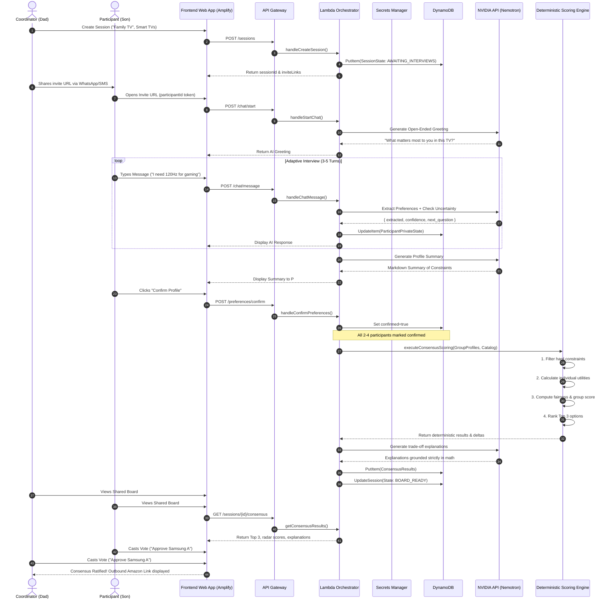

# 12 — User Flows & State Progression

## Document Metadata
- **Document Type**: Interaction Architecture & Sequence Flows
- **Status**: Approved Foundation
- **Owner**: Lead Product Architect & Frontend Engineer
- **Dependencies**: [10_REQUIREMENTS.md](file:///d:/Consenzo%20amazon%20hackathon/docs/10_REQUIREMENTS.md), [11_USER_STORIES.md](file:///d:/Consenzo%20amazon%20hackathon/docs/11_USER_STORIES.md)
- **Downstream References**: [13_PERMISSION_MODEL.md](file:///d:/Consenzo%20amazon%20hackathon/docs/13_PERMISSION_MODEL.md), [22_TECH_STACK_FLOW.md](file:///d:/Consenzo%20amazon%20hackathon/docs/22_TECH_STACK_FLOW.md), [23_DATA_FLOW.md](file:///d:/Consenzo%20amazon%20hackathon/docs/23_DATA_FLOW.md), [50_FRONTEND_ARCHITECTURE.md](file:///d:/Consenzo%20amazon%20hackathon/docs/50_FRONTEND_ARCHITECTURE.md)

---

## 1. End-to-End Macro Flow

The Consenzo user journey progresses through five deterministic phases:

```text
  PHASE 1: CREATION          PHASE 2: DISCOVERY        PHASE 3: CONSENSUS      PHASE 4: BOARD          PHASE 5: RATIFICATION
 ┌─────────────────┐       ┌─────────────────┐       ┌─────────────────┐     ┌─────────────────┐     ┌─────────────────────┐
 │ Coordinator     │       │ 2–4 Members     │       │ Deterministic   │     │ Shared Board    │     │ Group Vote          │
 │ Creates Session │──────►│ Private Chat    │──────►│ Scoring Engine  │────►│ Top 3 Ranking   │────►│ & Outbound Link     │
 │ & Invites Group │       │ with NVIDIA LLM │       │ Lambda Pipeline │     │ & Trade-offs    │     │ to Amazon ASIN      │
 └─────────────────┘       └─────────────────┘       └─────────────────┘     └─────────────────┘     └─────────────────────┘
```

---

## 2. Sequence Diagram: Complete Session Lifecycle



---

## 3. Micro-Flows & Edge Cases

### 3.1 Edge Case A: Irreconcilable Hard Constraints
When two participants specify mutually incompatible hard boundaries (e.g., Dad specifies `max_price <= 45000` while Son specifies `min_refresh_rate >= 120Hz`, but no 120Hz TV exists below ₹48,000):
1. The **Deterministic Engine** flags `ZERO_FEASIBLE_PRODUCTS`.
2. Instead of crashing, the engine generates **Relaxation Branches**:
   - *Branch A*: Keep Dad's budget, relax Son's refresh rate to 60Hz.
   - *Branch B*: Keep Son's 120Hz, calculate minimum budget stretch (e.g., ₹48,000, +₹3,000).
3. The **Shared Board** renders a high-priority banner:
   > *"Notice: Complete agreement on all strict constraints is impossible at current prices. Consenzo has calculated the two fairest compromise pathways below for family discussion."*

### 3.2 Edge Case B: Slow or Non-Responding Participant
If one invited participant does not complete their private interview within 15 minutes:
- The Coordinator dashboard displays participant status badges (`Dad: Confirmed`, `Mom: Confirmed`, `Son: In Progress`, `Daughter: Waiting`).
- The Coordinator has an explicit option: *"Proceed with 3 confirmed members"*, allowing the group to compute consensus without being blocked indefinitely.
