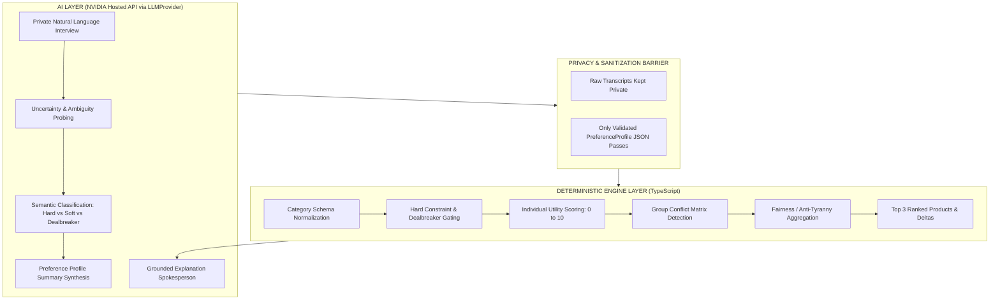
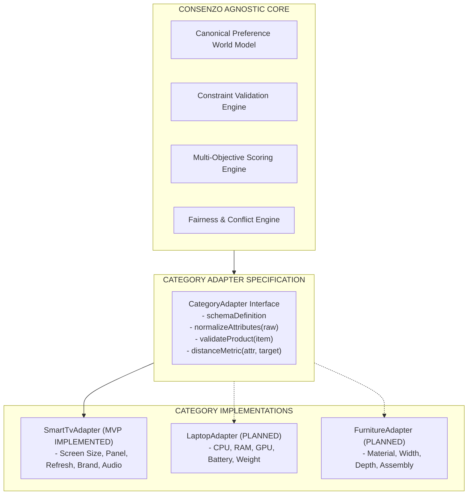
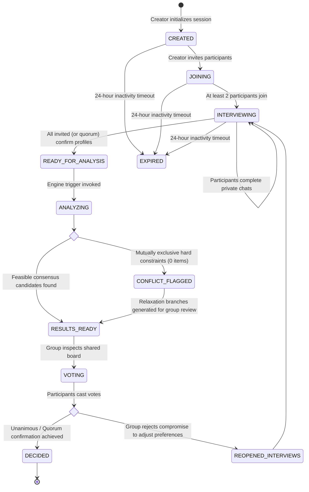

# 20 — System Macro Architecture

## Document Metadata
- **Document Type**: Macro System Architecture Specification
- **Status**: Approved Foundation
- **Owner**: Lead Systems Architect
- **Dependencies**: [00_PROJECT_CHARTER.md](file:///d:/Consenzo%20amazon%20hackathon/docs/00_PROJECT_CHARTER.md), [02_SOLUTION.md](file:///d:/Consenzo%20amazon%20hackathon/docs/02_SOLUTION.md), [04_MVP_SCOPE.md](file:///d:/Consenzo%20amazon%20hackathon/docs/04_MVP_SCOPE.md), [10_REQUIREMENTS.md](file:///d:/Consenzo%20amazon%20hackathon/docs/10_REQUIREMENTS.md)
- **Downstream References**: [21_TECH_STACK.md](file:///d:/Consenzo%20amazon%20hackathon/docs/21_TECH_STACK.md), [22_TECH_STACK_FLOW.md](file:///d:/Consenzo%20amazon%20hackathon/docs/22_TECH_STACK_FLOW.md), [23_DATA_FLOW.md](file:///d:/Consenzo%20amazon%20hackathon/docs/23_DATA_FLOW.md), [24_API_ARCHITECTURE.md](file:///d:/Consenzo%20amazon%20hackathon/docs/24_API_ARCHITECTURE.md), [33_CONSTRAINT_ENGINE.md](file:///d:/Consenzo%20amazon%20hackathon/docs/33_CONSTRAINT_ENGINE.md), [110_DECISIONS.md](file:///d:/Consenzo%20amazon%20hackathon/docs/110_DECISIONS.md)

---

## 1. Architectural Mission & Core Boundary

Consenzo is engineered around an uncompromised structural boundary:

$$\mathbf{AI\ Understands\ People} \quad \Big\Vert \quad \mathbf{Deterministic\ Software\ Decides\ the\ Product}$$

The generative AI layer is solely an empathetic, intelligent discovery medium that converts ambiguous human dialogue into verified, typed preference models. The decision layer is a verifiable, closed-form mathematical optimization pipeline that validates constraints, computes multi-objective utilities, detects group conflicts, balances equity, and deterministically ranks candidate products.



---

## 2. Layered Logical Architecture

The system is decomposed into seven strictly separated horizontal layers:

```text
┌────────────────────────────────────────────────────────────────────────┐
│ 1. PRESENTATION LAYER (React 18 + Vite SPA, AWS Amplify Hosting)       │
│    - Decision Room Setup & Participant Onboarding                      │
│    - 1-on-1 Private Adaptive Conversational Chat Drawer                │
│    - Preference Ratification Summary Modal                             │
│    - Interactive Shared Consensus Board & Voting Widget                │
├────────────────────────────────────────────────────────────────────────┤
│ 2. API / APPLICATION LAYER (Amazon API Gateway HTTP API + Lambda)      │
│    - Token Verification (HMAC-SHA256 Participant Bearer Tokens)         │
│    - Session Lifecycle State Machine Controller                        │
│    - Request Routing, Correlation ID Injection & Schema Validation     │
├────────────────────────────────────────────────────────────────────────┤
│ 3. CONVERSATION / AI LAYER (NVIDIA Nemotron + LLMProvider Abstraction) │
│    - Open-Ended Dynamic Dialogue Management (/no_think latency opt)    │
│    - Information Gain Evaluation & Follow-Up Probing                   │
│    - Candidate Preference Extraction & Latent Need Discovery           │
│    - Grounded Post-Ranking Natural Language Explanations               │
├────────────────────────────────────────────────────────────────────────┤
│ 4. PREFERENCE VALIDATION LAYER (TypeScript Schema Enforcer)            │
│    - JSON Schema Type Checking (Draft 2020-12)                         │
│    - Intra-Participant Contradiction Auditing                          │
│    - Participant Explicit Confirmation Verification (`confirmed=true`)  │
├────────────────────────────────────────────────────────────────────────┤
│ 5. DETERMINISTIC DECISION LAYER (Pure TypeScript Engine)               │
│    - Category Adapter Attribute Normalization                          │
│    - Boolean Gating & Dealbreaker Elimination                          │
│    - Multi-Objective Individual Utility Calculation                    │
│    - Conflict Detection & Relaxation Branch Formulation                │
│    - Dispersion / Fairness Penalty Calculation (Maximin / Gini)        │
│    - Top-3 Consensus Ranking & Delta Analysis                          │
├────────────────────────────────────────────────────────────────────────┤
│ 6. CATALOG LAYER (Controlled S3 Artifact + Memory Cache)               │
│    - Immutable, Versioned Catalog Artifacts                            │
│    - Schema Validation per Category Specification                      │
│    - Fast In-Memory Indexing for Lambda Runtimes                       │
├────────────────────────────────────────────────────────────────────────┤
│ 7. PERSISTENCE LAYER (Amazon DynamoDB Single-Table Design)             │
│    - Group Sessions, Readiness States, and Ratification Votes          │
│    - Isolated Private Conversation Message Stores                      │
│    - Validated Canonical Preference Profiles                           │
│    - Cached Deterministic Analysis Snapshots                           │
└────────────────────────────────────────────────────────────────────────┘
```

---

## 3. Category-Agnostic Core Architecture

To guarantee long-term platform viability, the Consenzo Core contains **zero television-specific logic**. 

The core operates on generic mathematical dimensions:
- Numeric continuous variables (e.g., `price`, `dimensions`, `power`, `latency`).
- Discrete ordinal ratings (e.g., `warranty_years`, `refresh_rate`).
- Categorical sets (e.g., `brand`, `operating_system`, `color`, `panel_type`).
- Boolean flags (e.g., `has_vrr`, `has_dolby_atmos`, `has_smart_hub`).



For the MVP, only the `SmartTvAdapter` is implemented. When Consenzo expands to laptops or appliances, only a new adapter schema and catalog artifact are supplied; the preference elicitation agent, constraint engine, fairness calculations, and shared board components remain completely unchanged.

---

## 4. Group Lifecycle State Machine

The group decision lifecycle is managed by an explicit, auditable finite state machine (FSM):



### State Transition Invariants
1. `CREATED`: Session registered, invite URLs generated, catalog version locked.
2. `JOINING`: Participants register display names; cryptographic participant tokens issued.
3. `INTERVIEWING`: 1-on-1 private conversations execute. Session readiness monitors active turns.
4. `READY_FOR_ANALYSIS`: Triggered when all participants have `confirmedByParticipant == true` (or coordinator executes explicit quorum override for stalled participants).
5. `ANALYZING`: Synchronous Lambda execution of deterministic pruning, scoring, fairness adjustment, and LLM grounded explanation generation.
6. `RESULTS_READY`: Top-3 recommendations and radar satisfaction deltas stored in DynamoDB.
7. `VOTING`: Shared board unlocked for all participants to cast confirmation votes.
8. `DECIDED`: Consensus ratified; outbound Amazon ASIN link highlighted for immediate checkout.
9. `EXPIRED`: Ephemeral state garbage collected after 24 hours of inactivity.

---

## 5. State Ownership & Persistence Boundaries

State ownership is strictly partitioned across AWS infrastructure to prevent race conditions or cross-domain leaks:

| Domain Entity | Authoritative Owner | Storage Technology | Access Policy |
| :--- | :--- | :--- | :--- |
| **Group Session State** | Session Coordinator Service | DynamoDB (`SESSION#<id>`) | Publicly readable with Session PIN; Coordinator writable |
| **Participant Identity** | Participant Service | DynamoDB (`SESSION#<id> / PART#<id>`) | Read/Write restricted to token bearer |
| **Private Chat Transcript**| Private Conversation Service | DynamoDB (`PARTICIPANT#<id> / MSG#<ts>`) | Strictly isolated to token bearer; NEVER read by group |
| **Canonical Preference Profile**| Preference Service | DynamoDB (`PARTICIPANT#<id> / PREF#current`)| Immutable once confirmed; forwarded to decision engine |
| **Controlled Catalog** | Catalog Service | Amazon S3 (`s3://.../catalog/v1.json`) | Read-only static artifact; cached in Lambda memory |
| **Analysis & Recommendations** | Deterministic Engine Service | DynamoDB (`SESSION#<id> / ANALYSIS#<id>`)| Read-only to group participants |
| **Ratification Votes** | Voting Service | DynamoDB (`SESSION#<id> / VOTE#<id>`) | Append-only per participant; triggers state change |

---

## 6. Container & Component Topology

```mermaid
graph TB
    subgraph CLIENT["Client Tier (Mobile / Desktop)"]
        UI["React 18 Single-Page Application (Amplify)"]
    end

    subgraph AWS_EDGE["AWS Edge & Routing"]
        AMP["AWS Amplify CDN / Hosting"]
        APIGW["Amazon API Gateway (HTTP API)"]
    end

    subgraph AWS_COMPUTE["AWS Serverless Compute (Lambda)"]
        L_SESS["Session & Group Lambda"]
        L_CHAT["Private Chat & Agent Lambda"]
        L_SCOR["Deterministic Scoring & Analysis Lambda"]
        L_VOTE["Voting & Ratification Lambda"]
    end

    subgraph AWS_SECURITY["AWS Security Tier"]
        SM["AWS Secrets Manager (NVIDIA_API_KEY)"]
    end

    subgraph AI_SERVICES["AI Services Tier (External Hosted Inference)"]
        NVIDIA["NVIDIA Hosted API (OpenAI-compatible)
        Model: nvidia/llama-3.3-nemotron-super-49b-v1.5
        Base URL: https://integrate.api.nvidia.com/v1"]
    end

    subgraph DATA_TIER["Storage & Data Tier"]
        DDB[("Amazon DynamoDB (Single Table)")]
        S3[("Amazon S3 (Catalog & Assets)")]
    end

    UI -->|Static Bundle| AMP
    UI -->|REST API Calls + Bearer Token| APIGW
    
    APIGW -->|/groups, /sessions| L_SESS
    APIGW -->|/chat, /preferences| L_CHAT
    APIGW -->|/analysis| L_SCOR
    APIGW -->|/votes| L_VOTE

    L_CHAT -->|Get Secret| SM
    L_SCOR -->|Get Secret| SM
    L_CHAT <-->|Adaptive Elicitation (HTTPS)| NVIDIA
    L_SCOR <-->|Grounded Explanation (HTTPS)| NVIDIA
    L_SCOR -->|Fetch Static Catalog| S3

    L_SESS <--> DDB
    L_CHAT <--> DDB
    L_SCOR <--> DDB
    L_VOTE <--> DDB
```

This macro architecture establishes unambiguous domain separation, enforces mathematical determinism, and isolates private consumer conversations while remaining lightweight and deployable within 48 hours.
