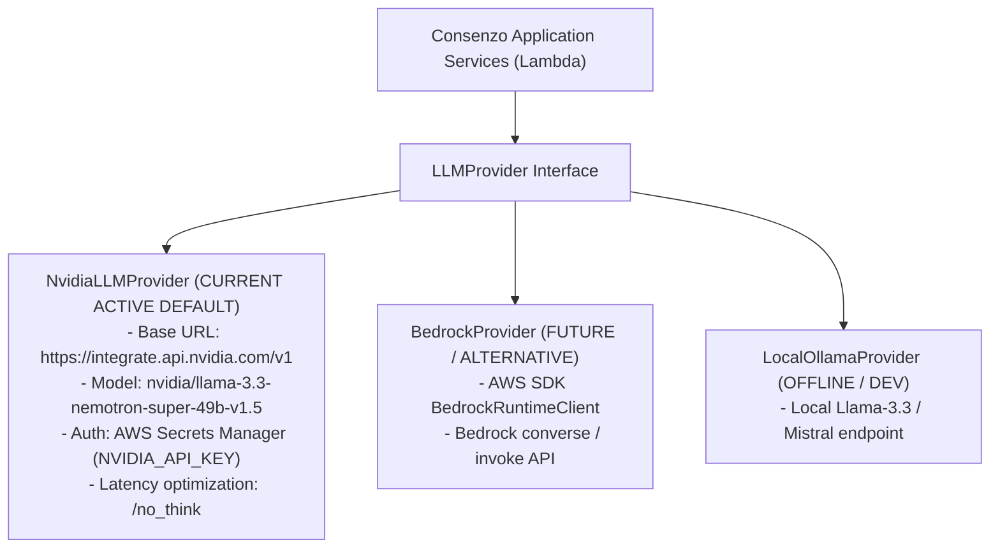

# 21 — Technology Stack & Cloud Selection

## Document Metadata
- **Document Type**: Technical Stack Evaluation & Engineering Selection
- **Status**: Approved Foundation
- **Owner**: Lead Systems Architect & Infrastructure Engineer
- **Dependencies**: [00_PROJECT_CHARTER.md](file:///d:/Consenzo%20amazon%20hackathon/docs/00_PROJECT_CHARTER.md), [04_MVP_SCOPE.md](file:///d:/Consenzo%20amazon%20hackathon/docs/04_MVP_SCOPE.md), [20_SYSTEM_ARCHITECTURE.md](file:///d:/Consenzo%20amazon%20hackathon/docs/20_SYSTEM_ARCHITECTURE.md)
- **Downstream References**: [22_TECH_STACK_FLOW.md](file:///d:/Consenzo%20amazon%20hackathon/docs/22_TECH_STACK_FLOW.md), [24_API_ARCHITECTURE.md](file:///d:/Consenzo%20amazon%20hackathon/docs/24_API_ARCHITECTURE.md), [60_AWS_ARCHITECTURE.md](file:///d:/Consenzo%20amazon%20hackathon/docs/60_AWS_ARCHITECTURE.md), [110_DECISIONS.md](file:///d:/Consenzo%20amazon%20hackathon/docs/110_DECISIONS.md)

---

## 1. Executive Summary & Stack Matrix

The Consenzo technology stack is engineered specifically for **rapid 48-hour delivery, zero-maintenance operational stability, sub-second latency, and deterministic reliability**.

| Layer | Selected Technology | Evaluated Alternatives | Deciding Factors |
| :--- | :--- | :--- | :--- |
| **Frontend Framework** | **React 18 + Vite** | Next.js, Remix, Vanilla HTML/JS | Instant build times, zero SSR complexity, pristine Amplify SPA hosting. |
| **Frontend Styling** | **Vanilla CSS (Design Tokens)** | TailwindCSS, Styled Components | Maximum design precision, zero runtime CSS bloat, clean dark/light mode tokens. |
| **Backend Runtime** | **Node.js 20 / TypeScript** | Python 3.11, Go, Java | End-to-end type sharing with frontend schemas, sub-200ms cold starts, native JSON speed. |
| **Serverless Compute** | **AWS Lambda** | AWS Fargate, EC2, App Runner | Scale-to-zero, zero server management, sub-millisecond execution billing. |
| **API Management** | **Amazon API Gateway (HTTP API)**| REST APIs, GraphQL (AppSync), ALB | Lowest latency, built-in CORS, 70% cheaper than REST API Gateway, simplified routing. |
| **Generative AI & Inference**| **NVIDIA Hosted API (`nvidia/llama-3.3-nemotron-super-49b-v1.5`)**| Amazon Bedrock, Local Ollama, OpenAI | 128K context, high-precision instruction following, OpenAI-compatible API, `/no_think` low-latency mode, multilingual (Hindi). |
| **Secrets Management** | **AWS Secrets Manager** | Plain Lambda env vars, SSM Parameter Store | Secure runtime storage and retrieval of `NVIDIA_API_KEY`, zero frontend exposure. |
| **Database** | **Amazon DynamoDB** | Amazon Aurora Serverless, DocumentDB | Single-digit millisecond latency, single-table design, scale-to-zero, zero connection pools. |
| **Static Object Storage**| **Amazon S3** | CloudFront + S3, EFS | Immutable, versioned catalog storage; zero infrastructure setup. |
| **Web Hosting** | **AWS Amplify Hosting** | S3 Static Website + CloudFront | Automated CI/CD from Git, preview branch deployments, integrated custom domains. |

---

## 2. Frontend Technology Selection: React 18 + Vite

### Evaluation: React + Vite vs. Next.js
- **Next.js**: Provides Server-Side Rendering (SSR) and Server Components. However, SSR introduces Node server hosting complexities on AWS (requiring Lambda adapters or Amplify Hosting compute SSR), environment variable leakage hazards, and potential hydration mismatch bugs during rapid UI prototyping.
- **React + Vite (Selected)**:
  1. **Instant Developer Velocity**: Hot Module Replacement (HMR) under 50ms ensures rapid iteration during the hackathon.
  2. **Static SPA Simplicity**: Compiles to pure static HTML/JS/CSS assets that can be distributed globally across AWS CDN edges with zero compute cost.
  3. **Predictable Client State**: Since group consensus updates and private chats are dynamic client-driven sessions, a client-side SPA with local caching provides superior developer clarity.

### Styling: Vanilla CSS with Custom Design Tokens
Rather than wrestling with third-party CSS utility frameworks that lead to generic appearances, Consenzo uses a curated Vanilla CSS design system (`index.css`) featuring modern typography (Inter / Outfit), glassmorphism cards, dynamic radar visualization, and fluid mobile-first layouts.

---

## 3. Backend Technology Selection: Node.js 20 / TypeScript

### Evaluation: TypeScript vs. Python
While Python is historically popular in data science and AI scripting, TypeScript is selected as the primary backend runtime for critical architectural reasons:
1. **End-to-End Type Sharing**: The `PreferenceWorldModel`, `CatalogSchema`, and `ConsensusResult` schemas are defined once in TypeScript and imported across both frontend and backend codebases, eliminating serialisation and mapping bugs.
2. **Cold-Start Performance**: Node.js 20 Lambda functions start up in ~150–220ms, whereas Python runtimes importing heavy data libraries (Pandas, Pydantic) frequently suffer 600–1200ms cold starts.
3. **Native JSON Serialization**: The scoring engine evaluates a 35-product catalog in pure JSON. V8's native C++ JSON parsing and memory manipulation executes in under 5 milliseconds.

---

## 4. AI Runtime & Provider Abstraction Layer

### Current Active Standard: NVIDIA Hosted API
In production, Consenzo uses the **NVIDIA hosted inference API** as the primary generative AI provider:
- **Model**: `nvidia/llama-3.3-nemotron-super-49b-v1.5`
- **Base URL**: `https://integrate.api.nvidia.com/v1`
- **Protocol**: OpenAI-compatible `POST /chat/completions`
- **Key Characteristics**:
  - High-precision instruction following and structured JSON schema extraction.
  - 128K context window allowing complete category catalog context when necessary.
  - Multilingual support including Hindi and regional nuances.
  - **Reasoning Toggle (`/no_think`)**: By default, the `/no_think` directive is appended to system/user prompts for the private interview and preference extraction paths to bypass lengthy chain-of-thought tokens, keeping response latency sub-second.
- **Security & Secret Management**:
  - The `NVIDIA_API_KEY` is stored in **AWS Secrets Manager** (`consenzo/nvidia-api-key`).
  - AWS Lambda retrieves the secret at runtime during cold-start or caches it in memory.
  - The API key is strictly isolated from the frontend, browser storage, client bundles, git history, and CloudWatch logs.

### Provider Configuration
Standardized environment variables configure the LLM provider:
```bash
LLM_PROVIDER=nvidia
LLM_MODEL=nvidia/llama-3.3-nemotron-super-49b-v1.5
LLM_BASE_URL=https://integrate.api.nvidia.com/v1
```

### Provider Abstraction (`LLMProvider`)
To ensure that development, offline testing, and future cloud expansions are decoupled from any single vendor, Consenzo implements a pluggable provider interface:

```typescript
export interface LLMProvider {
  /**
   * Generates natural language text given a prompt and options
   */
  generateText(prompt: string, options?: LLMOptions): Promise<string>;

  /**
   * Conducts one conversational turn with the participant and extracts structured candidates
   */
  extractStructuredPreferences(
    session: ParticipantSession,
    userMessage: string,
    catalogSchema: CategoryCatalogSchema
  ): Promise<AgentTurnResponse>;

  /**
   * Generates grounded trade-off explanation based strictly on deterministic scores
   */
  generateExplanation(
    product: ScoredProduct,
    groupPreferences: ParticipantPreferenceProfile[]
  ): Promise<GroundedExplanation>;

  /**
   * Verifies upstream API health and credentials
   */
  healthCheck(): Promise<boolean>;
}
```



> **Architectural Guarantee**: NVIDIA provides generative inference; AWS provides the secure serverless application infrastructure, data persistence, and orchestration. The provider abstraction ensures the codebase is completely extensible.

---

## 5. AWS Orchestration Evaluation & Deferral Decisions

To prevent hackathon collapse from over-engineering, we explicitly evaluate and categorize optional AWS services:

### 5.1 AWS Step Functions: DEFERRED
- **Evaluation**: Step Functions excels at long-running asynchronous workflows (>30 seconds) requiring distributed state transitions.
- **Decision**: Consenzo's deterministic consensus calculation takes <20 milliseconds for 35 products. Executing this synchronously within a single Lambda function is 10x faster, simpler to debug, and avoids Step Function state machine definition overhead.

### 5.2 Amazon EventBridge: DEFERRED
- **Evaluation**: EventBridge provides decoupled event choreography for asynchronous multi-service microservices.
- **Decision**: For a 48-hour MVP, direct API Gateway to Lambda invocation provides synchronous, deterministic request-response flows with clear HTTP error codes. EventBridge adds unnecessary eventual-consistency lag.

### 5.3 Strands / Multi-Agent Swarm Frameworks: REJECTED
- **Evaluation**: Experimental multi-agent frameworks (e.g., Strands, AutoGen, CrewAI) introduce uncontrolled LLM-to-LLM conversation loops, high token consumption, nondeterministic behavior, and debugging opacity.
- **Decision**: Consenzo rejects autonomous swarms. A clean, single-turn LLM provider call embedded in a structured state machine is robust, deterministic, and 100% controllable.
