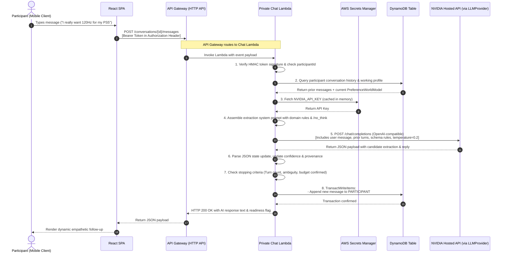
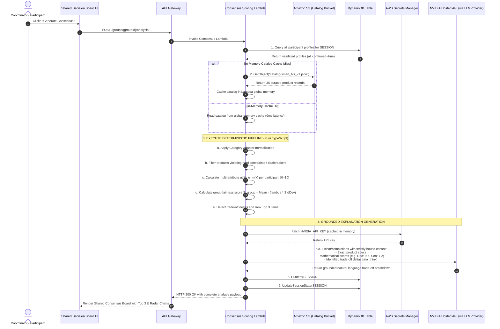

# 22 — Technology Stack Execution Flow

## Document Metadata
- **Document Type**: Execution Flow & Runtime Interaction Specification
- **Status**: Approved Foundation
- **Owner**: Lead Systems Architect & Backend Engineer
- **Dependencies**: [20_SYSTEM_ARCHITECTURE.md](file:///d:/Consenzo%20amazon%20hackathon/docs/20_SYSTEM_ARCHITECTURE.md), [21_TECH_STACK.md](file:///d:/Consenzo%20amazon%20hackathon/docs/21_TECH_STACK.md)
- **Downstream References**: [23_DATA_FLOW.md](file:///d:/Consenzo%20amazon%20hackathon/docs/23_DATA_FLOW.md), [24_API_ARCHITECTURE.md](file:///d:/Consenzo%20amazon%20hackathon/docs/24_API_ARCHITECTURE.md), [64_LAMBDA.md](file:///d:/Consenzo%20amazon%20hackathon/docs/64_LAMBDA.md)

---

## 1. Top-Level Technology Flow

The complete runtime journey connects modern browser clients with serverless AWS primitives in a synchronous, low-latency pipeline:

```text
 ┌────────────────┐       ┌─────────────────┐       ┌─────────────────┐       ┌─────────────────┐
 │ CLIENT BROWSER │──────►│  AMPLIFY / CDN  │──────►│   API GATEWAY   │──────►│   AWS LAMBDA    │
 │ React 18 SPA   │       │ Static Delivery │       │ HTTP API Router │       │ Node.js Runtime │
 └────────────────┘       └─────────────────┘       └─────────────────┘       └────────┬────────┘
                                                                                       │
                      ┌──────────────────┬───────────────────────────────┬─────────────┴─────────────────┐
                      ▼                  ▼                               ▼                               ▼
               ┌──────────────┐   ┌──────────────┐                ┌──────────────┐                ┌──────────────┐
               │SECRETS MGR   │   │NVIDIA API    │                │AMAZON DYNAMODB│               │  AMAZON S3   │
               │NVIDIA_API_KEY│   │Nemotron 49B  │                │Single-Table  │                │Static Catalog│
               │Runtime Fetch │   │LLMProvider   │                │State Storage │                │& Item Assets │
               └──────────────┘   └──────────────┘                └──────────────┘                └──────────────┘
```

---

## 2. Private Adaptive Interview Execution Flow

The private interview flow handles real-time conversational extraction while enforcing strict cryptographic and database isolation.



---

## 3. Final Consensus Analysis Execution Flow

The analysis pipeline executes when all participants confirm their profiles. It evaluates the controlled catalog with zero LLM interference in the product ranking.



---

## 4. Resilience & Error Boundaries

| Failure Point | Failure Mode | System Response & Mitigation Strategy |
| :--- | :--- | :--- |
| **NVIDIA API Rate Limit / Timeout** | `HTTP 429` or `504 Gateway Timeout` | Chat Lambda catches error, executes 1 exponential backoff retry (500ms). If unrecovered, returns a graceful fallback message: *"I'm having a brief moment of latency. Could you please re-send your last thought?"* State is not corrupted. |
| **Participant Dropped / Incomplete** | Participant leaves interview after 1 turn | Session stays in `INTERVIEWING`. Coordinator dashboard displays participant badges. Coordinator can trigger quorum override to compute consensus among completed members. |
| **Zero Feasible Products** | Hard constraints collide across group (or the request is unsatisfiable, e.g. an 85-inch OLED under INR 30k) | The **Nearest-Feasible Proximity Engine** (`src/engine/proximityEngine.ts` + `fitStats.ts`) ranks the **entire catalog** by statistically-normalized attribute distance (robust median/MAD z-scores, ordinal tier ladders, market-segment adjacency) and returns the top 15 closest real products with `matchQuality` labels, per-violation gap audits (e.g. "Requested >= 85-inch; closest on market: 65-inch"), and a per-attribute availability census. Dealbreakers are never silently marked satisfied; the response's `proximity.mode` is `NEAREST` instead of `EXACT`. Relaxation branches and conflict banners remain available for interactive relaxation flows. |
| **DynamoDB Transient Error** | `ProvisionedThroughputExceededException` | AWS SDK v3 automatically retries with jittered exponential backoff. Tables use On-Demand capacity mode to eliminate throughput throttling. |
