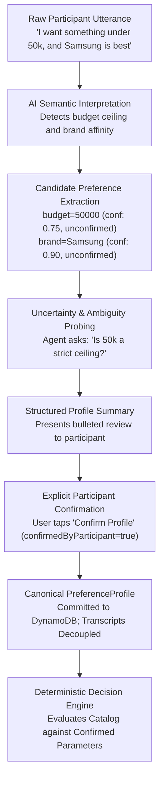

# 23 — Data Flow & Entity Lifecycle Specification

## Document Metadata
- **Document Type**: Information Architecture & Data Flow Specification
- **Status**: Approved Foundation
- **Owner**: Data Architect & Systems Engineer
- **Dependencies**: [20_SYSTEM_ARCHITECTURE.md](file:///d:/Consenzo%20amazon%20hackathon/docs/20_SYSTEM_ARCHITECTURE.md), [22_TECH_STACK_FLOW.md](file:///d:/Consenzo%20amazon%20hackathon/docs/22_TECH_STACK_FLOW.md), [32_PREFERENCE_WORLD_MODEL.md](file:///d:/Consenzo%20amazon%20hackathon/docs/32_PREFERENCE_WORLD_MODEL.md)
- **Downstream References**: [24_API_ARCHITECTURE.md](file:///d:/Consenzo%20amazon%20hackathon/docs/24_API_ARCHITECTURE.md), [66_DYNAMODB.md](file:///d:/Consenzo%20amazon%20hackathon/docs/66_DYNAMODB.md), [81_DATA_PRIVACY.md](file:///d:/Consenzo%20amazon%20hackathon/docs/81_DATA_PRIVACY.md)

---

## 1. Core Data Entities Matrix

Consenzo models 12 authoritative entities across the group purchasing lifecycle:

| Entity Name | Primary Producer | Primary Consumer | Storage Location | Privacy Tier | Mutability | Authoritative Source |
| :--- | :--- | :--- | :--- | :--- | :--- | :--- |
| **1. Group** | Coordinator Client | All Group Participants | DynamoDB (`SESSION#<id>`) | Shared | Mutable State | Coordinator / Session Service |
| **2. Participant** | Joining Client | Group Session Roster | DynamoDB (`SESSION#<id>/PART#<id>`) | Shared | Mutable Status | Participant Token Bearer |
| **3. Conversation** | Participant Chat | LLM Elicitation Agent (NVIDIA API) | DynamoDB (`PARTICIPANT#<id>/MSG#<ts>`) | **STRICTLY PRIVATE** | Append-Only | Participant Only |
| **4. PreferenceProfile**| Agent + Participant | Deterministic Decision Engine | DynamoDB (`PARTICIPANT#<id>/PREF#curr`)| Sanitized Shared | Immutable (Post-Confirm) | Participant Ratification |
| **5. Product** | Controlled Catalog | Scoring Engine, Shared Board | Amazon S3 (`catalog/v1.json`) | Public | Immutable (Versioned) | Catalog Maintainer |
| **6. ProductAttribute**| Category Adapter | Constraint / Scoring Engine | Amazon S3 / In-Memory | Public | Immutable | Category Schema Definition |
| **7. Analysis** | Scoring Lambda | Shared Decision Board UI | DynamoDB (`SESSION#<id>/ANALYSIS#<id>`)| Shared | Immutable Snapshot | Deterministic Scoring Engine |
| **8. ProductScore** | Scoring Engine | Analysis Record | DynamoDB (Embedded in Analysis) | Shared | Immutable | Deterministic Math Functions |
| **9. Conflict** | Constraint Engine | Analysis Record, UI Alert | DynamoDB (Embedded in Analysis) | Shared | Immutable | Boolean Validation Logic |
| **10. Recommendation**| Ranking Engine | Top-3 Display on Board | DynamoDB (Embedded in Analysis) | Shared | Immutable | Multi-Objective Sorter |
| **11. Vote** | Participant Client | Group Ratification Service | DynamoDB (`SESSION#<id>/VOTE#<id>`) | Shared | Append-Only | Participant Token Bearer |
| **12. Decision** | Ratification Service| Final Checkout Redirect | DynamoDB (`SESSION#<id>` state: DECIDED)| Shared | Terminal / Immutable | Group Consensus Rules |

---

## 2. Information Barrier: Private Data vs. Shared Data

The architecture strictly segregates private conversational context from shared decision artifacts:

```text
 ┌─────────────────────────────────────────────────────────────┐
 │                STRICTLY PRIVATE DATA DOMAIN                 │
 │  - Raw chat transcripts and linguistic phrasing             │
 │  - Emotional disclosures, financial anxieties, frustrations │
 │  - In-progress candidate attributes with confidence < 1.0   │
 │  - Latent reasoning anecdotes (e.g. "Previous TV broke")    │
 └──────────────────────────────┬──────────────────────────────┘
                                │ Sanitization & Explicit Confirmation
                                ▼
 ┌─────────────────────────────────────────────────────────────┐
 │                 DERIVED SHARED DATA DOMAIN                  │
 │  - Confirmed parametric constraints (e.g. Budget <= 50,000) │
 │  - Normalized preference weights [0.0 to 1.0]               │
 │  - Computed utility scores per product [0.0 to 10.0]        │
 │  - Identified group conflict pairs & relaxation branches     │
 │  - Top 3 consensus recommendations                          │
 │  - Per-person trade-off deltas                              │
 │  - Ratification votes (Approve / Reject)                    │
 └─────────────────────────────────────────────────────────────┘
```

> **Privacy Invariant**: Under no circumstances does the Shared Board API return, query, or log raw chat transcripts from the private data domain.

---

## 3. The Preference Transformation Pipeline

The conversion of unstructured speech into mathematically sound decision variables follows a strict unidirectional pipeline:



### Invariant: Unconfirmed Interpretations Never Bound the Engine
If an AI agent infers a candidate preference (e.g., `brand_loyalty: high`, confidence 0.60) but the user never validates or confirms it, that candidate parameter is **strictly excluded** from hard-constraint gating in the deterministic decision engine.

---

## 4. Mathematical Determinism Guarantee

To guarantee transparency, judge credibility, and user trust, Consenzo enforces absolute mathematical determinism:

$$\mathcal{R} = f\big(\mathcal{C}_{v}, \mathcal{P}_{confirmed}, \mathcal{W}_{config}\big)$$

Where:
- $\mathcal{C}_v$ is the immutable catalog artifact version $v$.
- $\mathcal{P}_{confirmed}$ is the set of confirmed participant preference profiles.
- $\mathcal{W}_{config}$ is the deterministic scoring weights and fairness penalty parameter $\lambda$.
- $\mathcal{R}$ is the ordered ranking of products with exact scores.

### Reproducibility Contract
- Executing $f$ with identical inputs 1,000 times will produce the identical ranking $\mathcal{R}$ down to two decimal places 1,000 times.
- Non-deterministic elements (such as random seeds, time-of-day weights, or LLM temperature variations) are mathematically forbidden inside the decision layer.
