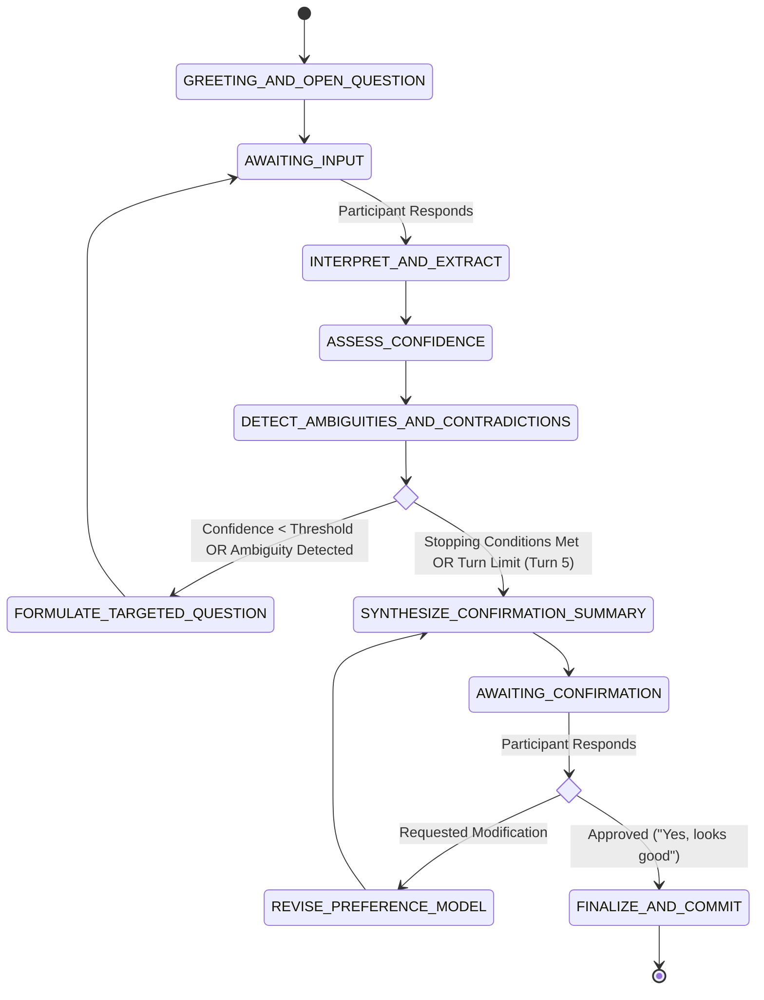

# 31 — Consenzo Agent Loop & State Machine

## Document Metadata
- **Document Type**: Agent Execution Loop & Algorithmic State Machine
- **Status**: Approved Foundation
- **Owner**: AI / NLP Engineer
- **Dependencies**: [30_CONSENZO_AGENT.md](file:///d:/Consenzo%20amazon%20hackathon/docs/30_CONSENZO_AGENT.md), [62_BEDROCK.md](file:///d:/Consenzo%20amazon%20hackathon/docs/62_BEDROCK.md)
- **Downstream References**: [32_PREFERENCE_WORLD_MODEL.md](file:///d:/Consenzo%20amazon%20hackathon/docs/32_PREFERENCE_WORLD_MODEL.md), [72_CONSENZO_API.md](file:///d:/Consenzo%20amazon%20hackathon/docs/72_CONSENZO_API.md), [81_DATA_PRIVACY.md](file:///d:/Consenzo%20amazon%20hackathon/docs/81_DATA_PRIVACY.md)

---

## 1. The Core Agent Loop

The Consenzo Agent executes an **adaptive, closed-loop state cycle** on every user turn. The loop maximizes preference certainty while strictly minimizing conversational fatigue.



---

## 2. Detailed Execution Steps

### Step 1: Ingestion & Privacy Isolation
- The participant sends a message in their private session.
- The backend verifies that the session token matches the participant ID.
- **Privacy Barrier**: The raw message is logged exclusively to the participant's ephemeral session history in DynamoDB and is strictly isolated from group visibility.

### Step 2: Interpretation & Candidate Extraction
The LLM Provider (NVIDIA hosted API targeting `nvidia/llama-3.3-nemotron-super-49b-v1.5`) is invoked via OpenAI-compatible `POST /chat/completions` with `/no_think` appended to minimize latency. The prompt includes the conversation history, the domain catalog schema (Smart TVs), and the current working preference model.
The model performs structured JSON extraction identifying:
- Stated dimensions (e.g., price, size, refresh rate, brand).
- Emotional tone and sentiment.
- Constraint candidate classifications (`dealbreaker`, `hard_constraint`, `soft_preference`, `nice_to_have`).

### Step 3: Confidence & Provenance Calibration
Every extracted candidate attribute is tagged with:
- `confidence`: Mathematical estimation $[0.0, 1.0]$ based on lexical precision.
- `source`: `"explicit_statement"`, `"inferred_latent"`, or `"clarified"`.
- `provenance_turn`: Message index where the statement occurred.

### Step 4: Contradiction & Ambiguity Detection
The agent checks for:
1. **Intra-participant contradiction**: (e.g., Previous statement: *"I only want Samsung"* vs. Current statement: *"That LG model looks pretty neat"*).
2. **Boundary ambiguity**: (e.g., *"Around 50k"* without clarification whether 52k is permissible).
3. **Implicit trade-off gaps**: High-end desires paired with low-end budget limits.

### Step 5: Information Gain Evaluation (Stop vs. Inquire)
The agent calculates the expected information gain of asking another question:

$$\Delta I = \sum_{a \in \text{CriticalAttributes}} (1.0 - \text{Confidence}(a)) \cdot \text{ImpactFactor}(a)$$

- If $\Delta I \ge \text{Threshold}$ and $\text{TurnCount} < 5$: Select the attribute with highest ambiguity and construct a targeted question.
- If $\Delta I < \text{Threshold}$ or $\text{TurnCount} \ge 5$: Transition to `SYNTHESIZE_CONFIRMATION_SUMMARY`.

### Step 6: Targeted Question Formulation
- Dynamic, empathetic phrasing.
- Avoids robotic interrogations.
- Focuses on trade-offs rather than raw data collection.
- Example: *"Got it! If finding a TV with 120Hz gaming capability stretches the budget to ₹53,000, would you prefer to stretch the budget or stick under ₹50,000 with standard 60Hz?"*

### Step 7: Summary & Participant Ratification
- When stopping criteria are met, the agent presents a bulleted, human-readable summary of constraints and trade-off allowances.
- Asks: *"Does this accurately reflect what you want?"*
- If the participant replies with adjustments (*"Actually, make sure it has at least 3 HDMI ports"*), the agent applies surgical edits to the model and requests confirmation.

### Step 8: Final Model Commit
- Once confirmed, `confirmedByParticipant` is marked `true`.
- The sanitized JSON preference profile is written to DynamoDB and emitted to the group coordinator Lambda.
- The raw chat transcript is permanently decoupled from the group record.

---

## 3. Conversational Budget & Safeguards

| Parameter | MVP Value | Justification |
| :--- | :--- | :--- |
| **Max Conversational Turns** | 5 turns | Prevents participant fatigue; preserves hackathon demo velocity. |
| **Target Completion Time** | 90–120 seconds | Optimal UX for casual group purchasing. |
| **Minimum Required Attributes** | Budget status, 1 primary preference, Dealbreaker check | Ensures deterministic scoring engine has sufficient data to rank items. |
| **Timeout / Abandonment** | 30 minutes idle expiration | Prevents stale sessions from locking the group. |

---

## 4. LLM System Prompt Strategy (Extraction Contract)

The prompt enforces a two-channel response from `nvidia/llama-3.3-nemotron-super-49b-v1.5` using XML tags and the `/no_think` directive to bypass reasoning latency:

```text
/no_think
You are Consenzo, an empathetic group purchasing discovery assistant for Smart TVs.
Analyze the participant's message and output two sections:

<internal_analysis>
{
  "updated_preferences": [ ... ],
  "ambiguities_detected": [ ... ],
  "contradictions_detected": [ ... ],
  "information_gain_score": 0.42,
  "should_terminate": false
}
</internal_analysis>

<response_to_participant>
Plain English message to participant (friendly, concise, maximum 2 sentences, 1 question).
</response_to_participant>
```

This guarantees that the backend Lambda can immediately parse the structured state updates while streaming or returning the conversational text to the user interface.
