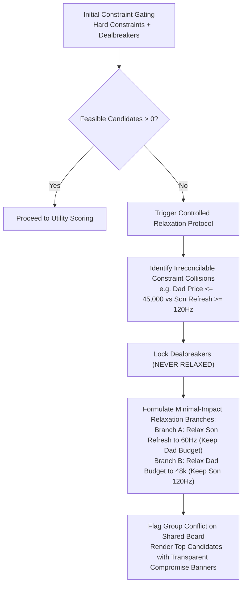

# 33 — Canonical Constraint Engine Specification

## Document Metadata
- **Document Type**: Algorithmic & Mathematical Specification
- **Status**: Approved Foundation
- **Owner**: Deterministic Engine Architect
- **Dependencies**: [20_SYSTEM_ARCHITECTURE.md](file:///d:/Consenzo%20amazon%20hackathon/docs/20_SYSTEM_ARCHITECTURE.md), [30_CONSENZO_AGENT.md](file:///d:/Consenzo%20amazon%20hackathon/docs/30_CONSENZO_AGENT.md), [32_PREFERENCE_WORLD_MODEL.md](file:///d:/Consenzo%20amazon%20hackathon/docs/32_PREFERENCE_WORLD_MODEL.md)
- **Downstream References**: [34_SCORING_ENGINE.md](file:///d:/Consenzo%20amazon%20hackathon/docs/34_SCORING_ENGINE.md), [35_CONFLICT_DETECTION.md](file:///d:/Consenzo%20amazon%20hackathon/docs/35_CONFLICT_DETECTION.md), [36_FAIRNESS_ENGINE.md](file:///d:/Consenzo%20amazon%20hackathon/docs/36_FAIRNESS_ENGINE.md), [110_DECISIONS.md](file:///d:/Consenzo%20amazon%20hackathon/docs/110_DECISIONS.md)

---

## 1. Purpose & Engine Philosophy

The **Consenzo Constraint Engine** is the deterministic gatekeeper of the decision pipeline. Operating completely independent of generative LLM inferences, it evaluates catalog products against individual and group requirements through strict mathematical and boolean logic.

> **Fundamental Principle**:  
> A product that violates a participant's dealbreaker or unrelaxed hard constraint is mathematically eliminated. It can never be redeemed by high scores on secondary features or an averaging formula.

---

## 2. Canonical Constraint Taxonomy & Precedence

Every extracted preference is categorized into exactly one of four hierarchical classes:

```text
 ┌─────────────────────────────────────────────────────────────┐
 │                      1. DEALBREAKER                         │
 │  - Absolute veto boundary.                                  │
 │  - Non-negotiable under all circumstances.                  │
 │  - Cannot be relaxed, traded off, or overridden by quorum.  │
 ├─────────────────────────────────────────────────────────────┤
 │                    2. HARD_CONSTRAINT                       │
 │  - Strict gating condition for baseline feasibility.        │
 │  - Prunes the catalog during primary candidate generation.  │
 │  - Relaxable ONLY if 0 products exist, via visible branch.  │
 ├─────────────────────────────────────────────────────────────┤
 │                      3. PREFERENCE                          │
 │  - High-weight soft utility driver [weight: 0.5 to 0.95].   │
 │  - Evaluated on continuous/step satisfaction functions.     │
 │  - Traded off against other attributes and price.           │
 ├─────────────────────────────────────────────────────────────┤
 │                     4. NICE_TO_HAVE                         │
 │  - Low-weight positive modifier [weight: 0.1 to 0.4].       │
 │  - Serves as tiebreaker among competitive candidates.       │
 │  - Zero penalty if unsatisfied.                             │
 └─────────────────────────────────────────────────────────────┘
```

### Precedence Semantics & Mathematical Enactment
1. **Dealbreakers (`DEALBREAKER`)**: Evaluated first. If any participant $m$ has a dealbreaker condition $D_m$ such that $D_m(x) = \text{False}$, product $x$ is immediately discarded:
   $$x \in \mathcal{C} \quad \text{is valid} \iff \forall m \in M, \forall D \in \text{Dealbreakers}_m: D(x) = \text{True}$$
2. **Hard Constraints (`HARD_CONSTRAINT`)**: Evaluated second. Establishes the initial feasible set $\mathcal{F}_0$:
   $$\mathcal{F}_0 = \{ x \in \mathcal{C} \mid \text{PassesAllDealbreakers}(x) \land \forall m, \forall H \in \text{HardConstraints}_m: H(x) = \text{True} \}$$
3. **Preferences & Nice-to-Haves**: Evaluated only on candidates surviving gating ($x \in \mathcal{F}_0$). They never prune candidates; they calculate numerical utility $u_m(x) \in [0.0, 10.0]$.

---

## 3. Canonical Constraint Schema

Every constraint in the engine is represented by a strongly-typed TypeScript interface:

```typescript
export type ConstraintType = 
  | 'DEALBREAKER' 
  | 'HARD_CONSTRAINT' 
  | 'PREFERENCE' 
  | 'NICE_TO_HAVE';

export type ConstraintOperator = 
  | 'LTE'          // <= (e.g. price <= 50000)
  | 'GTE'          // >= (e.g. refresh_rate >= 120)
  | 'EQ'           // == (e.g. brand == "Samsung")
  | 'NEQ'          // != (e.g. color != "Black")
  | 'IN'           // value in set (e.g. os in ["Google TV", "Tizen"])
  | 'NOT_IN'       // value not in set
  | 'RANGE'        // min <= value <= max
  | 'TARGET_PREF'; // target with acceptable tolerance

export interface CanonicalConstraint {
  id: string;
  participantId: string;
  attribute: string;
  operator: ConstraintOperator;
  value: string | number | boolean | Array<string | number>;
  type: ConstraintType;
  weight: number;                 // 0.0 to 1.0
  confidence: number;             // 0.0 to 1.0 (from elicitation)
  source: 'explicit_statement' | 'inferred_latent' | 'clarified';
  confirmed: boolean;             // Must be true to act as DEALBREAKER / HARD_CONSTRAINT
  tolerances?: {
    preferredTarget?: string | number;
    acceptableMarginPercent?: number;
    compensatingAttributes?: string[];
  };
}
```

---

## 4. Linguistic Mapping: Conversational Speech to Constraints

The table below defines how natural language expressions are mapped into the four classes during the adaptive interview:

| Conversational Utterance | Inferred Classification | Canonical Representation |
| :--- | :--- | :--- |
| *"I refuse to spend more than ₹50,000. That's my absolute limit."* | `HARD_CONSTRAINT` | `price_inr LTE 50000`, weight: 1.0 |
| *"Under no circumstances will I buy Brand X. Terrible service."* | `DEALBREAKER` | `brand NEQ "BrandX"`, weight: 1.0 |
| *"I'd like to stay around ₹50k, but could go slightly higher."* | `PREFERENCE` | `price_inr TARGET_PREF 50000`, margin: 10% |
| *"Samsung is a must for me."* *(Confirmed in turn)* | `HARD_CONSTRAINT` | `brand EQ "Samsung"`, weight: 1.0 |
| *"I'd strongly prefer Samsung over other brands."* | `PREFERENCE` | `brand EQ "Samsung"`, weight: 0.85 |
| *"120Hz is essential for my PS5 gaming."* | `PREFERENCE` (High) | `refresh_rate_hz GTE 120`, weight: 0.95 |
| *"A silver metallic frame would look nice in the living room."* | `NICE_TO_HAVE` | `bezel_color EQ "Silver"`, weight: 0.30 |
| *"I hate ugly thick bezels."* | `PREFERENCE` | `bezel_type EQ "Slim"`, weight: 0.60 |

> **Audit Rule**: Any statement classified as `DEALBREAKER` or `HARD_CONSTRAINT` must be explicitly reflected in the summary and ratified by the participant before the engine treats it as a non-negotiable gate.

---

## 5. Constraint Validation & Schema Normalization

Before any constraint is loaded into memory for evaluation, the engine runs strict schema validation:

1. **Attribute Existence Check**: The `attribute` field must exist in the active `CategoryAdapter` definition (e.g. for Smart TVs: `price_inr`, `screen_size_inches`, `refresh_rate_hz`, `panel_type`, `brand`, `warranty_years`, `hdmi_ports`, `audio_wattage`, `bezel_color`, `dimensions_width_cm`).
2. **Type Compatibility Check**:
   - `LTE`, `GTE`, `RANGE` can only operate on numerical attributes.
   - `IN`, `NOT_IN` can only operate on categorical or set attributes.
3. **Rejection of Unknown Attributes**:
   - If a participant specifies an unsupported attribute (e.g. `curved_screen == true` where the catalog has no such facet), the engine tags it as `UNMAPPED_ADVISORY`.
   - **It is never silently converted into a gating constraint.**

---

## 6. Controlled Constraint Relaxation Protocol

When the initial candidate set is empty ($\mathcal{F}_0 = \emptyset$):



### Invariant Rules for Relaxation
1. **Dealbreakers are strictly immune**: Dealbreakers are NEVER relaxed by software automation.
2. **Deterministic Stepwise Relaxation**: The engine identifies the smallest mathematical adjustment to a `HARD_CONSTRAINT` that yields at least 2 viable candidates.
3. **Explicit Labeling**: Every product generated under a relaxed constraint carries an explicit visual flag:
   `[COMPROMISE: Budget adjusted from ₹45,000 to ₹48,000 to satisfy gaming requirement]`.
