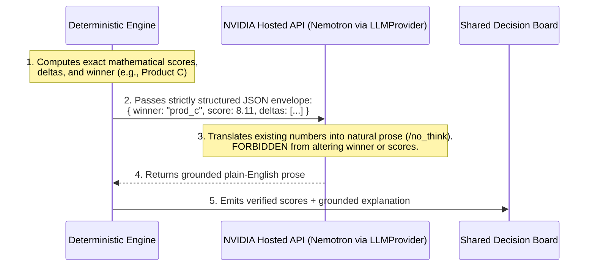

# 37 — Experience Memory, Auditability & Test Matrix

## Document Metadata
- **Document Type**: Memory Architecture, Audit Specification & Test Suite
- **Status**: Approved Foundation
- **Owner**: QA & Systems Architect
- **Dependencies**: [20_SYSTEM_ARCHITECTURE.md](file:///d:/Consenzo%20amazon%20hackathon/docs/20_SYSTEM_ARCHITECTURE.md), [33_CONSTRAINT_ENGINE.md](file:///d:/Consenzo%20amazon%20hackathon/docs/33_CONSTRAINT_ENGINE.md), [34_SCORING_ENGINE.md](file:///d:/Consenzo%20amazon%20hackathon/docs/34_SCORING_ENGINE.md), [36_FAIRNESS_ENGINE.md](file:///d:/Consenzo%20amazon%20hackathon/docs/36_FAIRNESS_ENGINE.md)
- **Downstream References**: [90_EVALUATION.md](file:///d:/Consenzo%20amazon%20hackathon/docs/90_EVALUATION.md), [93_CONSENZO_BENCHMARK.md](file:///d:/Consenzo%20amazon%20hackathon/docs/93_CONSENZO_BENCHMARK.md), [110_DECISIONS.md](file:///d:/Consenzo%20amazon%20hackathon/docs/110_DECISIONS.md)

---

## 1. Memory Model Boundaries & Scope

To prevent architectural instability, hallucinations, and unconstrained state drift, Consenzo's memory system is **deliberately bounded and scoped**.

```text
 ┌─────────────────────────────────────────────────────────────┐
 │                1. SESSION MEMORY (EPHEMERAL)                │
 │  - Scope: 1-on-1 private participant interview              │
 │  - Contents: Current conversation turns, extracted candidate│
 │    attributes, confidence levels, unresolved ambiguities.   │
 │  - Lifecycle: Destroyed/closed upon profile confirmation.   │
 ├─────────────────────────────────────────────────────────────┤
 │                2. DECISION MEMORY (SNAPSHOT)                │
 │  - Scope: Group purchasing decision room                    │
 │  - Contents: Confirmed preference profiles, locked catalog  │
 │    version, deterministic score outputs, trade-off deltas,  │
 │    participant votes, and final consensus decision.         │
 │  - Lifecycle: Persisted in DynamoDB (24-hour TTL).          │
 ├─────────────────────────────────────────────────────────────┤
 │           3. CROSS-SESSION MEMORY (DEFERRED)                │
 │  - Long-term household history across multiple purchases    │
 │  - Cross-group brand affinity learning                      │
 │  - DEFERRED to Post-Hackathon Roadmap (See 102_POST_HACK)    │
 └─────────────────────────────────────────────────────────────┘
```

> **Immutable Invariant**: Memory must NEVER silently modify or inject historical assumptions into confirmed constraints during an active decision session.

---

## 2. Versioning & Mathematical Reproducibility Contract

Every execution of the deterministic consensus engine is immutably tagged with five exact version hashes:

```json
{
  "provenance": {
    "catalogVersion": "catalog_smart_tvs_v1.20260915",
    "preferenceProfileVersion": "sha256_9b82c1f4e...",
    "scoringConfigVersion": "scoring_mult_v1.0",
    "fairnessConfigVersion": "hybrid_maximin_dispersion_v1.0",
    "analysisVersion": "an_992a_b471"
  }
}
```

### Reproducibility Guarantee
$$\text{Given the same 5 version hashes, } \mathbf{Output}(\text{Analysis}) \text{ is mathematically invariant across infinite re-runs.}$$

---

## 3. Critical Anti-Hallucination Contract

The system enforces an unbreakable contract between the deterministic engine and the generative explanation service:



The AI is strictly a **spokesperson**, never the judge.

---

## 4. Comprehensive Test Suite Matrix

The deterministic decision layer is formally validated against 8 mandatory reference test cases:

### Test 1: Full Group Agreement
- **Input**: 3 participants (Dad, Mom, Son) all state budget $\le$ ₹50,000 and prefer Samsung.
- **Expected Behavior**: Filter prunes non-Samsung and items > 50k; utility is maximized.
- **Expected Ranking**: Top Samsung TV under 50k scores $\approx 9.8 / 10$; $\sigma(u) \approx 0.0$.
- **Explanation**: "Unanimous match: Samsung Crystal perfectly satisfies everyone's budget and brand preferences."

### Test 2: Heterogeneous Soft Preferences (No Hard Conflict)
- **Input**: Dad wants low price, Mom wants Samsung brand, Son wants 120Hz gaming, Daughter wants silver frame.
- **Expected Behavior**: All soft preferences weighted; candidates scored on continuous utility.
- **Expected Ranking**: LG NanoCell (Product C) wins on consensus score (8.11) with balanced distribution.
- **Explanation**: Clear breakdown of what each person gained and Mom's brand compromise.

### Test 3: Conflicting Hard Constraints (Zero Initial Products)
- **Input**: Dad specifies hard ceiling ₹40,000; Son specifies hard constraint 120Hz native. (No 120Hz TV exists under ₹48,000).
- **Expected Behavior**: Initial candidate set $|\mathcal{F}_0| = 0$. Engine catches collision, locks dealbreakers, executes Controlled Relaxation Protocol, outputs Branch A (budget priority) and Branch B (gaming priority).
- **Expected Ranking**: Explicit conflict banner displayed; Top 2 compromise branches presented.
- **Explanation**: Empathetic conflict summary detailing the exact ₹8,000 market reality gap.

### Test 4: Tyranny of the Majority (Average Happiness Trap)
- **Input**: Product X gives 3 members 9.8/10 and Son 2.0/10 (Mean: 7.85). Product Y gives all 4 members 7.7/10 (Mean: 7.70).
- **Expected Behavior**: Tier 1 Maximin Quality Floor penalizes Product X for violating the $u_{min} \ge 4.0$ threshold (Floor penalty: 10.0). Product Y incurs 0 floor penalty and near-zero dispersion penalty.
- **Expected Ranking**: Product Y decisively beats Product X in final rank.
- **Explanation**: "Product Y chosen because it ensures the whole family is happy without leaving Son frustrated."

### Test 5: No Product Satisfies Everyone (Exhaustive Trade-Off)
- **Input**: 4 members with mutually exclusive brand, size, and budget targets.
- **Expected Behavior**: Engine computes Maximin / Nash compromise that maximizes minimum utility.
- **Expected Ranking**: Returns balanced middle-tier model (e.g. 50" TCL/Xiaomi at fair price).
- **Explanation**: Transparently highlights the specific attribute each member gave up.

### Test 6: Dealbreaker Gating
- **Input**: Product Z has high specs for price (scores 9.5 across all soft preferences), but Dad specified `brand != "BrandZ"` as a `DEALBREAKER`.
- **Expected Behavior**: Product Z is pruned during Stage 1 gating. Utility is mathematically $0.0$.
- **Expected Ranking**: Product Z does not appear in candidate ranking under any circumstances.
- **Explanation**: Product Z is completely omitted from the recommendation set.

### Test 7: Missing / Unmapped Catalog Attribute
- **Input**: Participant specifies `"Must have built-in ambient lighting"` (attribute not tracked in MVP Smart TV catalog).
- **Expected Behavior**: System flags attribute as `UNMAPPED_ADVISORY`; does not crash or silently convert to a dealbreaker.
- **Expected Ranking**: Standard catalog evaluation continues uninterrupted.
- **Explanation**: Notice displayed on profile summary that ambient lighting is not tracked in the current catalog.

### Test 8: Ambiguous Preference Before Confirmation
- **Input**: Participant says *"I'd like to stay around 50k"*.
- **Expected Behavior**: Agent identifies confidence $< 0.80$ on budget boundary; probes whether 50k is hard or flexible.
- **Expected Ranking**: Profile not submitted to group engine until participant explicitly confirms classification on summary card.
