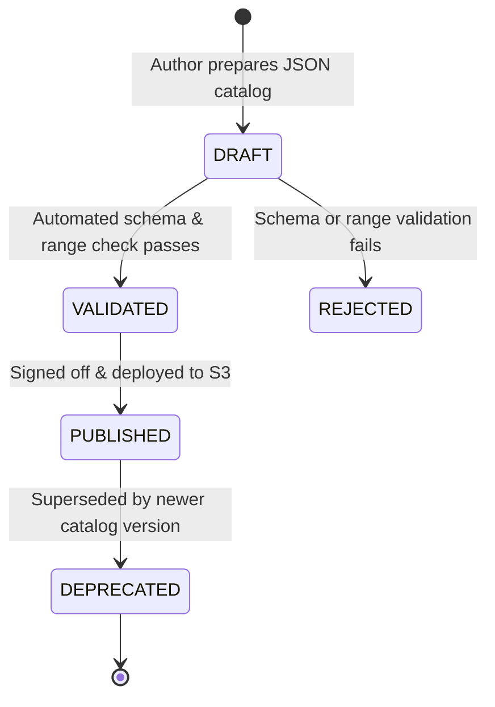

# 41 — Catalog State & Versioning Lifecycle

## Document Metadata
- **Document Type**: Data Lifecycle & Immutability Specification
- **Status**: Approved Foundation
- **Owner**: Data Architect & Systems Engineer
- **Dependencies**: [20_SYSTEM_ARCHITECTURE.md](file:///d:/Consenzo%20amazon%20hackathon/docs/20_SYSTEM_ARCHITECTURE.md), [37_EXPERIENCE_MEMORY.md](file:///d:/Consenzo%20amazon%20hackathon/docs/37_EXPERIENCE_MEMORY.md), [40_CONTROLLED_CATALOG.md](file:///d:/Consenzo%20amazon%20hackathon/docs/40_CONTROLLED_CATALOG.md)
- **Downstream References**: [42_CATALOG_TOOLS.md](file:///d:/Consenzo%20amazon%20hackathon/docs/42_CATALOG_TOOLS.md), [43_CATALOG_FAILURES.md](file:///d:/Consenzo%20amazon%20hackathon/docs/43_CATALOG_FAILURES.md), [67_S3.md](file:///d:/Consenzo%20amazon%20hackathon/docs/67_S3.md)

---

## 1. Catalog State Envelope Schema

A catalog is published as an immutable, self-describing JSON artifact:

```json
{
  "$schema": "https://consenzo.app/schemas/catalog-envelope-v1.json",
  "catalogVersion": "smart-tv-v1",
  "category": "smart_tvs",
  "schemaVersion": "1.0",
  "itemCount": 35,
  "checksum": "sha256:e3b0c44298fc1c149afbf4c8996fb92427ae41e4649b934ca495991b7852b855",
  "state": "PUBLISHED",
  "createdAt": "2026-09-15T18:00:00Z",
  "updatedAt": "2026-09-15T18:00:00Z",
  "products": [
    {
      "productId": "tv_001",
      "name": "Samsung Crystal 4K UHD Ultra",
      "brand": "Samsung",
      "priceInr": 48000,
      "rating": 4.5,
      "reviewCount": 1420,
      "screenSizeInches": 55,
      "resolution": "4K",
      "refreshRateHz": 60,
      "panelType": "LED",
      "hdrFormats": ["HDR10+", "HLG"],
      "hasGamingMode": true,
      "hasHdmi21": false,
      "hdmiPorts": 3,
      "warrantyYears": 2,
      "bezelColor": "Black",
      "widthCm": 123.1,
      "smartPlatform": "Tizen",
      "energyRatingStars": 3,
      "asin": "B09X1K87Z2",
      "imageUrl": "/assets/products/tv_001.webp"
    }
  ]
}
```

---

## 2. Catalog Versioning & Immutability Contract

To guarantee that past group analyses can be audited and reproduced down to the exact decimal score:

1. **Write-Once Immutability**:
   Once a catalog envelope is marked `PUBLISHED`, its contents are **permanently frozen**. It is never updated in place.
2. **Deterministic Version Progression**:
   Any price correction, product addition, or attribute amendment mandates a new semantic version:
   $$\text{smart-tv-v1} \longrightarrow \text{smart-tv-v2} \longrightarrow \text{smart-tv-v3}$$
3. **Analysis Pinning**:
   Every group analysis record stores the exact `catalogVersion` string and the SHA-256 artifact checksum evaluated. If an analysis was run against `smart-tv-v1`, it remains forever bound to that exact dataset.

---

## 3. Catalog State Lifecycle

Every catalog version progresses through four formal state gates:



### State Semantics
- **`DRAFT`**: Authoring phase. Stored locally or in staging S3 bucket. Not accessible to production Lambda runtimes.
- **`VALIDATED`**: Passed all automated data quality checks (types, bounds, no missing fields, valid ASIN formatting).
- **`PUBLISHED`**: Active benchmark catalog stored at `s3://consenzo-assets/catalogs/smart_tvs/smart-tv-v1.json`. Only `PUBLISHED` catalogs can be evaluated by the scoring engine.
- **`DEPRECATED`**: Retained in S3 for historical auditability and past session reproducibility, but new sessions default to the latest published version.

---

## 4. Runtime In-Memory Caching & Distribution

```text
 ┌─────────────────────────────────────────────────────────────┐
 │                AMAZON S3 STATIC REPOSITORY                  │
 │  s3://consenzo-assets/catalogs/smart_tvs/smart-tv-v1.json    │
 └──────────────────────────────┬──────────────────────────────┘
                                │ Cold-Start Fetch (Once per Lambda Container)
                                ▼
 ┌─────────────────────────────────────────────────────────────┐
 │               LAMBDA IN-MEMORY GLOBAL CACHE                 │
 │                                                             │
 │  let cachedCatalog: SmartTvProduct[] | null = null;         │
 │  // Sub-millisecond synchronous memory access               │
 └──────────────────────────────┬──────────────────────────────┘
                                │ Pure In-Memory Gating & Scoring
                                ▼
 ┌─────────────────────────────────────────────────────────────┐
 │           DETERMINISTIC CONSENSUS SCORING ENGINE            │
 │               Execution Time: < 5 Milliseconds              │
 └─────────────────────────────────────────────────────────────┘
```

Because the catalog is small (35 items $\approx 45\text{ KB}$ uncompressed JSON), keeping it in Lambda container memory achieves **sub-millisecond evaluation speed with zero database read latency**.
