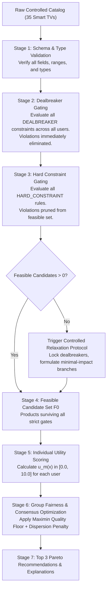

# 42 — Catalog Operations, Tooling & Engine Interfaces

## Document Metadata
- **Document Type**: Tooling Architecture & Engine Interface Specification
- **Status**: Approved Foundation
- **Owner**: Backend Engineer & Deterministic Engine Architect
- **Dependencies**: [20_SYSTEM_ARCHITECTURE.md](file:///d:/Consenzo%20amazon%20hackathon/docs/20_SYSTEM_ARCHITECTURE.md), [33_CONSTRAINT_ENGINE.md](file:///d:/Consenzo%20amazon%20hackathon/docs/33_CONSTRAINT_ENGINE.md), [40_CONTROLLED_CATALOG.md](file:///d:/Consenzo%20amazon%20hackathon/docs/40_CONTROLLED_CATALOG.md)
- **Downstream References**: [43_CATALOG_FAILURES.md](file:///d:/Consenzo%20amazon%20hackathon/docs/43_CATALOG_FAILURES.md), [67_S3.md](file:///d:/Consenzo%20amazon%20hackathon/docs/67_S3.md), [72_CONSENZO_API.md](file:///d:/Consenzo%20amazon%20hackathon/docs/72_CONSENZO_API.md)

---

## 1. Deterministic Catalog Tooling Interface

The catalog service provides a strongly-typed, deterministic interface used by both the API layer and the deterministic scoring engine:

```typescript
export interface CatalogService {
  /**
   * Loads a specific versioned catalog artifact from S3 or cache
   */
  loadCatalogVersion(category: string, version: string): Promise<CatalogEnvelope>;

  /**
   * Retrieves full product record by unique ID
   */
  getProduct(productId: string): Promise<SmartTvProduct | null>;

  /**
   * Returns all active products in a category
   */
  listProducts(category: string): Promise<SmartTvProduct[]>;

  /**
   * Pure deterministic gating function: filters products against Dealbreakers and Hard Constraints
   */
  filterCandidateProducts(
    catalog: SmartTvProduct[],
    groupConstraints: CanonicalConstraint[]
  ): GatingResult;

  /**
   * Validates raw JSON catalog against schema and business boundaries
   */
  validateCatalogEnvelope(rawJson: unknown): CatalogValidationReport;
}
```

---

## 2. Strict AI Access Boundaries

To prevent hallucinations, pricing distortions, and phantom inventory claims, the interaction between generative AI and the catalog adheres to ironclad permissions:

```text
 ┌─────────────────────────────────────────────────────────────┐
 │                      AI IS PERMITTED TO:                    │
 │                                                             │
 │  ✅ Retrieve verified product specifications by productId   │
 │  ✅ Reference verified catalog facts during discovery        │
 │  ✅ Explain already-calculated trade-offs using exact facts  │
 ├─────────────────────────────────────────────────────────────┤
 │                    AI IS STRICTLY FORBIDDEN FROM:           │
 │                                                             │
 │  ❌ Inventing or estimating product specifications          │
 │  ❌ Altering prices, discounts, or stock status             │
 │  ❌ Inserting phantom or hallucinated products              │
 │  ❌ Overriding or softening confirmed hard constraints     │
 │  ❌ Generating the product ranking or scoring candidates    │
 └─────────────────────────────────────────────────────────────┘
```

---

## 3. Candidate Retrieval & Evaluation Pipeline

The transition from the raw 35-item catalog to the final group ranking proceeds in an unambiguous, multi-stage pipeline:



---

## 4. Performance Rationale: In-Memory Evaluation vs. External Search

For the 48-hour MVP, all catalog operations execute **purely in Lambda container memory**.

### Architectural Decision
We explicitly reject introducing Amazon OpenSearch Service, Amazon Neptune, or Postgres full-text search:
1. **Computational Reality**:
   The entire 35-item catalog is $\approx 45\text{ KB}$ of structured JSON. A linear scan in V8 across 35 items evaluating 10 constraints per item executes in **less than 2 milliseconds**.
2. **Cost & Simplicity**:
   OpenSearch clusters cost $\approx \$50–\$150/\text{month}$ to keep idle, take 15–20 minutes to provision via CloudFormation, and introduce network latency (20–40ms roundtrip) for a trivial dataset.
3. **Absolute Determinism**:
   In-memory execution eliminates eventual consistency lag, connection pool exhaustion, and search index drift.
