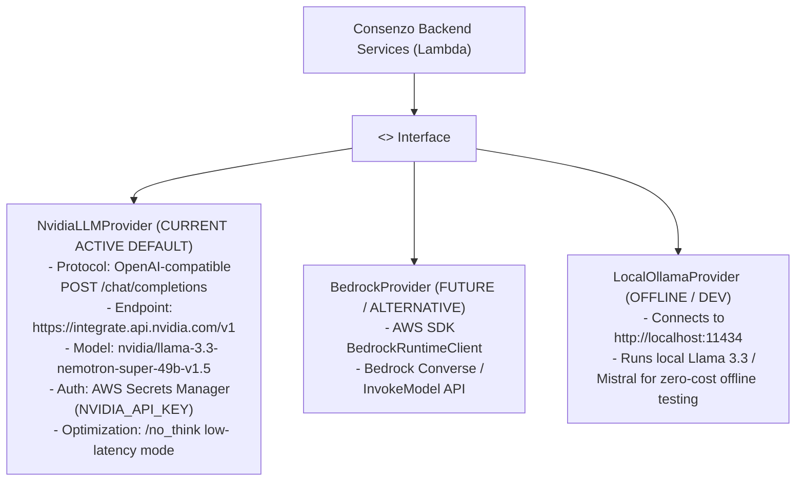

# 62 — LLM Provider Abstraction & NVIDIA Hosted Inference

## Document Metadata
- **Document Type**: AI Integration & LLM Runtime Specification
- **Status**: Implementation-Critical Frozen Specification
- **Owner**: AI / NLP Engineer & Systems Architect
- **Dependencies**: [20_SYSTEM_ARCHITECTURE.md](file:///d:/Consenzo%20amazon%20hackathon/docs/20_SYSTEM_ARCHITECTURE.md), [30_CONSENZO_AGENT.md](file:///d:/Consenzo%20amazon%20hackathon/docs/30_CONSENZO_AGENT.md), [31_AGENT_LOOP.md](file:///d:/Consenzo%20amazon%20hackathon/docs/31_AGENT_LOOP.md), [60_AWS_ARCHITECTURE.md](file:///d:/Consenzo%20amazon%20hackathon/docs/60_AWS_ARCHITECTURE.md)
- **Downstream References**: [72_CONSENZO_API.md](file:///d:/Consenzo%20amazon%20hackathon/docs/72_CONSENZO_API.md), [80_SECURITY.md](file:///d:/Consenzo%20amazon%20hackathon/docs/80_SECURITY.md), [81_DATA_PRIVACY.md](file:///d:/Consenzo%20amazon%20hackathon/docs/81_DATA_PRIVACY.md), [82_SECRETS.md](file:///d:/Consenzo%20amazon%20hackathon/docs/82_SECRETS.md)

---

## 1. Production Role of Generative Inference

NVIDIA provides generative inference; AWS provides the secure serverless application infrastructure and orchestration.

The active foundational model runtime for Consenzo is the **NVIDIA hosted API** (`nvidia/llama-3.3-nemotron-super-49b-v1.5`). The generative AI layer is strictly quarantined from final decision authority:

```text
 ┌─────────────────────────────────────────────────────────────┐
 │               APPROVED LLM RESPONSIBILITIES                 │
 │                                                             │
 │  1. Adaptive Conversational Interviewing (1-on-1 discovery) │
 │  2. Candidate Preference Extraction into Structured Schemas │
 │  3. Ambiguity & Uncertainty Probing Formulation             │
 │  4. Participant Preference Profile Summarization            │
 │  5. Grounded Plain-English Trade-Off Explanation Generation │
 ├─────────────────────────────────────────────────────────────┤
 │                   FORBIDDEN LLM CAPABILITIES                │
 │                                                             │
 │  ❌ Scoring products against utility curves                 │
 │  ❌ Ranking the product catalog                             │
 │  ❌ Inventing or modifying product catalog specifications   │
 │  ❌ Overriding participant dealbreakers or hard constraints │
 │  ❌ Deciding which product wins the group decision          │
 └─────────────────────────────────────────────────────────────┘
```

---

## 2. Model Configuration & Runtime Parameters

All inference calls are routed through the `LLMProvider` abstraction and configured via standardized environment variables:

```bash
LLM_PROVIDER=nvidia
LLM_MODEL=nvidia/llama-3.3-nemotron-super-49b-v1.5
LLM_BASE_URL=https://integrate.api.nvidia.com/v1
```

```typescript
export interface LLMConfig {
  provider: "nvidia" | "bedrock" | "ollama";
  model: string;                // "nvidia/llama-3.3-nemotron-super-49b-v1.5"
  baseUrl: string;              // "https://integrate.api.nvidia.com/v1"
  temperature: number;          // 0.2 for extraction; 0.5 for dialogue/explanations
  maxTokens: number;            // 1024 tokens maximum per turn
  disableReasoning: boolean;    // true by default via /no_think
  apiKeySecretArn: string;      // AWS Secrets Manager ARN
}
```

### Model Characteristics: `nvidia/llama-3.3-nemotron-super-49b-v1.5`
- **Capabilities**: Reasoning and chat, structured JSON instruction following, tool calling.
- **Context Window**: 128K context, accommodating full category catalogs and multi-turn interview states.
- **Multilingual Support**: High proficiency in English, Hindi, and Indian English colloquialisms.
- **Low-Latency Optimization (`/no_think`)**: For the conversational elicitation and preference extraction paths, reasoning is normally disabled by prepending `/no_think` to prompts. This bypasses verbose internal chain-of-thought tokens, cutting latency to sub-second turnaround times while maintaining strict JSON adherence. Temperature is kept low (0.2).

### Secret Management
- The `NVIDIA_API_KEY` is stored in **AWS Secrets Manager** (`consenzo/nvidia-api-key`).
- The Lambda execution role fetches the secret at runtime.
- The key is **never** bundled in frontend code, stored in browser memory, written to git, or exposed in API responses.

---

## 3. Pluggable Provider Abstraction (`LLMProvider`)

The backend codebase implements an abstraction barrier isolating application logic from vendor-specific inference SDKs:

```typescript
export interface LLMOptions {
  temperature?: number;
  maxTokens?: number;
  noThink?: boolean;
}

export interface LLMProvider {
  /**
   * Generates natural language text given a prompt and options
   */
  generateText(prompt: string, options?: LLMOptions): Promise<string>;

  /**
   * Conducts one conversational turn with the participant, extracts candidate
   * preferences, detects ambiguities, and returns an adaptive response.
   */
  extractStructuredPreferences(
    session: ParticipantSession,
    userMessage: string,
    catalogSchema: CategoryCatalogSchema
  ): Promise<AgentTurnResponse>;

  /**
   * Synthesizes a bulleted, human-readable summary of confirmed preferences
   */
  summarizeProfile(profile: PreferenceProfile): Promise<string>;

  /**
   * Generates a grounded, empathetic explanation of a mathematically
   * pre-computed recommendation and its trade-offs.
   */
  generateExplanation(
    product: ScoredProduct,
    groupBreakdown: GroupScoreBreakdown,
    participants: ParticipantPreferenceProfile[]
  ): Promise<string>;

  /**
   * Verifies upstream connectivity, credentials, and model health
   */
  healthCheck(): Promise<boolean>;
}
```



---

## 4. Structured Output Contract & Prompt Injection Defense

All model responses from upstream providers are treated as **untrusted input**.

### Two-Channel Extraction Protocol
The extraction prompt utilizes `/no_think` and formats outputs into distinct XML blocks:

```text
/no_think
You are Consenzo, an empathetic group purchasing discovery assistant for Smart TVs.
Analyze the participant's message and output two sections:

<internal_analysis>
{
  "extracted_preferences": [
    {
      "attribute": "price_inr",
      "operator": "LTE",
      "value": 50000,
      "type": "HARD_CONSTRAINT",
      "weight": 1.0,
      "confidence": 0.95
    }
  ],
  "ambiguities_detected": [],
  "is_ready_for_summary": false
}
</internal_analysis>

<response_to_participant>
Plain-English empathetic conversational reply (1-2 sentences).
</response_to_participant>
```

### Defense-in-Depth Validation
Before any extracted preference is accepted into the participant's working profile:
1. **Schema Check**: Validated against TypeScript JSON Schema.
2. **Attribute Whitelist**: The `attribute` string must exist in `CategoryAdapter.getSupportedAttributes()`. Unknown attributes are rejected or downgraded to `UNMAPPED_ADVISORY`.
3. **Operator Whitelist**: `operator` must belong to `['LTE', 'GTE', 'EQ', 'NEQ', 'IN', 'RANGE', 'TARGET_PREF']`.
4. **Range Sanitization**: Numerical values must be within physical reality (e.g. price between 10k and 500k).
5. **Zero Code Execution**: Model output is never passed to `eval()`, SQL queries, or shell runners.

---

## 5. Observability, Monitoring & Logging Invariants

All upstream inference calls emit structured telemetry to Amazon CloudWatch:

```json
{
  "level": "INFO",
  "eventType": "LLM_INFERENCE_CALL",
  "provider": "nvidia",
  "modelId": "nvidia/llama-3.3-nemotron-super-49b-v1.5",
  "correlationId": "corr_992a_b471",
  "latencyMs": 842,
  "success": true,
  "tokenUsage": {
    "promptTokens": 380,
    "completionTokens": 95,
    "totalTokens": 475
  }
}
```

### Strict Privacy Logging Rules
- **NEVER Log**:
  - `NVIDIA_API_KEY` or raw `Authorization` headers.
  - Raw private participant chat messages or emotional remarks at `INFO` level.
  - Cookies, session tokens, or internal credentials.
- **Always Log**:
  - Provider name, model ID, correlation ID, latency, success/failure code, and token usage counts.

---

## 6. Failure Recovery & Graceful Degradation

If the NVIDIA hosted API experiences rate limiting (`HTTP 429`), server errors (`503`), or timeouts:
1. **Automated Exponential Backoff**: The provider client retries once after a 500ms jittered delay.
2. **State Protection**: If the call fails, the user's message remains queued; no invalid preference state is written to DynamoDB.
3. **Conversational Recovery**: The API returns a polite retry prompt:
   > *"I'm experiencing a brief connection delay. Could you please send that last thought again?"*
4. **Zero Fallback Hallucination**: The system **never** invents preferences or fabricates a winner when the model is unavailable. The deterministic scoring engine only operates on verified, confirmed profiles.
