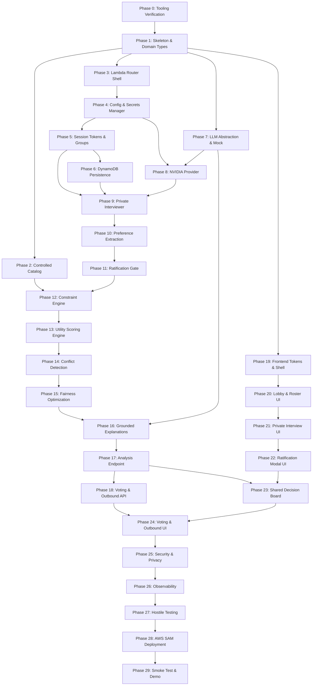

# Consenzo — Master Phase-by-Phase Implementation Playbook

> **Executive Invariant**:  
> **"NVIDIA provides generative inference; AWS provides the secure serverless application infrastructure and orchestration."**  
> **"The LLM understands people. Deterministic software decides the product ranking."**

---

## 1. Documentation State & Source of Truth

Before implementing any code or deploying cloud resources, the engineering team and AI coding agents must align on the documented source of truth across the Consenzo repository.

### 1.1 Authoritative Documents
The following documents are frozen and authoritative. In any discrepancy with high-level summaries or exploratory notes, these specifications govern implementation:

1. **Architecture Decision Records**: [docs/110_DECISIONS.md](file:///d:/Consenzo%20amazon%20hackathon/docs/110_DECISIONS.md) (ADR-001 through ADR-021).
2. **System Architecture & Data Flows**: [docs/20_SYSTEM_ARCHITECTURE.md](file:///d:/Consenzo%20amazon%20hackathon/docs/20_SYSTEM_ARCHITECTURE.md), [docs/22_TECH_STACK_FLOW.md](file:///d:/Consenzo%20amazon%20hackathon/docs/22_TECH_STACK_FLOW.md), and [docs/23_DATA_FLOW.md](file:///d:/Consenzo%20amazon%20hackathon/docs/23_DATA_FLOW.md).
3. **API Contracts & Envelopes**: [docs/70_API_CONTRACTS.md](file:///d:/Consenzo%20amazon%20hackathon/docs/70_API_CONTRACTS.md), [docs/71_GROUP_API.md](file:///d:/Consenzo%20amazon%20hackathon/docs/71_GROUP_API.md), and [docs/72_CONSENZO_API.md](file:///d:/Consenzo%20amazon%20hackathon/docs/72_CONSENZO_API.md).
4. **Deterministic Math & Fairness Engine**: [docs/33_CONSTRAINT_ENGINE.md](file:///d:/Consenzo%20amazon%20hackathon/docs/33_CONSTRAINT_ENGINE.md), [docs/34_SCORING_ENGINE.md](file:///d:/Consenzo%20amazon%20hackathon/docs/34_SCORING_ENGINE.md), [docs/35_CONFLICT_DETECTION.md](file:///d:/Consenzo%20amazon%20hackathon/docs/35_CONFLICT_DETECTION.md), and [docs/36_FAIRNESS_ENGINE.md](file:///d:/Consenzo%20amazon%20hackathon/docs/36_FAIRNESS_ENGINE.md).
5. **Preference World Model & Agent Loop**: [docs/30_CONSENZO_AGENT.md](file:///d:/Consenzo%20amazon%20hackathon/docs/30_CONSENZO_AGENT.md), [docs/31_AGENT_LOOP.md](file:///d:/Consenzo%20amazon%20hackathon/docs/31_AGENT_LOOP.md), and [docs/32_PREFERENCE_WORLD_MODEL.md](file:///d:/Consenzo%20amazon%20hackathon/docs/32_PREFERENCE_WORLD_MODEL.md).
6. **Controlled Catalog Specification**: [docs/40_CONTROLLED_CATALOG.md](file:///d:/Consenzo%20amazon%20hackathon/docs/40_CONTROLLED_CATALOG.md).
7. **LLM Provider Abstraction & Secrets**: [docs/62_BEDROCK.md](file:///d:/Consenzo%20amazon%20hackathon/docs/62_BEDROCK.md) *(title: 62 — LLM Provider Abstraction & NVIDIA Hosted Inference)*, [docs/80_SECURITY.md](file:///d:/Consenzo%20amazon%20hackathon/docs/80_SECURITY.md), and [docs/82_SECRETS.md](file:///d:/Consenzo%20amazon%20hackathon/docs/82_SECRETS.md).
8. **Client Architecture**: [docs/50_FRONTEND_ARCHITECTURE.md](file:///d:/Consenzo%20amazon%20hackathon/docs/50_FRONTEND_ARCHITECTURE.md).

### 1.2 Frozen Architectural Decisions (ADR-001 to ADR-021)
- **ADR-001**: Deterministic scoring engine over LLM ranking (LLM strictly restricted to conversation, extraction, and explanation).
- **ADR-002**: Controlled single category (Smart TVs) with a 35-item verified static catalog.
- **ADR-003**: 1-on-1 private preference elicitation (raw transcripts never exposed to other participants or group board).
- **ADR-004**: AWS Serverless Architecture with NVIDIA Hosted Inference (Amplify, API Gateway, Lambda, DynamoDB, S3, Secrets Manager, CloudWatch).
- **ADR-005**: Exclusion of Amazon direct checkout (outbound ASIN deep-links only).
- **ADR-006**: 3-Tier Hybrid Fairness Engine ($u_{min} \ge 4.0$ maximin floor, $\lambda = 0.50$ dispersion penalty).
- **ADR-007**: Cryptographically signed participant session tokens (HMAC-SHA256, 24h TTL); Amazon Cognito explicitly deferred.
- **ADR-008**: Adaptive conversational elicitation over static survey forms.
- **ADR-009**: Category-agnostic core engine with pluggable `CategoryAdapter<T>` interface.
- **ADR-010**: Node.js 20 / TypeScript runtime for serverless compute.
- **ADR-011**: React 18 + Vite SPA with Vanilla CSS design tokens.
- **ADR-012**: Provider-neutral `LLMProvider` interface with `NvidiaLLMProvider` default.
- **ADR-013**: Deferral of AWS Step Functions and EventBridge for the 48-hour MVP.
- **ADR-014**: Pareto multi-candidate framing (`BEST_CONSENSUS`, `LOWEST_CONFLICT`, `BEST_VALUE`) on the Shared Board.
- **ADR-015**: Controlled constraint relaxation protocol (dealbreakers locked; hard constraints relaxed only if feasible set is empty).
- **ADR-016**: Controlled benchmark catalog over live scraping/PA-API.
- **ADR-017**: In-memory catalog gating and linear scan ($O(N), N=35$).
- **ADR-018**: Conservative missing attribute penalty (gated out for dealbreakers/hard constraints, 0.0 for soft preferences).
- **ADR-019**: Monolithic Lambda handler with internal sub-path routing.
- **ADR-020**: Configurable LLM selection via `LLM_PROVIDER`, `LLM_MODEL`, `LLM_BASE_URL`.
- **ADR-021**: Active migration to NVIDIA hosted API (`nvidia/llama-3.3-nemotron-super-49b-v1.5`) with AWS Secrets Manager key retrieval and `/no_think` low-latency mode.

### 1.3 Explicitly Deferred Technical Decisions (DO NOT BUILD FOR MVP)
- **Amazon Cognito User Pools**: Deferred per ADR-007. Use ephemeral HMAC-SHA256 tokens.
- **AWS Step Functions & EventBridge**: Deferred per ADR-013. Use synchronous API Gateway to Lambda invocations.
- **Amazon OpenSearch / RDS / Neptune**: Deferred per ADR-017. In-memory linear scan of 35 catalog items in Lambda memory.
- **WebSockets / API Gateway WebSocket API**: Deferred for MVP. Group lobby uses lightweight client-side polling (3-second interval).
- **Direct Amazon Cart / 1-Click Checkout**: Deferred per ADR-005. Use outbound ASIN deep links.
- **Live Amazon Marketplace Scraping or PA-API**: Strictly prohibited per ADR-016.
- **Multi-Category Ingestion**: Deferred per ADR-002. Only Smart TVs implemented.
- **Cross-Session Long-Term Agent Memory**: Deferred per ADR-001 & doc 37. Bounded to current session memory only.

### 1.4 Known Documentation Inconsistencies & Conflict Resolution
1. **Filename `docs/62_BEDROCK.md`**: The document contents have been completely rewritten to specify the generic `LLMProvider` interface and active `NvidiaLLMProvider` implementation. The physical file remains named `62_BEDROCK.md` for link backwards compatibility. Treat `62_BEDROCK.md` as the authoritative specification for NVIDIA hosted inference and provider decoupling.
2. **Incomplete Stub Files**: Files `docs/63_STRANDS.md` through `docs/69_EVENTBRIDGE.md`, `docs/90_EVALUATION.md` through `docs/97_BACKUP_DEMO.md`, and `docs/100_DAY_1.md` through `docs/113_CHANGELOG.md` are marked "Planned". They do not contain executable specifications. The executable source of truth resides entirely in files `00` through `62`, `70` through `72`, `80` through `82`, and `110`.
3. **Historical Bedrock References**: Any mentions of `BedrockProvider` in `docs/21_TECH_STACK.md`, `docs/24_API_ARCHITECTURE.md`, `docs/62_BEDROCK.md`, or `docs/110_DECISIONS.md` are strictly architectural future alternatives. NVIDIA hosted inference is the sole active production provider.

---

## 2. Event Start Gate & Pre-Event Boundary

Consenzo is engineered for the Amazon Hackathon. To adhere to hackathon compliance guidelines:

```text
┌─────────────────────────────────────────────────────────────────────────┐
│                           EVENT START GATE                              │
├─────────────────────────────────────────────────────────────────────────┤
│  PRE-EVENT WINDOW (ALLOWED):                                            │
│  - Architecture design, documentation, and schema definitions.          │
│  - Playbook authoring and phase dependency planning.                    │
│  - Local tool and runtime environment verification (Node, AWS CLI, git).│
│                                                                         │
│  EVENT WINDOW (COMMENCES ONLY AFTER OFFICIAL EVENT CLOCK OPENS):        │
│  - Initializing application code, npm packages, or git commits.         │
│  - Creating AWS resources (DynamoDB, S3, API Gateway, Lambda, Secrets). │
│  - Calling NVIDIA hosted inference APIs with live payloads.             │
│  - Building frontend UI components or styling.                          │
└─────────────────────────────────────────────────────────────────────────┘
```

> **Rule for AI Coding Agents**:  
> You must not execute code generation, directory creation, or command runs for Phase 1 onward until the user explicitly confirms the official hackathon build window is active.

---

## 3. Product Invariants & Information Barriers

1. **The Core Workflow**:
   ```text
   Participant 1-on-1 Chat
             ↓
   Adaptive LLM Elicitation (/no_think mode)
             ↓
   Candidate Parameter Extraction (JSON Schema)
             ↓
   Explicit Participant Confirmation & Lock
             ↓
   Sanitized Group Aggregation (Transcripts Expunged)
             ↓
   Deterministic Constraint Gating & Dealbreaker Veto
             ↓
   Multi-Attribute Utility Calculation (um ∈ [0, 10])
             ↓
   Conflict Detection & Classification
             ↓
   3-Tier Fairness Optimization (Maximin + Dispersion)
             ↓
   Pareto Consensus Ranking (Top 3)
             ↓
   Grounded Natural-Language Explanation (Fact-Bounded)
             ↓
   Shared Decision Board (Radar + Trade-off Deltas + Voting)
   ```
2. **Absolute Privacy Boundary**: Raw chat messages reside strictly in `PARTICIPANT#<id>/MSG#<ts>` in DynamoDB and are queryable only by the authenticated participant. The Shared Board API (`/groups/{id}/analysis`) physically excludes raw transcripts from its queries, memory, and responses.
3. **Determinism Boundary**: Product scores and rankings are calculated by pure TypeScript functions in `scoringEngine.ts` and `fairnessEngine.ts`. The LLM never scores products, ranks candidates, or overrides math.

---

## 4. Master File & Folder Topology

When implementation begins, the project tree must follow this organized structure:

```text
Consenzo/
├── package.json                          # Monorepo / root workspace script definitions
├── tsconfig.json                         # Base TypeScript configuration
├── samconfig.toml                        # AWS SAM deployment configuration
├── template.yaml                         # AWS SAM Serverless Application Model template
│
├── catalog/
│   ├── smart_tvs_v1.json                 # Immutable 35-item Smart TV benchmark catalog
│   └── catalog_schema.json               # JSON Schema validating benchmark catalog
│
├── shared/                               # Cross-boundary domain types (Zero external dependencies)
│   ├── types/
│   │   ├── catalog.ts                    # SmartTvProduct, CategoryAdapter interfaces
│   │   ├── preferences.ts                # CanonicalConstraint, PreferenceProfile, WorldModel
│   │   ├── scoring.ts                    # ProductScore, UtilityBreakdown, TradeoffDelta
│   │   ├── fairness.ts                   # FairnessMetrics, ConsensusResult, ParetoTag
│   │   ├── session.ts                    # Group, Participant, SessionTokenPayload, Role
│   │   └── api.ts                        # ApiResponse<T>, ApiError, Envelope contracts
│   └── constants/
│       └── calibration.ts                # u_min (4.0), lambda (0.50), penalty_coeff (2.5)
│
├── backend/                              # Monolithic Node.js 20 / TypeScript Lambda
│   ├── package.json
│   ├── tsconfig.json
│   └── src/
│       ├── index.ts                      # Lambda entry point (API Gateway HTTP API proxy)
│       ├── router.ts                     # In-memory sub-path router (/groups, /conversations, etc.)
│       ├── config/
│       │   ├── env.ts                    # Validates LLM_PROVIDER, LLM_MODEL, LLM_BASE_URL
│       │   └── secrets.ts                # AWS Secrets Manager wrapper with in-memory caching
│       ├── middleware/
│       │   ├── auth.ts                   # HMAC-SHA256 token verification & path-level authorization
│       │   ├── correlation.ts            # X-Correlation-Id generation & propagation
│       │   ├── error.ts                  # Standardized JSON error envelope responder
│       │   └── logger.ts                 # Redacted structured JSON logger (zero key/chat leak)
│       ├── services/
│       │   ├── sessionService.ts         # Group creation, join PIN, participant roster
│       │   ├── dynamoClient.ts           # DynamoDB DocumentClient single-table abstraction
│       │   ├── catalogService.ts         # S3 / local bundle loader, O(N) in-memory scanner
│       │   └── llm/
│       │       ├── types.ts              # LLMProvider interface & method signatures
│       │       ├── providerFactory.ts    # Resolves active provider based on LLM_PROVIDER env
│       │       ├── mockProvider.ts       # Deterministic mock provider for offline tests
│       │       ├── nvidiaProvider.ts     # ACTIVE: OpenAI-compat client to NVIDIA Hosted API
│       │       └── bedrockProvider.ts    # FUTURE / ALTERNATIVE: AWS Bedrock SDK stub
│       ├── interviewer/
│       │   ├── dialogueEngine.ts         # State machine for conversational interview turns
│       │   ├── prompts.ts                # System prompts with /no_think and XML delimiters
│       │   └── extractor.ts              # Strongly typed JSON preference extraction parser
│       └── engine/
│           ├── constraintEngine.ts       # Dealbreaker veto & hard-constraint feasibility gating
│           ├── scoringEngine.ts          # Multi-attribute utility functions (categorical, numeric, bool)
│           ├── conflictDetector.ts       # Direct vs. budget-feature conflict classification
│           ├── fairnessEngine.ts         # 3-Tier hybrid fairness operator (Maximin + Dispersion)
│           ├── paretoSorter.ts           # Multi-candidate classification (Consensus, Conflict, Value)
│           └── explanationGenerator.ts   # Factual grounding prompt for trade-off narratives
│
├── frontend/                             # React 18 + Vite SPA
│   ├── package.json
│   ├── tsconfig.json
│   ├── vite.config.ts
│   ├── index.html
│   └── src/
│       ├── main.tsx                      # Vite mounting point
│       ├── App.tsx                       # Route definition & context provider hierarchy
│       ├── assets/                       # SVG icons and visual assets
│       ├── styles/
│       │   ├── tokens.css                # Color palette, spacing, elevation, typography tokens
│       │   └── index.css                 # Global resets, glassmorphism utilities, layout grid
│       ├── context/
│       │   ├── SessionContext.tsx        # Room status, invite URL, group metadata
│       │   └── ParticipantContext.tsx    # Active participant token, ID, role, display name
│       ├── services/
│       │   └── api.ts                    # Typed fetch wrapper with Bearer token & correlation headers
│       ├── hooks/
│       │   ├── useChat.ts                # Interview message loop, optimistic state, turn counter
│       │   ├── useGroupPolling.ts        # 3-second lightweight poll for room roster readiness
│       │   └── useConsensus.ts           # Triggers & caches /groups/{id}/analysis result
│       ├── components/                   # Reusable presentational components
│       │   ├── Button.tsx
│       │   ├── Card.tsx
│       │   ├── Header.tsx
│       │   ├── RadarScore.tsx            # Canvas/SVG polygon rendering per-member satisfaction
│       │   ├── ConflictBanner.tsx        # Visual compromise notification & relaxation choices
│       │   └── OutboundAmazon.tsx        # ASIN deep-link CTA
│       └── routes/                       # Application view modules
│           ├── Landing.tsx               # Product overview & "Start Room" CTA
│           ├── CreateGroup.tsx           # Category & title initialization form
│           ├── JoinGroup.tsx             # 6-character PIN verification & participant join
│           ├── GroupLobby.tsx            # Roster readiness tracking & waiting room
│           ├── PrivateInterview.tsx      # Mobile-first 1-on-1 AI discovery drawer
│           ├── PreferenceReview.tsx      # Pre-commitment constraint ratification modal
│           ├── AnalysisProgress.tsx      # Calculation loader screen
│           ├── RecommendationBoard.tsx   # PRIMARY WOW SCREEN: Top 3 Pareto candidates + deltas
│           └── ErrorRecovery.tsx         # Session retry & disconnection handling
│
└── tests/                                # Multi-tier automated verification suites
    ├── fixtures/                         # Test fixtures (conflicts, family profiles, catalogs)
    │   ├── familyProfileFixture.ts
    │   ├── zeroMatchFixture.ts
    │   └── benchmarkCatalogFixture.ts
    ├── unit/                             # Engine math & constraint gating unit tests
    │   ├── constraintEngine.test.ts
    │   ├── scoringEngine.test.ts
    │   ├── fairnessEngine.test.ts
    │   └── conflictDetector.test.ts
    ├── integration/                      # API endpoint & token authorization tests
    │   ├── groupApi.test.ts
    │   ├── conversationApi.test.ts
    │   ├── analysisApi.test.ts
    │   └── secretsIntegration.test.ts
    └── hostile/                          # Adversarial security & edge-case tests
        ├── tyrannyOfMajority.test.ts
        ├── tokenTampering.test.ts
        ├── promptInjection.test.ts
        └── missingAttribute.test.ts
```

---

# Parallel Frontend/Backend Execution Protocol

The project will be implemented by two independent agents running concurrently:

### Agent A — Frontend Owner
* **Agent**: Antigravity / Gemini CLI
* **Primary Responsibility**:
  - `frontend/**`
  - frontend tests
  - frontend-specific documentation
* **Owns**:
  - React 18 + Vite application
  - routing
  - page/screen implementation
  - component system
  - Vanilla CSS/design tokens
  - responsive/mobile UX
  - React Context/custom hooks
  - API client
  - frontend loading/error/empty states
  - frontend auth/token handling
  - frontend mock API integration
  - frontend test coverage
* **Must NOT modify**:
  - `backend/**`
  - deterministic scoring engine
  - catalog implementation
  - backend configuration
  - AWS infrastructure
  - backend secrets/configuration
  - backend-owned tests
* **Contract Rule**: The frontend agent must build against the documented API contracts and shared types. When backend endpoints do not yet exist, use typed mock responses/local fixtures.

---

### Agent B — Backend Owner
* **Agent**: Claude Code through Ollama
* **Primary Responsibility**:
  - `backend/**`
  - backend/deterministic engine tests
  - backend-specific documentation
* **Owns**:
  - API routing
  - Lambda handler
  - session/group lifecycle
  - participant authentication/token validation
  - DynamoDB access
  - catalog access
  - LLM provider abstraction
  - NVIDIA provider
  - future Bedrock provider boundary
  - interviewer/dialogue logic
  - preference extraction
  - preference ratification
  - constraint handling
  - deterministic scoring
  - conflict resolution
  - fairness calculation
  - Pareto analysis
  - grounded explanations
  - voting
  - outbound product links
  - logging/error handling
  - backend tests
  - Secrets Manager integration
* **Authority & Boundaries**:
  - The backend agent must remain the sole owner of backend business logic and deterministic decision-making.
* **Must NOT**:
  - edit frontend implementation files
  - redesign frontend routes/components
  - place secrets in source code
  - expose NVIDIA credentials to the browser
  - allow the LLM to directly determine final rankings
  - silently change the public API contract

---

### Shared Ownership Rules

The following paths are shared coordination surfaces:
* `shared/**`
* `tests/fixtures/**`
* API contract documentation (`docs/70_API_CONTRACTS.md`, `docs/71_GROUP_API.md`, `docs/72_CONSENZO_API.md`)
* Root implementation documentation (`phase_by_phase_implementation.md`, `docs/AGENT_OWNERSHIP.md`, `docs/PARALLEL_INTEGRATION_CONTRACT.md`, `docs/AGENT_HANDOFF.md`)

#### Shared Contract Authority
**Claude/backend agent is the contract authority.**

The backend agent owns changes to:
* shared API request/response types
* endpoint schemas
* backend-facing DTOs
* deterministic engine shared types
* contract documentation

The frontend agent consumes these contracts but must not silently change them.

If the frontend needs a contract change:
1. Document the requested change in `docs/AGENT_HANDOFF.md`.
2. Notify the backend agent.
3. Backend updates the canonical contract in `shared/**` and contract documentation.
4. Frontend updates its implementation against the new contract.

**No agent may silently diverge from the shared contract.**

---

### Concurrent Workflow Architecture

```text
                         phase_by_phase_implementation.md
                                      |
                         Parallel Execution Protocol
                                      |
                 +--------------------+--------------------+
                 |                                         |
                 v                                         v
       FRONTEND TRACK                              BACKEND TRACK
   Antigravity / Gemini CLI                    Claude Code / Ollama
                 |                                         |
        frontend/**                                 backend/**
                 |                                         |
        mock API contracts                         MockLLMProvider
                 |                                         |
                 +--------------------+--------------------+
                                      |
                               Integration Gates
                                      |
                                      v
                              Real NVIDIA API
                                      |
                                      v
                              AWS Deployment
                                      |
                                      v
                              Demo Validation
```

> **The frontend and backend do not wait for one another to begin. They synchronize through contracts and integration gates.**

---

### Parallel Phase Mapping

| Phase | Frontend Agent (Antigravity / Gemini CLI) | Backend Agent (Claude Code / Ollama) |
| :--- | :--- | :--- |
| **0 Tooling** | Support | Support |
| **1 Skeleton / Shared Types** | Consumer | **OWNER** |
| **2 Catalog** | READ ONLY | **OWNER** |
| **3 Backend Router** | — | **OWNER** |
| **4 Config / Secrets** | — | **OWNER** |
| **5 Session** | Consumer | **OWNER** |
| **6 DynamoDB** | — | **OWNER** |
| **7 LLM Abstraction / Mock** | — | **OWNER** |
| **8 NVIDIA Provider** | — | **OWNER** |
| **9 Interviewer** | Consumer | **OWNER** |
| **10 Extraction** | Consumer | **OWNER** |
| **11 Ratification** | Consumer | **OWNER** |
| **12 Constraints** | Display only | **OWNER** |
| **13 Scoring** | Display only | **OWNER** |
| **14 Conflict** | Display only | **OWNER** |
| **15 Fairness / Pareto** | Display only | **OWNER** |
| **16 Explanations** | Display only | **OWNER** |
| **17 Analysis Endpoint** | Consumer | **OWNER** |
| **18 Voting / Outbound API** | Consumer | **OWNER** |
| **19 Frontend Tokens / Shell** | **OWNER** | — |
| **20 Lobby** | **OWNER** | Consumer |
| **21 Private Interview UI** | **OWNER** | Consumer |
| **22 Review Modal** | **OWNER** | Consumer |
| **23 Recommendation Board** | **OWNER** | Consumer |
| **24 Voting / Outbound UI** | **OWNER** | Consumer |
| **25 Security** | **OWNER** for browser concerns | **OWNER** for server concerns |
| **26 Observability** | Consumer | **OWNER** |
| **27 Hostile Tests** | Frontend tests | Backend/engine tests |
| **28 AWS Deployment** | Consumer | **OWNER** |
| **29 Smoke / Demo** | **OWNER** for UX | **OWNER** for backend |

> **Phases do not imply strict serial execution. Where ownership permits, frontend and backend work proceeds concurrently.**

---

### Integration Gates

Explicit synchronization gates govern progress:

1. **Gate 1 — Contract Lock**:
   - Before substantial implementation: shared types exist, API request/response schemas exist, endpoint names are frozen, auth/token format is documented, and error response format is documented.
   - Frontend may begin screen implementation immediately using mocks.
   - Backend may begin endpoint implementation immediately using the same contracts.
2. **Gate 2 — Group Flow**:
   - Validate: `Create Group → Join Group → Lobby → Participant Status`.
   - Frontend may use mocks while backend is still completing endpoints. Integration occurs once backend endpoints are available.
3. **Gate 3 — Private Interview**:
   - Validate: `Interview → Extract Preferences → Review → Confirm`.
   - **Privacy Rule**: Raw private conversation must never be sent as part of shared group decision payloads. Frontend should only consume the ratified structured preference representation required by the API.
4. **Gate 4 — Decision Engine**:
   - Validate: `Confirmed Preferences → Constraints → Scoring → Conflict → Fairness → Pareto → Explanation`.
   - The frontend displays backend results. The frontend must **NEVER** independently calculate utility, fairness, ranking, conflict score, or Pareto status. The backend is authoritative.
5. **Gate 5 — Recommendation Board**:
   - Validate: `Analysis API → Recommendation Board → Vote → Outbound Product Link`.
   - The UI may visualize backend-provided calculations but must not recreate them with separate formulas.
6. **Gate 6 — Production Integration**:
   - Validate: Amplify frontend, API Gateway, Lambda, DynamoDB, Secrets Manager, NVIDIA hosted inference, CloudWatch logging, authentication/token validation, production API contracts.

---

### Conflict Protocol

When an agent encounters a mismatch, execute this exact sequence:

```text
    STOP ──► REPORT ──► CONTRACT ──► IMPLEMENT
```

1. **STOP**: Do not patch around the mismatch locally.
2. **REPORT**: Record expected contract, actual contract, affected file/path, and impact in `docs/AGENT_HANDOFF.md`.
3. **CONTRACT**: The contract owner (Claude / Backend Agent) updates the canonical shared contract if appropriate.
4. **IMPLEMENT**: Both agents update their owned code against the same contract.

This prevents two independently-correct implementations from becoming mutually incompatible.

---

### Definition of Done for Each Agent

#### Frontend Agent Definition of Done
Before declaring frontend work complete:
- Every required screen exists.
- Every route works.
- Responsive behavior is implemented.
- Loading/error/empty states exist.
- API requests use the canonical contract.
- Mock mode works without backend availability.
- No scoring/ranking logic is duplicated in the client.
- Private chat data is not exposed in shared decision payloads.
- NVIDIA/AWS secrets are never present in frontend code.
- Frontend tests pass.

#### Backend Agent Definition of Done
Before declaring backend work complete:
- Every documented endpoint exists.
- Request validation exists.
- Auth/token checks exist.
- Private data boundaries are enforced.
- Deterministic decision engine is implemented.
- Engine tests pass.
- `MockLLMProvider` works.
- NVIDIA provider is isolated behind `LLMProvider`.
- Production secret retrieval is server-side.
- Structured logging/error handling exists.
- Backend tests pass.

---

### Hard Safety Rules for Parallel Work

1. **Never modify another agent's owned implementation files.**
2. **Never silently alter shared API contracts.**
3. **Never duplicate backend decision logic in the frontend.**
4. **Never move secrets into frontend code.**
5. **Never expose raw private conversations through shared state.**
6. **Never replace deterministic scoring with LLM-generated ranking.**
7. **Never assume another agent's code exists until an integration gate confirms it.**
8. **Never block frontend progress waiting for backend completion; use mocks.**
9. **Never block backend progress waiting for frontend completion; use contract fixtures.**
10. **Never reset, overwrite, or revert another agent's uncommitted work.**

---

### Event-Start Protection Gate

> [!IMPORTANT]
> **Hackathon Rules Compliance**: Implementation cannot begin before the official event start.
> This protocol is strictly for documentation and repository coordination.
> Prior to the official event start, agents must **NOT**:
> - Create application source code files (`frontend/src/**`, `backend/src/**`).
> - Create AWS cloud resources or trigger deployments.
> - Invoke paid production services.
> - Generate functional implementation logic.
> Work prior to event start is restricted to architecture, schema definition, ownership alignment, and coordination tooling.

---

## 5. Phase-by-Phase Implementation Plan

```text
IMPLEMENTATION PHASES AT A GLANCE
Phase 0:  Repo & Tooling Verification          Phase 15: Conflict Detection & Classification
Phase 1:  Skeleton & Shared Domain Types       Phase 16: Fairness & Pareto Ranking Engine
Phase 2:  Controlled Catalog & Adapter        Phase 17: Grounded Explanation Generation
Phase 3:  Backend Lambda Router Foundation     Phase 18: Voting & Final Ratification API
Phase 4:  Config & AWS Secrets Manager         Phase 19: Frontend Tokens & App Shell
Phase 5:  Session Token Cryptography & Groups  Phase 20: Group Lobby & Roster UI
Phase 6:  DynamoDB Persistence Layer           Phase 21: Private Interview Chat UI
Phase 7:  Generic LLM Abstraction & Mock       Phase 22: Preference Ratification Modal UI
Phase 8:  NVIDIA Hosted API Provider           Phase 23: Shared Decision Board (Primary WOW)
Phase 9:  Private Adaptive Interviewer Loop    Phase 24: Voting & Outbound Checkout UI
Phase 10: Structured Preference Extraction     Phase 25: Security & Privacy Hardening
Phase 11: Preference Ratification Gate         Phase 26: Observability & Redacted Logging
Phase 12: Deterministic Constraint Gating      Phase 27: Hostile & Adversarial Tests
Phase 13: Multi-Attribute Utility Engine       Phase 28: AWS SAM Cloud Provisioning
Phase 14: Category Specific TV Logic           Phase 29: Production Smoke & 3-Min Demo Runbook
```

---

### PHASE 0: Repository, Tooling & Environment Verification
- **Objective**: Verify that the local development environment possesses all required runtimes, CLI utilities, and repository configs without modifying or creating code.
- **Why This Phase Exists**: Prevents silent toolchain failures during hackathon build execution.
- **Prerequisites**: Access to developer terminal; official hackathon start acknowledged.
- **Inputs**: Local environment binaries (`node`, `npm`, `aws`, `sam`).
- **Files to Create**: None.
- **Files to Modify**: None.
- **Exact Implementation Tasks**:
  1. Verify Node.js runtime version is 20.x: `node --version`.
  2. Verify npm package manager version: `npm --version`.
  3. Verify AWS CLI v2 installation: `aws --version`.
  4. Verify AWS credentials and profile: `aws sts get-caller-identity --profile consenzo`.
  5. Verify AWS SAM CLI installation: `sam --version`.
- **Internal Dependencies**: None.
- **AWS Dependencies**: AWS CLI profile `consenzo`.
- **Environment/Configuration**: Terminal environment on Windows / PowerShell.
- **API Endpoints Affected**: None.
- **Data Models Affected**: None.
- **Tests Required**: Run version verification commands in shell.
- **Acceptance Criteria**:
  - `node` reports v20.x.
  - `aws sts get-caller-identity --profile consenzo` returns valid account identity without errors.
- **Manual Verification**: Review command terminal outputs.
- **Failure Conditions**: Node.js not installed or < v20; AWS CLI missing or profile `consenzo` unauthenticated.
- **Rollback Considerations**: Correct path / install missing tools before proceeding.
- **Definition of Done**: All tool versions confirmed and documented.
- **What MUST NOT Be Implemented**: Do not write application code or create AWS resources.
- **What Becomes Unblocked**: Phase 1 (Monorepo skeleton).

---

### PHASE 1: Workspace Skeleton, Monorepo Setup & Shared Domain Types
- **Objective**: Establish the repository directory structure, npm workspaces, TypeScript configs, and shared domain TypeScript types across frontend and backend.
- **Why This Phase Exists**: Establishes end-to-end type safety between client and server, preventing interface drift.
- **Prerequisites**: Phase 0 complete.
- **Inputs**: [docs/32_PREFERENCE_WORLD_MODEL.md](file:///d:/Consenzo%20amazon%20hackathon/docs/32_PREFERENCE_WORLD_MODEL.md), [docs/33_CONSTRAINT_ENGINE.md](file:///d:/Consenzo%20amazon%20hackathon/docs/33_CONSTRAINT_ENGINE.md), [docs/40_CONTROLLED_CATALOG.md](file:///d:/Consenzo%20amazon%20hackathon/docs/40_CONTROLLED_CATALOG.md), [docs/70_API_CONTRACTS.md](file:///d:/Consenzo%20amazon%20hackathon/docs/70_API_CONTRACTS.md).
- **Files to Create**:
  - `package.json`
  - `tsconfig.json`
  - `shared/types/catalog.ts`
  - `shared/types/preferences.ts`
  - `shared/types/scoring.ts`
  - `shared/types/fairness.ts`
  - `shared/types/session.ts`
  - `shared/types/api.ts`
  - `shared/constants/calibration.ts`
- **Files to Modify**: None.
- **Exact Implementation Tasks**:
  1. Create root `package.json` with npm workspaces (`backend`, `frontend`, `shared`).
  2. Create root `tsconfig.json` enabling strict type checking, `ES2022` target, and module resolution.
  3. Define `SmartTvProduct` interface in `shared/types/catalog.ts` according to doc 40.
  4. Define `CanonicalConstraint`, `ConstraintType`, `ConstraintOperator`, and `ParticipantPreferenceProfile` in `shared/types/preferences.ts` according to doc 32 and 33.
  5. Define `ProductScore`, `UtilityBreakdown`, and `TradeoffDelta` in `shared/types/scoring.ts` according to doc 34 and 35.
  6. Define `FairnessMetrics`, `ConsensusResult`, and `ParetoTag` in `shared/types/fairness.ts` according to doc 36.
  7. Define `Group`, `Participant`, `SessionTokenPayload`, and `GroupStatus` in `shared/types/session.ts` according to doc 71.
  8. Define `ApiResponse<T>`, `ApiErrorEnvelope`, and `ApiMeta` in `shared/types/api.ts` according to doc 70.
  9. Export calibration constants ($u_{min}=4.0$, $\lambda=0.50$, $penalty=2.5$) in `shared/constants/calibration.ts`.
- **Internal Dependencies**: None.
- **AWS Dependencies**: None.
- **Environment/Configuration**: TypeScript compiler.
- **API Endpoints Affected**: None.
- **Data Models Affected**: All domain interfaces.
- **Tests Required**: `npm run typecheck` or `tsc --noEmit` on shared types.
- **Acceptance Criteria**: Types compile with zero TypeScript errors under strict mode.
- **Manual Verification**: Inspect generated `.d.ts` or typecheck output.
- **Failure Conditions**: Circular imports or missing fields in domain types.
- **Rollback Considerations**: Delete created files and re-check interface definitions.
- **Definition of Done**: Root workspace initializes cleanly and all shared types pass type checking.
- **What MUST NOT Be Implemented**: No runtime execution logic, API routing, or UI views.
- **What Becomes Unblocked**: Phase 2 (Catalog) and Phase 3 (Backend Lambda).

---

### PHASE 2: Controlled Benchmark Catalog Artifact & Smart TV Category Adapter
- **Objective**: Create the immutable 35-item Smart TV benchmark catalog JSON artifact, its JSON Schema validator, and the `SmartTvAdapter` class for in-memory indexing.
- **Why This Phase Exists**: Implements ADR-002 and ADR-016. Ensures zero reliance on flaky external web scraping or third-party APIs.
- **Prerequisites**: Phase 1 complete.
- **Inputs**: [docs/40_CONTROLLED_CATALOG.md](file:///d:/Consenzo%20amazon%20hackathon/docs/40_CONTROLLED_CATALOG.md), [docs/41_CATALOG_STATE.md](file:///d:/Consenzo%20amazon%20hackathon/docs/41_CATALOG_STATE.md).
- **Files to Create**:
  - `catalog/smart_tvs_v1.json`
  - `catalog/catalog_schema.json`
  - `backend/src/services/catalogService.ts`
  - `tests/unit/catalogValidation.test.ts`
- **Files to Modify**: None.
- **Exact Implementation Tasks**:
  1. Author `catalog/smart_tvs_v1.json` containing exactly 35 curated TV models spanning diverse price tiers (₹18,000 to ₹1,45,000), refresh rates (60Hz, 120Hz, 144Hz), brands (Samsung, LG, Sony, TCL, Xiaomi), and finishes (Black, Silver, Titanium).
  2. Ensure every product includes mandatory conflict vectors (`hasHdmi21`, `bezelColor`, `widthCm`, `refreshRateHz`, `warrantyYears`, `asin`).
  3. Author `catalog_schema.json` validating field constraints and mandatory fields.
  4. Implement `catalogService.ts` to load the JSON file synchronously at startup into container memory and expose an $O(N)$ query scan (`getAll()`, `getById()`, `filter()`).
  5. Write unit test `catalogValidation.test.ts` validating all 35 products against the schema.
- **Internal Dependencies**: `shared/types/catalog.ts`.
- **AWS Dependencies**: S3 bucket target location defined (bundle locally for MVP Lambda).
- **Environment/Configuration**: Local filesystem read.
- **API Endpoints Affected**: None directly (consumed by engine).
- **Data Models Affected**: `SmartTvProduct`.
- **Tests Required**: Run `npm test catalogValidation.test.ts`.
- **Acceptance Criteria**: All 35 products pass JSON schema validation; price, dimensions, and refresh rates match specifications; zero missing required fields.
- **Manual Verification**: Verify item count is 35 and specific test archetypes (e.g., Samsung Crystal, LG NanoCell Gaming) exist with correct ASINs.
- **Failure Conditions**: Fewer than 35 products; schema validation errors; invalid ASIN formats.
- **Rollback Considerations**: Fix schema violations in `smart_tvs_v1.json`.
- **Definition of Done**: Catalog passes 100% schema validation and loads in < 2ms into memory.
- **What MUST NOT Be Implemented**: No dynamic web scraping, Amazon PA-API calls, or external HTTP requests.
- **What Becomes Unblocked**: Phase 12 (Constraint Gating) and Phase 13 (Scoring Engine).

---

### PHASE 3: Backend Lambda Foundation, Routing & Envelope Infrastructure
- **Objective**: Build the monolithic Node.js 20 Lambda entry point, in-memory router, standardized request/response envelopes, and error handling.
- **Why This Phase Exists**: Implements ADR-019 and [docs/70_API_CONTRACTS.md](file:///d:/Consenzo%20amazon%20hackathon/docs/70_API_CONTRACTS.md). Unifies API routing in one container to minimize cold starts.
- **Prerequisites**: Phase 1 complete.
- **Inputs**: [docs/24_API_ARCHITECTURE.md](file:///d:/Consenzo%20amazon%20hackathon/docs/24_API_ARCHITECTURE.md), [docs/70_API_CONTRACTS.md](file:///d:/Consenzo%20amazon%20hackathon/docs/70_API_CONTRACTS.md).
- **Files to Create**:
  - `backend/package.json`
  - `backend/tsconfig.json`
  - `backend/src/index.ts`
  - `backend/src/router.ts`
  - `backend/src/middleware/correlation.ts`
  - `backend/src/middleware/error.ts`
  - `backend/src/utils/response.ts`
  - `tests/unit/router.test.ts`
- **Files to Modify**: Root `package.json`.
- **Exact Implementation Tasks**:
  1. Configure `backend/package.json` with dependencies (`aws-sdk`, `jsonwebtoken`, `zod`).
  2. Implement `middleware/correlation.ts` extracting `X-Correlation-Id` from HTTP headers or generating a fresh UUID.
  3. Implement `utils/response.ts` providing typed helpers: `successResponse(data, statusCode, meta)` and `errorResponse(code, message, statusCode, details, meta)`.
  4. Implement `router.ts` matching method and path patterns (`POST /groups`, `POST /conversations`, etc.) and dispatching to registered controllers.
  5. Implement `index.ts` as the AWS Lambda `APIGatewayProxyHandlerV2` entry point wrapping request parsing, correlation, routing, and unhandled exception capture.
  6. Author unit test `router.test.ts` testing 404 for unknown routes, 405 for unsupported methods, and correct envelope structure.
- **Internal Dependencies**: `shared/types/api.ts`.
- **AWS Dependencies**: API Gateway HTTP API proxy event payload schema.
- **Environment/Configuration**: `NODE_ENV=test`.
- **API Endpoints Affected**: Global routing foundation for all endpoints.
- **Data Models Affected**: `ApiResponse<T>`, `ApiErrorEnvelope`.
- **Tests Required**: Run `npm test router.test.ts`.
- **Acceptance Criteria**: Every response carries `{ data, meta: { requestId, correlationId, timestamp } }` or `{ error, meta }`; unknown routes return `404 NOT_FOUND` with valid error envelope.
- **Manual Verification**: Test mock Lambda invocation with a synthetic HTTP API event.
- **Failure Conditions**: Unhandled exceptions returning raw stack traces instead of standardized error envelope.
- **Rollback Considerations**: Revert router changes; verify Lambda event parser.
- **Definition of Done**: Lambda handler successfully routes synthetic HTTP API events and returns contract-compliant JSON envelopes.
- **What MUST NOT Be Implemented**: Concrete business services (groups, chats, scoring).
- **What Becomes Unblocked**: Phase 4 (Config/Secrets) and Phase 5 (Session/Group API).

---

### PHASE 4: Configuration, Secrets & Environment Management
- **Objective**: Implement server-side configuration parsing and AWS Secrets Manager integration for `NVIDIA_API_KEY`, including container-level in-memory caching and offline mock support.
- **Why This Phase Exists**: Implements ADR-020, ADR-021, and [docs/82_SECRETS.md](file:///d:/Consenzo%20amazon%20hackathon/docs/82_SECRETS.md). Ensures zero secret leakage to frontend, logs, or git.
- **Prerequisites**: Phase 3 complete.
- **Inputs**: [docs/60_AWS_ARCHITECTURE.md](file:///d:/Consenzo%20amazon%20hackathon/docs/60_AWS_ARCHITECTURE.md), [docs/80_SECURITY.md](file:///d:/Consenzo%20amazon%20hackathon/docs/80_SECURITY.md), [docs/82_SECRETS.md](file:///d:/Consenzo%20amazon%20hackathon/docs/82_SECRETS.md).
- **Files to Create**:
  - `backend/src/config/env.ts`
  - `backend/src/config/secrets.ts`
  - `tests/unit/secrets.test.ts`
- **Files to Modify**: None.
- **Exact Implementation Tasks**:
  1. Implement `config/env.ts` using `zod` to strictly validate required environment variables:
     - `LLM_PROVIDER`: default `'nvidia'` (enum: `'nvidia'`, `'bedrock'`, `'mock'`).
     - `LLM_MODEL`: default `'nvidia/llama-3.3-nemotron-super-49b-v1.5'`.
     - `LLM_BASE_URL`: default `'https://integrate.api.nvidia.com/v1'`.
     - `NVIDIA_API_KEY_SECRET_ARN`: optional in local/test mode, required in production.
     - `JWT_SECRET`: signing secret for session tokens.
     - `DYNAMODB_TABLE_NAME`: default `'consenzo-sessions'`.
  2. Implement `config/secrets.ts`:
     - Provide `getNvidiaApiKey()` with module-level variable caching across warm Lambda invocations.
     - In production: fetch via AWS Secrets Manager SDK (`secretsmanager:GetSecretValue`).
     - In local/test mode: fall back to local uncommitted environment variable `NVIDIA_API_KEY` or mock string.
     - Never log the returned secret or authorization headers.
  3. Write unit test `secrets.test.ts` testing cache hits, fallback handling, and secret redaction.
- **Internal Dependencies**: `backend/src/utils/response.ts`.
- **AWS Dependencies**: AWS Secrets Manager (`consenzo/nvidia-api-key`).
- **Environment/Configuration**: `LLM_PROVIDER=nvidia`, `LLM_MODEL=nvidia/llama-3.3-nemotron-super-49b-v1.5`.
- **API Endpoints Affected**: Internal configuration.
- **Data Models Affected**: None.
- **Tests Required**: Run `npm test secrets.test.ts`.
- **Acceptance Criteria**: `getNvidiaApiKey()` caches the secret in memory; secret is never outputted to console or error payloads; invalid config throws informative error at cold start.
- **Manual Verification**: Verify that printing config object omits the actual key value.
- **Failure Conditions**: Missing required environment variables causing silent failures; key leakage in logs.
- **Rollback Considerations**: Adjust zod schema defaults in `env.ts`.
- **Definition of Done**: Environment configuration and Secrets Manager caching pass all unit tests without credential exposure.
- **What MUST NOT Be Implemented**: No direct NVIDIA HTTP network calls yet.
- **What Becomes Unblocked**: Phase 5 (Auth/Sessions) and Phase 8 (NVIDIA Provider).

---

### PHASE 5: Session Token Cryptography & Group Room Management
- **Objective**: Implement HMAC-SHA256 session token generation and verification, room initialization (`POST /groups`), participant joining (`POST /groups/join`), and path authorization middleware.
- **Why This Phase Exists**: Implements ADR-007, [docs/13_PERMISSION_MODEL.md](file:///d:/Consenzo%20amazon%20hackathon/docs/13_PERMISSION_MODEL.md), and [docs/71_GROUP_API.md](file:///d:/Consenzo%20amazon%20hackathon/docs/71_GROUP_API.md). Eliminates signup friction while guaranteeing server-side isolation.
- **Prerequisites**: Phase 3 and Phase 4 complete.
- **Inputs**: [docs/13_PERMISSION_MODEL.md](file:///d:/Consenzo%20amazon%20hackathon/docs/13_PERMISSION_MODEL.md), [docs/71_GROUP_API.md](file:///d:/Consenzo%20amazon%20hackathon/docs/71_GROUP_API.md).
- **Files to Create**:
  - `backend/src/middleware/auth.ts`
  - `backend/src/services/sessionService.ts`
  - `backend/src/controllers/groupController.ts`
  - `tests/unit/auth.test.ts`
  - `tests/integration/groupApi.test.ts`
- **Files to Modify**: `backend/src/router.ts`.
- **Exact Implementation Tasks**:
  1. In `middleware/auth.ts`, implement `generateSessionToken(payload: SessionTokenPayload): string` and `verifySessionToken(token: string): SessionTokenPayload` with 24-hour expiration (`exp`) and HMAC-SHA256 signature.
  2. Implement authorization guard `requireParticipantAuth()` extracting Bearer token from `Authorization` header, validating signature, and attaching `participant` to request context.
  3. Implement `sessionService.ts` with in-memory store (bridged to DynamoDB in Phase 6):
     - `createGroup(title, category, creatorDisplayName, targetCount)`: generates 6-character PIN invite code (`TV-881A`), creates coordinator participant record, and issues token.
     - `joinGroup(inviteCode, displayName)`: validates PIN, appends participant, returns signed token.
     - `getGroupStatus(groupId)`: returns participant roster and readiness states.
  4. Implement `groupController.ts` handling `POST /groups`, `POST /groups/join`, and `GET /groups/{groupId}`.
  5. Register endpoints in `router.ts`.
  6. Author tests in `auth.test.ts` and `groupApi.test.ts` testing expired tokens, tampered signatures, wrong group access, and successful room join flows.
- **Internal Dependencies**: `shared/types/session.ts`, `backend/src/config/env.ts`.
- **AWS Dependencies**: None (in-memory for unit tests; DynamoDB in Phase 6).
- **Environment/Configuration**: `JWT_SECRET`.
- **API Endpoints Affected**:
  - `POST /groups`
  - `POST /groups/join`
  - `GET /groups/{groupId}`
- **Data Models Affected**: `Group`, `Participant`, `SessionTokenPayload`.
- **Tests Required**: Run `npm test auth.test.ts groupApi.test.ts`.
- **Acceptance Criteria**:
  - `POST /groups` returns `201 Created` with signed token, `groupId`, and `inviteCode`.
  - `POST /groups/join` adds participant and returns new token with `sub=participantId`.
  - Tampered tokens return `401 UNAUTHORIZED`.
- **Manual Verification**: Call `POST /groups` followed by `POST /groups/join` with returned invite code; verify distinct participant IDs and tokens.
- **Failure Conditions**: Tokens missing `exp`; participant token allowed to impersonate another participant.
- **Rollback Considerations**: Review token generation and signing key verification logic.
- **Definition of Done**: Group lifecycle endpoints operate correctly with cryptographically signed tokens and pass all authorization tests.
- **What MUST NOT Be Implemented**: Private chat messages or LLM inference.
- **What Becomes Unblocked**: Phase 6 (DynamoDB) and Phase 19 (Frontend Lobby).

---

### PHASE 6: DynamoDB Persistence Layer & Single-Table Client
- **Objective**: Implement the Amazon DynamoDB single-table persistence service storing groups, participants, preferences, and analysis records.
- **Why This Phase Exists**: Implements [docs/23_DATA_FLOW.md](file:///d:/Consenzo%20amazon%20hackathon/docs/23_DATA_FLOW.md) and [docs/61_AWS_SERVICES.md](file:///d:/Consenzo%20amazon%20hackathon/docs/61_AWS_SERVICES.md). Persists session state across stateless Lambda invocations.
- **Prerequisites**: Phase 5 complete.
- **Inputs**: [docs/23_DATA_FLOW.md](file:///d:/Consenzo%20amazon%20hackathon/docs/23_DATA_FLOW.md), [docs/66_DYNAMODB.md](file:///d:/Consenzo%20amazon%20hackathon/docs/66_DYNAMODB.md).
- **Files to Create**:
  - `backend/src/services/dynamoClient.ts`
  - `backend/src/repositories/groupRepository.ts`
  - `backend/src/repositories/preferenceRepository.ts`
  - `tests/integration/dynamoPersistence.test.ts`
- **Files to Modify**: `backend/src/services/sessionService.ts`.
- **Exact Implementation Tasks**:
  1. Implement `dynamoClient.ts` wrapping `@aws-sdk/lib-dynamodb` with automatic retries and exponential backoff.
  2. Implement single-table access patterns in `groupRepository.ts`:
     - Group Record: `PK = SESSION#<groupId>`, `SK = METADATA`.
     - Participant Record: `PK = SESSION#<groupId>`, `SK = PART#<participantId>`.
     - Invite PIN Lookup: `GSI1_PK = INVITE#<inviteCode>`, `GSI1_SK = SESSION#<groupId>`.
     - TTL attribute: `expiresAt` (epoch seconds, 24 hours).
  3. Implement private storage in `preferenceRepository.ts`:
     - Chat messages: `PK = PARTICIPANT#<participantId>`, `SK = MSG#<timestamp>`.
     - Confirmed Preferences: `PK = PARTICIPANT#<participantId>`, `SK = PREF#confirmed`.
  4. Refactor `sessionService.ts` to delegate state operations to repositories.
  5. Author unit/mock tests in `dynamoPersistence.test.ts` using DynamoDB mock client.
- **Internal Dependencies**: `backend/src/config/env.ts`, `shared/types/session.ts`.
- **AWS Dependencies**: DynamoDB table `consenzo-sessions` with GSI1 (`GSI1_PK`, `GSI1_SK`).
- **Environment/Configuration**: `DYNAMODB_TABLE_NAME`.
- **API Endpoints Affected**: `POST /groups`, `POST /groups/join`, `GET /groups/{groupId}`.
- **Data Models Affected**: Single-table entity schema.
- **Tests Required**: Run `npm test dynamoPersistence.test.ts`.
- **Acceptance Criteria**: Group creation, participant joins, and invite lookups correctly read and write DynamoDB items; 24h TTL attribute is set on all records.
- **Manual Verification**: Inspect DynamoDB mock calls to verify correct PK, SK, and attribute mappings.
- **Failure Conditions**: Mismatched partition keys; unindexed invite code queries causing table scans.
- **Rollback Considerations**: Re-verify key naming against doc 23.
- **Definition of Done**: All session state read/write operations execute against DynamoDB abstractions with 100% test coverage.
- **What MUST NOT Be Implemented**: Do not write raw chat transcripts into shared `SESSION#<groupId>` items.
- **What Becomes Unblocked**: Phase 9 (Interviewer Loop) and Phase 11 (Preference Ratification).

---

### PHASE 7: Generic LLM Provider Abstraction & Mock Provider
- **Objective**: Define the provider-neutral `LLMProvider` TypeScript interface and build `MockLLMProvider` for deterministic offline testing without external API credentials.
- **Why This Phase Exists**: Implements ADR-012, ADR-020, and [docs/62_BEDROCK.md](file:///d:/Consenzo%20amazon%20hackathon/docs/62_BEDROCK.md). Decouples application domain logic from specific model runtimes.
- **Prerequisites**: Phase 1 complete.
- **Inputs**: [docs/21_TECH_STACK.md](file:///d:/Consenzo%20amazon%20hackathon/docs/21_TECH_STACK.md), [docs/62_BEDROCK.md](file:///d:/Consenzo%20amazon%20hackathon/docs/62_BEDROCK.md).
- **Files to Create**:
  - `backend/src/services/llm/types.ts`
  - `backend/src/services/llm/mockProvider.ts`
  - `backend/src/services/llm/providerFactory.ts`
  - `tests/unit/mockLlmProvider.test.ts`
- **Files to Modify**: None.
- **Exact Implementation Tasks**:
  1. In `services/llm/types.ts`, define the core interface:
     ```typescript
     export interface LLMProvider {
       readonly providerName: string;
       readonly modelId: string;
       generateText(prompt: string, options?: LLMInvocationOptions): Promise<string>;
       extractStructuredPreferences(transcript: string, schema: object): Promise<ParticipantPreferenceProfile>;
       generateExplanation(context: ExplanationContext): Promise<string>;
       healthCheck(): Promise<{ ok: boolean; latencyMs: number }>;
     }
     ```
  2. Implement `mockProvider.ts` returning deterministic, fixture-based responses:
     - Pre-configured conversational turns ("Understood! Is ₹50k a strict limit?").
     - Structured JSON profiles matching test personas (Dad, Mom, Son, Daughter).
     - Standardized grounded trade-off explanation narratives.
  3. Implement `providerFactory.ts` returning `MockLLMProvider` when `LLM_PROVIDER=mock`.
  4. Write unit test `mockLlmProvider.test.ts` verifying all interface methods return valid structures.
- **Internal Dependencies**: `shared/types/preferences.ts`.
- **AWS Dependencies**: None.
- **Environment/Configuration**: `LLM_PROVIDER=mock`.
- **API Endpoints Affected**: None directly.
- **Data Models Affected**: `LLMProvider` interface.
- **Tests Required**: Run `npm test mockLlmProvider.test.ts`.
- **Acceptance Criteria**: `MockLLMProvider` implements all interface methods; passes structured schema validation; requires zero API keys or network access.
- **Manual Verification**: Call `generateText` and `extractStructuredPreferences` using mock provider and assert deterministic return values.
- **Failure Conditions**: Missing interface methods or unhandled promise rejections.
- **Rollback Considerations**: Adjust method signatures in `types.ts`.
- **Definition of Done**: Provider interface is locked and verified with an offline mock implementation.
- **What MUST NOT Be Implemented**: Real external HTTP requests.
- **What Becomes Unblocked**: Phase 8 (NVIDIA Provider), Phase 9 (Interviewer Loop), and Phase 10 (Extraction).

---

### PHASE 8: NVIDIA Hosted LLM Provider Integration
- **Objective**: Implement `NvidiaLLMProvider` connecting to `https://integrate.api.nvidia.com/v1/chat/completions` for `nvidia/llama-3.3-nemotron-super-49b-v1.5` with `/no_think` low-latency mode and secret handling.
- **Why This Phase Exists**: Implements ADR-021 and [docs/62_BEDROCK.md](file:///d:/Consenzo%20amazon%20hackathon/docs/62_BEDROCK.md). Establishes live AI inference capability.
- **Prerequisites**: Phase 4 and Phase 7 complete.
- **Inputs**: [docs/21_TECH_STACK.md](file:///d:/Consenzo%20amazon%20hackathon/docs/21_TECH_STACK.md), [docs/62_BEDROCK.md](file:///d:/Consenzo%20amazon%20hackathon/docs/62_BEDROCK.md), [docs/82_SECRETS.md](file:///d:/Consenzo%20amazon%20hackathon/docs/82_SECRETS.md).
- **Files to Create**:
  - `backend/src/services/llm/nvidiaProvider.ts`
  - `tests/unit/nvidiaProvider.test.ts`
- **Files to Modify**: `backend/src/services/llm/providerFactory.ts`.
- **Exact Implementation Tasks**:
  1. Implement `NvidiaLLMProvider` satisfying `LLMProvider`:
     - Base URL: `https://integrate.api.nvidia.com/v1`.
     - Endpoint: `POST /chat/completions`.
     - Model: `nvidia/llama-3.3-nemotron-super-49b-v1.5`.
     - Authentication: `Authorization: Bearer <NVIDIA_API_KEY>` fetched via `getNvidiaApiKey()`.
     - Request defaults: `temperature: 0.2`, `max_tokens: 1024`.
  2. Prepend `/no_think` directive to conversational elicitation prompts by default to suppress lengthy reasoning chains and ensure < 1.5s turn latency.
  3. Implement exponential backoff retry for HTTP 429 / 503 upstream errors (up to 2 retries, 500ms initial delay).
  4. Redact `Authorization` headers and API keys from all error logs.
  5. Update `providerFactory.ts` to return `NvidiaLLMProvider` when `LLM_PROVIDER=nvidia`.
  6. Author unit tests mocking `fetch` to verify request payloads, `/no_think` header injection, JSON response parsing, and error sanitization.
- **Internal Dependencies**: `backend/src/config/secrets.ts`, `backend/src/services/llm/types.ts`.
- **AWS Dependencies**: Secrets Manager key access.
- **Environment/Configuration**: `LLM_PROVIDER=nvidia`, `LLM_MODEL=nvidia/llama-3.3-nemotron-super-49b-v1.5`.
- **API Endpoints Affected**: Internal AI service.
- **Data Models Affected**: `LLMProvider`.
- **Tests Required**: Run `npm test nvidiaProvider.test.ts`.
- **Acceptance Criteria**:
  - Correct payload sent to `https://integrate.api.nvidia.com/v1/chat/completions`.
  - `/no_think` is injected into conversational messages.
  - Failures redact API keys completely from thrown exceptions.
- **Manual Verification**: Run mock HTTP test asserting payload structure and header formatting.
- **Failure Conditions**: API key logged in error messages; unhandled network timeouts; prompt missing `/no_think`.
- **Rollback Considerations**: Fall back to `MockLLMProvider` if NVIDIA endpoint is unreachable.
- **Definition of Done**: `NvidiaLLMProvider` is fully implemented, unit tested with mocked HTTP transport, and ready for live execution.
- **What MUST NOT Be Implemented**: Real external API calls during automated CI/build unless running live smoke tests.
- **What Becomes Unblocked**: Live testing in Phase 9 and Phase 10.

---

### PHASE 9: Private Adaptive Interviewer Engine & Prompt Engineering
- **Objective**: Implement the conversational dialogue state machine, system prompts, ambiguity probing, and `/conversations` endpoints for 1-on-1 private interviews.
- **Why This Phase Exists**: Implements ADR-003, ADR-008, [docs/30_CONSENZO_AGENT.md](file:///d:/Consenzo%20amazon%20hackathon/docs/30_CONSENZO_AGENT.md), [docs/31_AGENT_LOOP.md](file:///d:/Consenzo%20amazon%20hackathon/docs/31_AGENT_LOOP.md), and [docs/72_CONSENZO_API.md](file:///d:/Consenzo%20amazon%20hackathon/docs/72_CONSENZO_API.md).
- **Prerequisites**: Phase 5, Phase 6, and Phase 7 complete.
- **Inputs**: [docs/30_CONSENZO_AGENT.md](file:///d:/Consenzo%20amazon%20hackathon/docs/30_CONSENZO_AGENT.md), [docs/31_AGENT_LOOP.md](file:///d:/Consenzo%20amazon%20hackathon/docs/31_AGENT_LOOP.md), [docs/72_CONSENZO_API.md](file:///d:/Consenzo%20amazon%20hackathon/docs/72_CONSENZO_API.md).
- **Files to Create**:
  - `backend/src/interviewer/prompts.ts`
  - `backend/src/interviewer/dialogueEngine.ts`
  - `backend/src/controllers/conversationController.ts`
  - `tests/unit/interviewerLoop.test.ts`
  - `tests/integration/conversationApi.test.ts`
- **Files to Modify**: `backend/src/router.ts`.
- **Exact Implementation Tasks**:
  1. In `interviewer/prompts.ts`, author the Consenzo Interviewer System Prompt:
     - Persona: Empathetic, neutral group buying discovery assistant.
     - Directive: Prepend `/no_think` to minimize conversational latency.
     - Probing rules: Adapt questions based on previous answers; identify hard ceilings vs. soft targets; probe trade-offs; detect intrapersonal contradictions; complete discovery in 3–5 turns.
     - Output format: Wraps conversational reply in `<reply>` tags and candidate extracted attributes in `<candidate_extraction>` JSON tags.
  2. Implement `dialogueEngine.ts`:
     - Manages conversation turn counter ($1 \dots 5$).
     - Appends user and assistant messages to `PARTICIPANT#<id>/MSG#<ts>` in DynamoDB.
     - Calls active `LLMProvider.generateText()`.
     - Detects when sufficient constraints are gathered (`isReadyForSummary = turnCount >= 3`).
  3. Implement `conversationController.ts` handling `POST /conversations` (start interview) and `POST /conversations/{conversationId}/messages` (send message).
  4. Author tests in `interviewerLoop.test.ts` verifying 1-on-1 privacy, turn counting, and adaptive question generation using `MockLLMProvider`.
- **Internal Dependencies**: `backend/src/services/llm/providerFactory.ts`, `backend/src/repositories/preferenceRepository.ts`.
- **AWS Dependencies**: DynamoDB private message partition.
- **Environment/Configuration**: `LLM_PROVIDER`.
- **API Endpoints Affected**:
  - `POST /conversations`
  - `POST /conversations/{conversationId}/messages`
- **Data Models Affected**: `Conversation`, private message records.
- **Tests Required**: Run `npm test interviewerLoop.test.ts conversationApi.test.ts`.
- **Acceptance Criteria**:
  - Calling `/conversations` returns `turnCount: 1` and contextual welcome message.
  - Calling `/conversations/{id}/messages` increments turn count and returns AI reply.
  - Messages from Participant A cannot be accessed or queried by Participant B.
- **Manual Verification**: Walk through a 3-turn interview via API calls; verify private storage isolation in DynamoDB.
- **Failure Conditions**: Participant A accessing Participant B's conversation; turn counter failing to increment.
- **Rollback Considerations**: Verify `requireParticipantAuth` middleware checks.
- **Definition of Done**: Conversational interview loop functions end-to-end with strict participant privacy.
- **What MUST NOT Be Implemented**: Do not aggregate raw chat into group decision models.
- **What Becomes Unblocked**: Phase 10 (Structured Extraction) and Phase 21 (Frontend Chat UI).

---

### PHASE 10: Structured Preference Extraction & Candidate Profile Generation
- **Objective**: Implement robust JSON extraction from conversational dialogue into strongly typed `ParticipantPreferenceProfile` records.
- **Why This Phase Exists**: Implements [docs/31_AGENT_LOOP.md](file:///d:/Consenzo%20amazon%20hackathon/docs/31_AGENT_LOOP.md) and [docs/32_PREFERENCE_WORLD_MODEL.md](file:///d:/Consenzo%20amazon%20hackathon/docs/32_PREFERENCE_WORLD_MODEL.md). Converts human language into canonical mathematical parameters.
- **Prerequisites**: Phase 9 complete.
- **Inputs**: [docs/31_AGENT_LOOP.md](file:///d:/Consenzo%20amazon%20hackathon/docs/31_AGENT_LOOP.md), [docs/32_PREFERENCE_WORLD_MODEL.md](file:///d:/Consenzo%20amazon%20hackathon/docs/32_PREFERENCE_WORLD_MODEL.md), [docs/72_CONSENZO_API.md](file:///d:/Consenzo%20amazon%20hackathon/docs/72_CONSENZO_API.md).
- **Files to Create**:
  - `backend/src/interviewer/extractor.ts`
  - `backend/src/controllers/preferenceController.ts`
  - `tests/unit/preferenceExtraction.test.ts`
- **Files to Modify**: `backend/src/router.ts`.
- **Exact Implementation Tasks**:
  1. Implement `interviewer/extractor.ts`:
     - Parses `<candidate_extraction>` JSON blocks from LLM outputs.
     - Validates extracted JSON against `ParticipantPreferenceProfile` Zod schema.
     - Classifies attributes: `DEALBREAKER` (absolute veto), `HARD_CONSTRAINT` (strict ceiling/spec), `PREFERENCE` (weighted soft target), `NICE_TO_HAVE` (low-weight bonus).
     - Handles numeric normalization: converts `"50k"`, `"₹50,000"`, `"50000 INR"` to numeric `50000`.
     - Synthesizes a readable markdown summary: `summaryMarkdown` (e.g., "• Top Priority: 120Hz native gaming...").
  2. Implement `GET /participants/{participantId}/preferences` returning working profile and markdown summary.
  3. Author unit test `preferenceExtraction.test.ts` with test cases:
     - "₹50k is really the limit" $\rightarrow$ `budget: { type: "hard_ceiling", amountInr: 50000 }`.
     - "Samsung is a must" $\rightarrow$ `constraints: [{ attribute: "brand", operator: "EQ", value: "Samsung", type: "hard_constraint" }]`.
     - "I hate black bezels" $\rightarrow$ `constraints: [{ attribute: "bezelColor", operator: "NEQ", value: "Black", type: "dealbreaker" }]`.
     - "Silver would be nice" $\rightarrow$ `preferences: [{ attribute: "bezelColor", preferredValue: "Silver", type: "nice_to_have", weight: 0.3 }]`.
- **Internal Dependencies**: `shared/types/preferences.ts`, `backend/src/interviewer/dialogueEngine.ts`.
- **AWS Dependencies**: DynamoDB preference store.
- **Environment/Configuration**: None.
- **API Endpoints Affected**: `GET /participants/{participantId}/preferences`.
- **Data Models Affected**: `ParticipantPreferenceProfile`.
- **Tests Required**: Run `npm test preferenceExtraction.test.ts`.
- **Acceptance Criteria**:
  - Extraction correctly differentiates `DEALBREAKER`, `HARD_CONSTRAINT`, `PREFERENCE`, and `NICE_TO_HAVE`.
  - Malformed LLM JSON is handled gracefully with fallback extraction regex.
  - `summaryMarkdown` reflects current extracted parameters accurately.
- **Manual Verification**: Run sample conversation transcripts through extractor and verify resulting JSON fields and operators.
- **Failure Conditions**: Misclassifying a dealbreaker as a soft preference; failing to parse Indian currency strings.
- **Rollback Considerations**: Adjust extraction prompt regex and schema validation rules.
- **Definition of Done**: Extraction engine converts conversational text into valid, validated preference profiles with 100% test pass rate.
- **What MUST NOT Be Implemented**: Do not feed unconfirmed candidate preferences into the group consensus engine.
- **What Becomes Unblocked**: Phase 11 (Ratification Gate) and Phase 22 (Frontend Review Modal).

---

### PHASE 11: Preference Ratification & Explicit Confirmation Gate
- **Objective**: Implement explicit participant ratification (`POST /participants/{participantId}/preferences/confirm`), locking the profile and establishing the boundary where preferences become eligible for group evaluation.
- **Why This Phase Exists**: Implements [docs/23_DATA_FLOW.md](file:///d:/Consenzo%20amazon%20hackathon/docs/23_DATA_FLOW.md) (Section 3). Guarantees that unconfirmed AI interpretations never silently bind the deterministic decision engine.
- **Prerequisites**: Phase 10 complete.
- **Inputs**: [docs/23_DATA_FLOW.md](file:///d:/Consenzo%20amazon%20hackathon/docs/23_DATA_FLOW.md), [docs/72_CONSENZO_API.md](file:///d:/Consenzo%20amazon%20hackathon/docs/72_CONSENZO_API.md).
- **Files to Create**:
  - `tests/integration/preferenceConfirmation.test.ts`
- **Files to Modify**:
  - `backend/src/controllers/preferenceController.ts`
  - `backend/src/repositories/preferenceRepository.ts`
  - `backend/src/repositories/groupRepository.ts`
- **Exact Implementation Tasks**:
  1. In `preferenceController.ts`, implement `confirmPreferences(participantId)`:
     - Validates that caller's Bearer token matches `{participantId}`.
     - Sets `confirmedByParticipant = true` and stamps `lockedAt = new Date().toISOString()`.
     - Writes confirmed profile to `PARTICIPANT#<id>/PREF#confirmed`.
     - Updates participant roster status in `SESSION#<groupId>` from `INTERVIEWING` to `CONFIRMED`.
     - Checks if all group participants are now `CONFIRMED`; if so, sets group status to `READY_FOR_ANALYSIS`.
  2. Implement route `POST /participants/{participantId}/preferences/confirm`.
  3. Write test `preferenceConfirmation.test.ts` verifying that post-confirmation edits are rejected and group readiness triggers.
- **Internal Dependencies**: `backend/src/repositories/groupRepository.ts`, `backend/src/repositories/preferenceRepository.ts`.
- **AWS Dependencies**: DynamoDB transaction / batch write.
- **Environment/Configuration**: None.
- **API Endpoints Affected**: `POST /participants/{participantId}/preferences/confirm`.
- **Data Models Affected**: `ParticipantPreferenceProfile.confirmedByParticipant`, `Group.status`.
- **Tests Required**: Run `npm test preferenceConfirmation.test.ts`.
- **Acceptance Criteria**:
  - Response returns `confirmed: true` and `readiness: "CONFIRMED"`.
  - Participant state transitions to `CONFIRMED` in group roster.
  - When all participants confirm, group transitions to `READY_FOR_ANALYSIS`.
- **Manual Verification**: Simulate 2 participants joining, chatting, and confirming; check group status transitions to `READY_FOR_ANALYSIS`.
- **Failure Conditions**: Unconfirmed preferences marked as confirmed; participant confirming another user's profile.
- **Rollback Considerations**: Ensure atomic update of participant status and profile confirmation flag.
- **Definition of Done**: Ratification gate is locked, tested, and prevents unconfirmed preferences from passing downstream.
- **What MUST NOT Be Implemented**: Deterministic consensus calculation (handled in Phase 12-16).
- **What Becomes Unblocked**: Phase 12 (Constraint Gating) and Phase 16 (Consensus Engine).

---

### PHASE 12: Deterministic Constraint Gating & Dealbreaker Engine
- **Objective**: Implement the pure TypeScript constraint engine evaluating catalog products against dealbreakers and hard constraints, including controlled relaxation branch generation.
- **Why This Phase Exists**: Implements ADR-001, ADR-015, and [docs/33_CONSTRAINT_ENGINE.md](file:///d:/Consenzo%20amazon%20hackathon/docs/33_CONSTRAINT_ENGINE.md). Guarantees zero spec hallucination and non-negotiable veto enforcement.
- **Prerequisites**: Phase 1 and Phase 2 complete.
- **Inputs**: [docs/33_CONSTRAINT_ENGINE.md](file:///d:/Consenzo%20amazon%20hackathon/docs/33_CONSTRAINT_ENGINE.md), [docs/40_CONTROLLED_CATALOG.md](file:///d:/Consenzo%20amazon%20hackathon/docs/40_CONTROLLED_CATALOG.md).
- **Files to Create**:
  - `backend/src/engine/constraintEngine.ts`
  - `tests/unit/constraintEngine.test.ts`
- **Files to Modify**: None.
- **Exact Implementation Tasks**:
  1. Implement `evaluateConstraint(product: SmartTvProduct, constraint: CanonicalConstraint): boolean`:
     - Supports operators: `LTE`, `GTE`, `EQ`, `NEQ`, `IN`, `NOT_IN`, `RANGE`.
     - Handles missing attributes according to ADR-018: product is immediately gated out if missing an attribute targeted by a `DEALBREAKER` or `HARD_CONSTRAINT`.
  2. Implement `gateCatalog(catalog: SmartTvProduct[], profiles: ParticipantPreferenceProfile[])`:
     - **Tier 1 (Dealbreaker Veto)**: Prunes any product violating any participant's dealbreaker. Dealbreakers are **never** relaxed.
     - **Tier 2 (Hard Constraints)**: Filters surviving products against all participants' hard constraints to produce feasible set $\mathcal{F}_0$.
  3. Implement `computeRelaxationBranches(catalog, profiles)`:
     - If $|\mathcal{F}_0| == 0$, lock all dealbreakers and compute minimal-impact single-attribute relaxations on hard constraints (e.g. stretch budget by ₹3,000 or allow 60Hz refresh rate).
  4. Author unit test `constraintEngine.test.ts` testing:
     - Dealbreaker veto of black bezels.
     - Hard budget ceiling of ₹50,000 gating out ₹52,000 TV.
     - Zero-candidate relaxation branch calculation.
     - Missing attribute rejection.
- **Internal Dependencies**: `shared/types/catalog.ts`, `shared/types/preferences.ts`.
- **AWS Dependencies**: None (pure in-memory TypeScript logic).
- **Environment/Configuration**: None.
- **API Endpoints Affected**: Internal calculation engine.
- **Data Models Affected**: Feasible product candidate set $\mathcal{F}_0$.
- **Tests Required**: Run `npm test constraintEngine.test.ts`.
- **Acceptance Criteria**:
  - Any product failing a dealbreaker is eliminated with 100% reliability.
  - Feasible set $\mathcal{F}_0$ contains strictly products satisfying all dealbreakers and active hard constraints.
  - If $\mathcal{F}_0 = \emptyset$, dealbreakers remain locked while relaxation branches are returned.
- **Manual Verification**: Run test suite against the 35-item catalog and print surviving IDs.
- **Failure Conditions**: A dealbreaker being relaxed; a gated product slipping into $\mathcal{F}_0$.
- **Rollback Considerations**: Re-verify boolean evaluation logic in `evaluateConstraint`.
- **Definition of Done**: Constraint engine passes all unit tests with 100% mathematical determinism.
- **What MUST NOT Be Implemented**: Utility scoring or ranking (handled in Phase 13 and 15).
- **What Becomes Unblocked**: Phase 13 (Scoring Engine) and Phase 14 (Conflict Detection).

---

### PHASE 13: Multi-Attribute Utility Scoring Engine
- **Objective**: Implement compiled mathematical satisfaction functions and individual utility scoring $u_m(x) \in [0.0, 10.0]$ for surviving products.
- **Why This Phase Exists**: Implements [docs/34_SCORING_ENGINE.md](file:///d:/Consenzo%20amazon%20hackathon/docs/34_SCORING_ENGINE.md). Translates soft preferences into continuous, auditable satisfaction scores.
- **Prerequisites**: Phase 12 complete.
- **Inputs**: [docs/34_SCORING_ENGINE.md](file:///d:/Consenzo%20amazon%20hackathon/docs/34_SCORING_ENGINE.md).
- **Files to Create**:
  - `backend/src/engine/scoringEngine.ts`
  - `tests/unit/scoringEngine.test.ts`
- **Files to Modify**: None.
- **Exact Implementation Tasks**:
  1. Implement attribute satisfaction functions $s(x, p) \in [0.0, 1.0]$:
     - `s_cat`: Categorical match (1.0 preferred, 0.65 acceptable, 0.25 neutral, 0.0 disliked).
     - `s_budget`: Continuous piecewise budget curve (1.0 for high savings, linear penalty approaching ceiling, 0.0 above stretch).
     - `s_ordered`: Discrete ordered tiers (1.0 target, 0.60 1 tier below e.g. 60Hz vs 120Hz, 0.20 2+ tiers below).
     - `s_bool`: Boolean flags (1.0 true, 0.0 false).
  2. Implement `computeIndividualUtility(product: SmartTvProduct, profile: ParticipantPreferenceProfile): ProductScore`:
     - Normalizes weights: $\bar{w}_{k} = w_k / \sum w_j$.
     - Computes $u_m(x) = 10.0 \times \sum \bar{w}_k s_k(x)$.
     - Handles missing attributes per ADR-018: defaults satisfaction to $0.0$ for that facet.
     - Clamps final utility strictly to $[0.0, 10.0]$.
  3. Author unit test `scoringEngine.test.ts` verifying exact utility values against reference calculations in doc 34.
- **Internal Dependencies**: `shared/types/scoring.ts`, `backend/src/engine/constraintEngine.ts`.
- **AWS Dependencies**: None (pure TypeScript math).
- **Environment/Configuration**: None.
- **API Endpoints Affected**: Internal calculation engine.
- **Data Models Affected**: `ProductScore`, `UtilityBreakdown`.
- **Tests Required**: Run `npm test scoringEngine.test.ts`.
- **Acceptance Criteria**:
  - All computed utility scores fall strictly within $[0.0, 10.0]$.
  - Weights sum to 1.0; satisfaction curves match mathematical specifications in doc 34.
  - Zero LLM invocation during scoring.
- **Manual Verification**: Verify utility scores for reference products (Samsung Crystal, LG NanoCell) match doc 34 Section 4.
- **Failure Conditions**: Utility score $< 0.0$ or $> 10.0$; divide-by-zero on unweighted profiles.
- **Rollback Considerations**: Review weight normalization and curve clamping logic.
- **Definition of Done**: Utility engine computes verified, auditable scores with zero non-deterministic variation.
- **What MUST NOT Be Implemented**: Group aggregation or ranking (handled in Phase 15).
- **What Becomes Unblocked**: Phase 14 (Conflict Detection) and Phase 15 (Fairness Optimization).

---

### PHASE 14: Conflict Detection, Classification & Trade-off Delta Engine
- **Objective**: Implement pairwise conflict detection, conflict classification (direct clash vs. budget-feature trade-off), and stakeholder trade-off delta calculations.
- **Why This Phase Exists**: Implements [docs/35_CONFLICT_DETECTION.md](file:///d:/Consenzo%20amazon%20hackathon/docs/35_CONFLICT_DETECTION.md). Explicitly isolates why a group cannot satisfy all desires simultaneously.
- **Prerequisites**: Phase 12 and Phase 13 complete.
- **Inputs**: [docs/35_CONFLICT_DETECTION.md](file:///d:/Consenzo%20amazon%20hackathon/docs/35_CONFLICT_DETECTION.md).
- **Files to Create**:
  - `backend/src/engine/conflictDetector.ts`
  - `tests/unit/conflictDetector.test.ts`
- **Files to Modify**: None.
- **Exact Implementation Tasks**:
  1. Implement `detectConflicts(profiles: ParticipantPreferenceProfile[], catalog: SmartTvProduct[])`:
     - **Direct Value Clashes**: Detects mutually exclusive constraints across participants (e.g., Participant A: `brand == Samsung`, Participant B: `brand == Sony`).
     - **Budget-Feature Trade-offs**: Detects feature desires whose market cost exceeds budget ceilings (e.g., Son desires 120Hz native gaming while Dad sets budget $\le ₹50,000$).
     - Computes severity: `CRITICAL` (dealbreaker/hard constraint clash), `MODERATE` (preference clash), `MINOR` (nice-to-have divergence).
  2. Implement `computeTradeoffDeltas(product: SmartTvProduct, profile: ParticipantPreferenceProfile)`:
     - Calculates attribute deltas between user desired values and product attributes (e.g., "Son: Desired 120Hz, gets 60Hz (-50%)").
  3. Author unit test `conflictDetector.test.ts` verifying correct identification of the reference family conflict (Dad's ₹50k vs. Son's 120Hz vs. Mom's Samsung brand).
- **Internal Dependencies**: `shared/types/scoring.ts`, `backend/src/engine/scoringEngine.ts`.
- **AWS Dependencies**: None.
- **Environment/Configuration**: None.
- **API Endpoints Affected**: Internal analysis pipeline.
- **Data Models Affected**: `Conflict`, `TradeoffDelta`.
- **Tests Required**: Run `npm test conflictDetector.test.ts`.
- **Acceptance Criteria**:
  - Correctly detects and classifies direct value clashes and budget-feature tensions.
  - Assigns valid severity ratings (`CRITICAL`, `MODERATE`, `MINOR`).
  - Generates clear, structured trade-off deltas for each participant.
- **Manual Verification**: Test with family profile fixture; confirm Dad vs. Son budget conflict is identified.
- **Failure Conditions**: False positive conflict on compatible preferences; silent omission of direct value clashes.
- **Rollback Considerations**: Adjust conflict classification threshold rules.
- **Definition of Done**: Conflict detector reliably identifies and categorizes group decision frictions.
- **What MUST NOT Be Implemented**: Natural language narrative generation (handled in Phase 16).
- **What Becomes Unblocked**: Phase 15 (Fairness Optimization) and Phase 23 (Frontend Conflict Banner).

---

### PHASE 15: Consenzo Hybrid Fairness Optimization & Pareto Ranking Engine
- **Objective**: Implement the frozen 3-tier hybrid fairness optimization operator ($u_{min} \ge 4.0$, $\lambda = 0.50$, quadratic floor penalty) and Pareto multi-candidate ranking.
- **Why This Phase Exists**: Implements ADR-006, ADR-014, and [docs/36_FAIRNESS_ENGINE.md](file:///d:/Consenzo%20amazon%20hackathon/docs/36_FAIRNESS_ENGINE.md). Mathematically eliminates the "Tyranny of the Majority" and selects Top 3 Pareto candidates.
- **Prerequisites**: Phase 13 and Phase 14 complete.
- **Inputs**: [docs/36_FAIRNESS_ENGINE.md](file:///d:/Consenzo%20amazon%20hackathon/docs/36_FAIRNESS_ENGINE.md), `shared/constants/calibration.ts`.
- **Files to Create**:
  - `backend/src/engine/fairnessEngine.ts`
  - `backend/src/engine/paretoSorter.ts`
  - `tests/unit/fairnessEngine.test.ts`
  - `tests/unit/tyrannyOfMajority.test.ts`
- **Files to Modify**: None.
- **Exact Implementation Tasks**:
  1. Implement `calculateConsensusScore(scores: number[]): FairnessMetrics`:
     - Group Mean: $\bar{u} = \frac{1}{M} \sum u_m$.
     - Population Standard Deviation: $\sigma(u) = \sqrt{\frac{1}{M}\sum (u_m - \bar{u})^2}$.
     - Maximin Floor Penalty ($u_{floor}=4.0$, $coeff=2.5$):
       $$\text{FloorPenalty} = u_{min} < 4.0 \;?\; 2.5 \times (4.0 - u_{min})^2 : 0.0$$
     - Net Consensus Score ($\lambda=0.50$):
       $$S_{group} = \bar{u} - 0.50 \cdot \sigma(u) - \text{FloorPenalty}$$
  2. Implement `paretoSorter.ts` classifying surviving candidates into top positions:
     - Rank 1: `BEST_CONSENSUS` (highest $S_{group}$).
     - Rank 2: `LOWEST_CONFLICT` (lowest $\sigma(u)$ among top tier).
     - Rank 3: `BEST_VALUE` (highest utility-per-rupee ratio).
  3. Author unit test `fairnessEngine.test.ts` verifying the reference scenario math:
     - Product A (Samsung): $\bar{u}=8.575$, $\sigma=1.258$, $S_{group}=7.946$.
     - Product C (LG): $\bar{u}=8.775$, $\sigma=1.341$, $S_{group}=8.105$.
  4. Author `tyrannyOfMajority.test.ts` proving that Product Y (7.8, 7.8, 7.8, 7.5) defeats Product X (9.8, 9.8, 9.8, 2.0).
- **Internal Dependencies**: `shared/constants/calibration.ts`, `shared/types/fairness.ts`.
- **AWS Dependencies**: None (pure TypeScript math).
- **Environment/Configuration**: None.
- **API Endpoints Affected**: Internal calculation engine.
- **Data Models Affected**: `FairnessMetrics`, `ConsensusResult`, `ParetoTag`.
- **Tests Required**: Run `npm test fairnessEngine.test.ts tyrannyOfMajority.test.ts`.
- **Acceptance Criteria**:
  - The Tyranny of the Majority is mathematically prevented: Product Y strictly beats Product X.
  - Calibration parameters ($4.0$, $0.50$, $2.5$) are strictly loaded from `calibration.ts`.
  - Top 3 recommendations are tagged with valid Pareto classifications.
- **Manual Verification**: Verify console test output confirms Product Y beats Product X by score differential.
- **Failure Conditions**: Product with participant score $< 4.0$ winning consensus; standard deviation calculation using sample ($N-1$) instead of population ($N$).
- **Rollback Considerations**: Verify formulas against doc 36 Section 3.
- **Definition of Done**: Fairness engine passes all mathematical proofs and reference family test vectors.
- **What MUST NOT Be Implemented**: Do not allow the LLM to modify or re-rank consensus scores.
- **What Becomes Unblocked**: Phase 16 (Grounded Explanations) and Phase 17 (Analysis API).

---

### PHASE 16: Grounded Explanation Generation & Anti-Hallucination Pipeline
- **Objective**: Implement factual explanation generation using `LLMProvider.generateExplanation()`, strictly bounded by computed scores, trade-off deltas, and catalog specs.
- **Why This Phase Exists**: Implements [docs/36_FAIRNESS_ENGINE.md](file:///d:/Consenzo%20amazon%20hackathon/docs/36_FAIRNESS_ENGINE.md) (Section 6) and [docs/37_EXPERIENCE_MEMORY.md](file:///d:/Consenzo%20amazon%20hackathon/docs/37_EXPERIENCE_MEMORY.md). Guarantees zero spec hallucination while delivering plain-English transparency.
- **Prerequisites**: Phase 7, Phase 14, and Phase 15 complete.
- **Inputs**: [docs/36_FAIRNESS_ENGINE.md](file:///d:/Consenzo%20amazon%20hackathon/docs/36_FAIRNESS_ENGINE.md), [docs/37_EXPERIENCE_MEMORY.md](file:///d:/Consenzo%20amazon%20hackathon/docs/37_EXPERIENCE_MEMORY.md).
- **Files to Create**:
  - `backend/src/engine/explanationGenerator.ts`
  - `tests/unit/explanationGenerator.test.ts`
- **Files to Modify**: None.
- **Exact Implementation Tasks**:
  1. In `explanationGenerator.ts`, construct the strict explanation prompt:
     - Feeds mathematically finalized data: product name, price, specs, individual utilities, and trade-off deltas.
     - Anti-Hallucination Invariant: Prohibits introducing unlisted features, altering numbers, or contradicting computed scores.
     - Mandates structured summary: "Why It Won", "Key Compromises", and "Who Conceded What".
  2. Implement `generateGroundedExplanations(recommendations, profiles, conflicts)`:
     - Calls `LLMProvider.generateExplanation()` with low temperature (0.2).
     - Fallback: If LLM call fails, generates deterministic template explanation without failing the request.
  3. Author unit test `explanationGenerator.test.ts` asserting that generated text accurately cites participant names and trade-off deltas without hallucinating unverified attributes.
- **Internal Dependencies**: `backend/src/services/llm/providerFactory.ts`, `shared/types/fairness.ts`.
- **AWS Dependencies**: None (uses LLM provider abstraction).
- **Environment/Configuration**: `LLM_PROVIDER`.
- **API Endpoints Affected**: Internal analysis pipeline.
- **Data Models Affected**: `ConsensusRecommendation.groundedExplanation`.
- **Tests Required**: Run `npm test explanationGenerator.test.ts`.
- **Acceptance Criteria**:
  - Explanations mention actual participants and actual trade-offs (e.g. "Mom accepts an LG brand compromise").
  - Zero hallucinated specs (refresh rates, prices, and HDMI counts match catalog exactly).
  - Fallback template activates seamlessly if provider is unreachable.
- **Manual Verification**: Review generated explanation text against catalog record for `tv_008`.
- **Failure Conditions**: Explanation citing incorrect prices or non-existent TV features.
- **Rollback Considerations**: Tighten prompt guardrails in `explanationGenerator.ts`.
- **Definition of Done**: Explanation engine delivers factual, grounded trade-off narratives backed by a resilient fallback template.
- **What MUST NOT Be Implemented**: Never allow LLM to recalculate utility scores.
- **What Becomes Unblocked**: Phase 17 (Analysis API) and Phase 23 (Frontend Shared Board).

---

### PHASE 17: Group Consensus Analysis Endpoint (`POST /groups/{id}/analysis`)
- **Objective**: Assemble the complete deterministic pipeline into the primary analysis endpoint (`POST /groups/{groupId}/analysis`), supporting idempotency, authorization, and caching.
- **Why This Phase Exists**: Implements [docs/72_CONSENZO_API.md](file:///d:/Consenzo%20amazon%20hackathon/docs/72_CONSENZO_API.md) (Section 4). Serves as the core analytical interface between backend engine and shared UI.
- **Prerequisites**: Phases 11, 12, 13, 14, 15, and 16 complete.
- **Inputs**: [docs/70_API_CONTRACTS.md](file:///d:/Consenzo%20amazon%20hackathon/docs/70_API_CONTRACTS.md), [docs/72_CONSENZO_API.md](file:///d:/Consenzo%20amazon%20hackathon/docs/72_CONSENZO_API.md).
- **Files to Create**:
  - `backend/src/controllers/analysisController.ts`
  - `tests/integration/analysisApi.test.ts`
- **Files to Modify**: `backend/src/router.ts`.
- **Exact Implementation Tasks**:
  1. Implement `analysisController.ts`:
     - Verifies caller is a participant of `{groupId}`.
     - Asserts that all participants have `CONFIRMED` preference profiles (or coordinator override).
     - Checks `Idempotency-Key` header; returns cached analysis if key was previously processed.
     - Loads catalog and calls: `gateCatalog()` $\rightarrow$ `computeUtilities()` $\rightarrow$ `detectConflicts()` $\rightarrow$ `calculateConsensusScores()` $\rightarrow$ `paretoSort()` $\rightarrow$ `generateGroundedExplanations()`.
     - Persists analysis result snapshot in DynamoDB under `SESSION#<groupId>` / `ANALYSIS#<analysisId>`.
     - Returns `200 OK` with top recommendations, Pareto tags, individual breakdown radar scores, and trade-off deltas.
  2. Register route `POST /groups/{groupId}/analysis`.
  3. Author test `analysisApi.test.ts` executing end-to-end analysis on 4 confirmed family profiles and verifying output contract matches doc 72.
- **Internal Dependencies**: All engine modules (Phases 12-16), `backend/src/repositories/groupRepository.ts`.
- **AWS Dependencies**: DynamoDB persistence.
- **Environment/Configuration**: None.
- **API Endpoints Affected**: `POST /groups/{groupId}/analysis`.
- **Data Models Affected**: `AnalysisRecord`, `ConsensusResult`.
- **Tests Required**: Run `npm test analysisApi.test.ts`.
- **Acceptance Criteria**:
  - Calling analysis endpoint returns contract-compliant JSON with Top 3 recommendations.
  - Execution completes in < 500ms when using mock provider (in < 2.5s with live NVIDIA provider).
  - Unconfirmed participants block analysis with `400 INVALID_STATE_TRANSITION`.
- **Manual Verification**: Run curl/synthetic request to `/groups/{id}/analysis`; verify radar scores and Pareto tags.
- **Failure Conditions**: Incomplete profiles triggering analysis crash; missing correlation ID in response.
- **Rollback Considerations**: Review pipeline error handling in `analysisController.ts`.
- **Definition of Done**: Primary analysis endpoint executes end-to-end and returns mathematically verified recommendations.
- **What MUST NOT Be Implemented**: Direct checkout / Amazon cart manipulation.
- **What Becomes Unblocked**: Phase 18 (Voting API) and Phase 23 (Frontend Shared Board).

---

### PHASE 18: Voting, Final Ratification & Outbound Amazon Link API
- **Objective**: Implement group ratification voting (`POST /groups/{groupId}/votes`) and outbound Amazon ASIN link generation.
- **Why This Phase Exists**: Implements ADR-005 and [docs/72_CONSENZO_API.md](file:///d:/Consenzo%20amazon%20hackathon/docs/72_CONSENZO_API.md) (Section 5). Concludes the group decision lifecycle.
- **Prerequisites**: Phase 17 complete.
- **Inputs**: [docs/72_CONSENZO_API.md](file:///d:/Consenzo%20amazon%20hackathon/docs/72_CONSENZO_API.md).
- **Files to Create**:
  - `backend/src/controllers/voteController.ts`
  - `tests/integration/voteApi.test.ts`
- **Files to Modify**: `backend/src/router.ts`.
- **Exact Implementation Tasks**:
  1. Implement `voteController.ts` handling `POST /groups/{groupId}/votes`:
     - Records participant vote (`APPROVE` or `REJECT`) for specified `productId`.
     - Persists vote in `SESSION#<groupId>/VOTE#<participantId>`.
     - Tally approvals: if `approvalsCount == totalParticipants`, mark `isUnanimous = true` and transition group status to `DECIDED`.
     - Generate outbound affiliate/ASIN link: `https://www.amazon.in/dp/${asin}?tag=consenzo-21`.
  2. Register route in `router.ts`.
  3. Author test `voteApi.test.ts` verifying voting tally, duplicate vote prevention, and unanimous group resolution.
- **Internal Dependencies**: `backend/src/repositories/groupRepository.ts`.
- **AWS Dependencies**: DynamoDB vote record.
- **Environment/Configuration**: None.
- **API Endpoints Affected**: `POST /groups/{groupId}/votes`.
- **Data Models Affected**: `VoteRecord`, `Group.status`.
- **Tests Required**: Run `npm test voteApi.test.ts`.
- **Acceptance Criteria**:
  - Each participant can cast one vote; duplicate votes update existing record.
  - When all participants approve, `isUnanimous: true` and `decisionStatus: "DECIDED"` are returned.
  - Outbound link contains valid Amazon ASIN.
- **Manual Verification**: Cast 4 approval votes; verify group state transitions to `DECIDED`.
- **Failure Conditions**: Non-group participant casting vote; incorrect unanimous calculation.
- **Rollback Considerations**: Check vote aggregation query in `voteController.ts`.
- **Definition of Done**: Voting API successfully tracks group consensus and provides outbound purchasing links.
- **What MUST NOT Be Implemented**: In-app payment processing or Amazon cart injection.
- **What Becomes Unblocked**: Backend API is 100% complete; unblocks Phase 24 (Frontend Voting UI).

---

### PHASE 19: Frontend Design Tokens, App Shell & Session Management
- **Objective**: Initialize the React 18 + Vite SPA, establish the Vanilla CSS design token system, configure context providers, and set up typed API clients.
- **Why This Phase Exists**: Implements ADR-011 and [docs/50_FRONTEND_ARCHITECTURE.md](file:///d:/Consenzo%20amazon%20hackathon/docs/50_FRONTEND_ARCHITECTURE.md). Establishes a responsive, high-aesthetic client foundation.
- **Prerequisites**: Phase 1 and Phase 5 complete.
- **Inputs**: [docs/50_FRONTEND_ARCHITECTURE.md](file:///d:/Consenzo%20amazon%20hackathon/docs/50_FRONTEND_ARCHITECTURE.md).
- **Files to Create**:
  - `frontend/package.json`
  - `frontend/vite.config.ts`
  - `frontend/index.html`
  - `frontend/src/main.tsx`
  - `frontend/src/App.tsx`
  - `frontend/src/styles/tokens.css`
  - `frontend/src/styles/index.css`
  - `frontend/src/context/SessionContext.tsx`
  - `frontend/src/context/ParticipantContext.tsx`
  - `frontend/src/services/api.ts`
- **Files to Modify**: Root `package.json`.
- **Exact Implementation Tasks**:
  1. Configure `frontend/package.json` with React 18, Vite, Lucide icons, and Canvas/SVG utilities.
  2. Implement `styles/tokens.css` with curated design tokens:
     - Color palette: Deep obsidian dark mode (`--bg-primary: #0a0d14`, `--bg-card: #121824`), vibrant violet primary (`--primary: #7c3aed`), emerald consensus accent (`--success: #10b981`), amber conflict accent (`--warning: #f59e0b`).
     - Modern typography: Outfit / Inter Google Fonts font-family stacks.
     - Glassmorphism: Background blur, 1px translucent borders (`border: 1px solid rgba(255,255,255,0.08)`).
  3. Implement `services/api.ts` wrapping `fetch` to automatically attach `Authorization: Bearer <token>`, `X-Correlation-Id`, and handle envelope unwrapping.
  4. Implement `SessionContext.tsx` and `ParticipantContext.tsx` reading/writing session tokens in `sessionStorage`.
  5. Implement `App.tsx` with lightweight route switching (Landing, Create, Join, Lobby, Chat, Board).
- **Internal Dependencies**: `shared/types/session.ts`, `shared/types/api.ts`.
- **AWS Dependencies**: None.
- **Environment/Configuration**: `VITE_API_BASE_URL`.
- **API Endpoints Affected**: Frontend client wrapper.
- **Data Models Affected**: Client session state.
- **Tests Required**: Run `npm run build` in `frontend/`.
- **Acceptance Criteria**:
  - Vite dev server starts with zero errors; production bundle builds cleanly.
  - Session tokens persist in `sessionStorage` and clear on sign-out.
  - Design tokens render consistent dark-mode glassmorphism styling.
- **Manual Verification**: Open browser at `http://localhost:5173`; verify dark theme, typography, and clean console.
- **Failure Conditions**: Missing tokens causing unstyled flash; API client failing to send Bearer token.
- **Rollback Considerations**: Verify CSS token imports in `main.tsx`.
- **Definition of Done**: Frontend app shell mounts, renders modern design tokens, and manages session state.
- **What MUST NOT Be Implemented**: Heavy third-party UI component libraries (Tailwind, Redux).
- **What Becomes Unblocked**: Phase 20 (Lobby UI) and Phase 21 (Chat UI).

---

### PHASE 20: Frontend Group Lobby, Invite Flow & Roster Tracking
- **Objective**: Build `Landing.tsx`, `CreateGroup.tsx`, `JoinGroup.tsx`, and `GroupLobby.tsx` with shareable PIN/links and 3-second roster polling.
- **Why This Phase Exists**: Implements [docs/12_USER_FLOWS.md](file:///d:/Consenzo%20amazon%20hackathon/docs/12_USER_FLOWS.md) and [docs/50_FRONTEND_ARCHITECTURE.md](file:///d:/Consenzo%20amazon%20hackathon/docs/50_FRONTEND_ARCHITECTURE.md). Enables frictionless family onboarding via mobile/desktop.
- **Prerequisites**: Phase 19 complete.
- **Inputs**: [docs/12_USER_FLOWS.md](file:///d:/Consenzo%20amazon%20hackathon/docs/12_USER_FLOWS.md), [docs/50_FRONTEND_ARCHITECTURE.md](file:///d:/Consenzo%20amazon%20hackathon/docs/50_FRONTEND_ARCHITECTURE.md).
- **Files to Create**:
  - `frontend/src/routes/Landing.tsx`
  - `frontend/src/routes/CreateGroup.tsx`
  - `frontend/src/routes/JoinGroup.tsx`
  - `frontend/src/routes/GroupLobby.tsx`
  - `frontend/src/hooks/useGroupPolling.ts`
- **Files to Modify**: `frontend/src/App.tsx`.
- **Exact Implementation Tasks**:
  1. Implement `Landing.tsx` with high-impact hero copy ("Everyone can find a product. The hard part is getting everyone to agree."), "Start a Decision Room" button, and 3-step value proposition cards.
  2. Implement `CreateGroup.tsx` allowing coordinator to name room ("Living Room TV") and select Smart TVs category.
  3. Implement `JoinGroup.tsx` supporting 6-character PIN entry (`TV-881A`) or instant link join (`/join/:code`).
  4. Implement `GroupLobby.tsx` showing room title, copyable invite link, participant avatar cards, and readiness badges (`INTERVIEWING`, `CONFIRMED`).
  5. Implement `useGroupPolling.ts` executing lightweight 3s interval `GET /groups/{id}` queries to update roster in real time.
- **Internal Dependencies**: `frontend/src/services/api.ts`, `frontend/src/context/SessionContext.tsx`.
- **AWS Dependencies**: API Gateway endpoint access.
- **Environment/Configuration**: `VITE_API_BASE_URL`.
- **API Endpoints Affected**: `POST /groups`, `POST /groups/join`, `GET /groups/{groupId}`.
- **Data Models Affected**: `Group`, `Participant`.
- **Tests Required**: Run component mount tests in Vitest.
- **Acceptance Criteria**:
  - User can create a group and receive shareable invite PIN.
  - Second user joining with PIN appears in lobby roster within 3 seconds.
  - "Start Private Interview" CTA appears for each participant.
- **Manual Verification**: Open two browser tabs (one normal, one incognito); create group in Tab 1, join with PIN in Tab 2; verify both avatars display.
- **Failure Conditions**: Polling loop spamming errors on disconnect; invite code failing validation.
- **Rollback Considerations**: Verify polling cleanup on unmount in `useGroupPolling.ts`.
- **Definition of Done**: Room creation, invite sharing, and real-time roster tracking operate smoothly across tabs.
- **What MUST NOT Be Implemented**: Heavy WebSocket connections (polling is frozen for MVP).
- **What Becomes Unblocked**: Phase 21 (Private Interview UI).

---

### PHASE 21: Frontend Mobile-First Private Interview Chat UI
- **Objective**: Build the mobile-first conversational drawer `PrivateInterview.tsx` and `useChat.ts` hook for 1-on-1 private preference discovery.
- **Why This Phase Exists**: Implements ADR-003, [docs/12_USER_FLOWS.md](file:///d:/Consenzo%20amazon%20hackathon/docs/12_USER_FLOWS.md), and [docs/50_FRONTEND_ARCHITECTURE.md](file:///d:/Consenzo%20amazon%20hackathon/docs/50_FRONTEND_ARCHITECTURE.md). Delivers the empathetic, low-friction conversational interview.
- **Prerequisites**: Phase 9 and Phase 19 complete.
- **Inputs**: [docs/12_USER_FLOWS.md](file:///d:/Consenzo%20amazon%20hackathon/docs/12_USER_FLOWS.md), [docs/50_FRONTEND_ARCHITECTURE.md](file:///d:/Consenzo%20amazon%20hackathon/docs/50_FRONTEND_ARCHITECTURE.md).
- **Files to Create**:
  - `frontend/src/routes/PrivateInterview.tsx`
  - `frontend/src/hooks/useChat.ts`
  - `frontend/src/components/ChatBubble.tsx`
- **Files to Modify**: `frontend/src/App.tsx`.
- **Exact Implementation Tasks**:
  1. Implement `useChat.ts` managing optimistic message lists, sending `POST /conversations/{id}/messages`, tracking turn count, and handling loading states.
  2. Implement `PrivateInterview.tsx` with mobile-optimized layout:
     - Header: "Private 1-on-1 with Consenzo AI" with privacy shield badge ("Your family cannot see this conversation").
     - Progress bar tracking Turn $1 \dots 5$.
     - Chat stream rendering empathetic assistant bubbles and user messages.
     - Bottom input bar with quick-reply recommendation chips (e.g. "₹50,000 max", "Gaming on PS5", "Samsung preferred").
     - When `isReadyForSummary = true`, trigger "Review My Priorities" CTA button.
- **Internal Dependencies**: `frontend/src/services/api.ts`, `frontend/src/context/ParticipantContext.tsx`.
- **AWS Dependencies**: None.
- **Environment/Configuration**: None.
- **API Endpoints Affected**: `POST /conversations`, `POST /conversations/{id}/messages`.
- **Data Models Affected**: Chat message state.
- **Tests Required**: Run chat message state unit tests.
- **Acceptance Criteria**:
  - Messages send smoothly with optimistic UI update and loading indicator.
  - Turn counter advances correctly.
  - Privacy shield prominently reassures user of transcript confidentiality.
- **Manual Verification**: Conduct an interactive 3-turn chat; verify quick chips populate text and response renders in < 1.5s.
- **Failure Conditions**: UI freezing during LLM generation; message ordering flipping on slow responses.
- **Rollback Considerations**: Ensure message list state uses stable keys.
- **Definition of Done**: Private interview chat operates cleanly with sub-second UI responsiveness.
- **What MUST NOT Be Implemented**: Do not show other participants' chat in the drawer.
- **What Becomes Unblocked**: Phase 22 (Ratification Modal UI).

---

### PHASE 22: Frontend Preference Ratification Modal UI
- **Objective**: Build `PreferenceReview.tsx` modal allowing the user to review extracted constraints, make edits if needed, and explicitly lock their profile.
- **Why This Phase Exists**: Implements ADR-008 and [docs/23_DATA_FLOW.md](file:///d:/Consenzo%20amazon%20hackathon/docs/23_DATA_FLOW.md). Guarantees user agency before entering group decision calculation.
- **Prerequisites**: Phase 11 and Phase 21 complete.
- **Inputs**: [docs/32_PREFERENCE_WORLD_MODEL.md](file:///d:/Consenzo%20amazon%20hackathon/docs/32_PREFERENCE_WORLD_MODEL.md), [docs/50_FRONTEND_ARCHITECTURE.md](file:///d:/Consenzo%20amazon%20hackathon/docs/50_FRONTEND_ARCHITECTURE.md).
- **Files to Create**:
  - `frontend/src/routes/PreferenceReview.tsx`
- **Files to Modify**: `frontend/src/App.tsx`.
- **Exact Implementation Tasks**:
  1. Implement `PreferenceReview.tsx` as a modal overlay:
     - Fetches `GET /participants/{id}/preferences`.
     - Displays formatted markdown summary with highlighted priority tags (`Dealbreaker`, `Must-Have`, `Budget Ceiling`, `Soft Preference`).
     - Provides an optional "Make a correction" button reopening chat drawer.
     - Provides primary CTA: "Confirm & Lock My Priorities" triggering `POST /participants/{id}/preferences/confirm`.
     - On confirmation, redirects user to `GroupLobby.tsx` or `RecommendationBoard.tsx`.
- **Internal Dependencies**: `frontend/src/services/api.ts`.
- **AWS Dependencies**: None.
- **Environment/Configuration**: None.
- **API Endpoints Affected**: `GET /participants/{id}/preferences`, `POST /participants/{id}/preferences/confirm`.
- **Data Models Affected**: `ParticipantPreferenceProfile.confirmedByParticipant`.
- **Tests Required**: Component interaction test verifying confirmation action.
- **Acceptance Criteria**:
  - Markdown summary renders clearly with distinct pill badges for constraint types.
  - Tapping "Confirm" disables button, shows loading state, and successfully calls confirmation API.
- **Manual Verification**: Review summary modal for Son persona; verify "120Hz native gaming" displays as high priority.
- **Failure Conditions**: Button allowing multiple clicks during pending network call; modal closing without confirmation.
- **Rollback Considerations**: Verify state lock on confirmation submission.
- **Definition of Done**: Ratification modal allows clear review and explicit profile locking.
- **What MUST NOT Be Implemented**: Direct manual JSON editing form.
- **What Becomes Unblocked**: Phase 23 (Shared Decision Board UI).

---

### PHASE 23: Frontend Shared Decision Board (Primary "WOW" Surface)
- **Objective**: Build `RecommendationBoard.tsx`, `RadarScore.tsx`, `ConflictBanner.tsx`, and product cards rendering the Top 3 Pareto candidates, satisfaction polygons, and grounded trade-off narratives.
- **Why This Phase Exists**: Implements ADR-014, [docs/36_FAIRNESS_ENGINE.md](file:///d:/Consenzo%20amazon%20hackathon/docs/36_FAIRNESS_ENGINE.md), and [docs/50_FRONTEND_ARCHITECTURE.md](file:///d:/Consenzo%20amazon%20hackathon/docs/50_FRONTEND_ARCHITECTURE.md). Represents the primary judge-facing "wow" experience.
- **Prerequisites**: Phase 17 and Phase 19 complete.
- **Inputs**: [docs/36_FAIRNESS_ENGINE.md](file:///d:/Consenzo%20amazon%20hackathon/docs/36_FAIRNESS_ENGINE.md), [docs/50_FRONTEND_ARCHITECTURE.md](file:///d:/Consenzo%20amazon%20hackathon/docs/50_FRONTEND_ARCHITECTURE.md).
- **Files to Create**:
  - `frontend/src/routes/RecommendationBoard.tsx`
  - `frontend/src/components/RadarScore.tsx`
  - `frontend/src/components/ConflictBanner.tsx`
  - `frontend/src/components/ProductCard.tsx`
  - `frontend/src/hooks/useConsensus.ts`
- **Files to Modify**: `frontend/src/App.tsx`.
- **Exact Implementation Tasks**:
  1. Implement `useConsensus.ts` triggering `POST /groups/{groupId}/analysis` and caching results.
  2. Implement `RadarScore.tsx`:
     - Renders an interactive SVG polygon plotting each participant's satisfaction score ($u_m \in [0.0, 10.0]$).
     - Color-coded vertices (Dad, Mom, Son, Daughter) with clear numeric badges.
  3. Implement `ConflictBanner.tsx`:
     - Renders highlighted alert banner when group tensions are resolved (e.g. "Budget vs. Refresh Rate Compromise Detected").
  4. Implement `ProductCard.tsx`:
     - Displays Rank badge (`#1 BEST CONSENSUS`, `#2 LOWEST CONFLICT`, `#3 BEST VALUE`).
     - Product specs: Display size, refresh rate, bezel finish, pricing in INR.
     - Net consensus score pill (e.g., `8.11 / 10`).
     - Trade-off narrative quote box rendering `groundedExplanation`.
     - Stakeholder concession breakdown ("Who Conceded What").
  5. Implement `RecommendationBoard.tsx` assembling cards in a responsive grid layout.
- **Internal Dependencies**: `frontend/src/services/api.ts`, `shared/types/fairness.ts`.
- **AWS Dependencies**: None.
- **Environment/Configuration**: None.
- **API Endpoints Affected**: `POST /groups/{groupId}/analysis`.
- **Data Models Affected**: `ConsensusResult`.
- **Tests Required**: Visual rendering tests in Vitest.
- **Acceptance Criteria**:
  - In 10 seconds, a user clearly understands why Rank 1 won, who compromised, and what trade-offs were made.
  - Radar polygon renders smoothly across all 2–4 participants.
  - Grounded explanation displays prominently on each card.
- **Manual Verification**: Mount board with reference family analysis fixture; verify #1 LG NanoCell (8.11) and #2 Samsung Crystal (7.95) render side-by-side.
- **Failure Conditions**: Radar polygon vertices misaligning; product images failing to load.
- **Rollback Considerations**: Ensure fallback dimensions for SVG polygon rendering.
- **Definition of Done**: Shared Decision Board renders all Top 3 candidates, radar polygons, and trade-off narratives flawlessly.
- **What MUST NOT Be Implemented**: Do not display another member's raw conversational transcripts on the board.
- **What Becomes Unblocked**: Phase 24 (Voting UI) and Phase 29 (Demo Runbook).

---

### PHASE 24: Frontend Voting, Final Ratification & Outbound Checkout UI
- **Objective**: Build the ratification voting interaction on `ProductCard.tsx`, unanimous celebration badge, and the `OutboundAmazon.tsx` deep-link button.
- **Why This Phase Exists**: Implements ADR-005 and [docs/72_CONSENZO_API.md](file:///d:/Consenzo%20amazon%20hackathon/docs/72_CONSENZO_API.md). Delivers closure to the decision and transitions the user to purchase.
- **Prerequisites**: Phase 18 and Phase 23 complete.
- **Inputs**: [docs/72_CONSENZO_API.md](file:///d:/Consenzo%20amazon%20hackathon/docs/72_CONSENZO_API.md).
- **Files to Create**:
  - `frontend/src/components/OutboundAmazon.tsx`
- **Files to Modify**:
  - `frontend/src/components/ProductCard.tsx`
  - `frontend/src/routes/RecommendationBoard.tsx`
- **Exact Implementation Tasks**:
  1. On `ProductCard.tsx`, implement the "Approve This Pick" button:
     - Calls `POST /groups/{id}/votes` with `{ productId, vote: "APPROVE" }`.
     - Displays live tally of approvals (e.g., "3 of 4 approved").
  2. When `isUnanimous = true`:
     - Render celebratory banner ("Family Consensus Reached! 🎉").
     - Activate `OutboundAmazon.tsx` prominent CTA button: "Proceed to Amazon India" linking to `https://www.amazon.in/dp/{asin}?tag=consenzo-21`.
  3. Implement `ErrorRecovery.tsx` handling session expiration or network failures with "Reconnect to Room" button.
- **Internal Dependencies**: `frontend/src/services/api.ts`.
- **AWS Dependencies**: None.
- **Environment/Configuration**: None.
- **API Endpoints Affected**: `POST /groups/{id}/votes`.
- **Data Models Affected**: `VoteRecord`, `Group.status`.
- **Tests Required**: Run voting interaction unit test.
- **Acceptance Criteria**:
  - Voting updates count instantly.
  - When all members vote "Approve", the unanimous badge displays and the Amazon deep link activates with valid ASIN.
- **Manual Verification**: Cast votes from multiple tabs; verify unanimous celebration and Amazon URL structure.
- **Failure Conditions**: Outbound link missing target ASIN; broken link syntax.
- **Rollback Considerations**: Check ASIN mapping in `OutboundAmazon.tsx`.
- **Definition of Done**: Voting and outbound purchasing flow completes smoothly across the full UI journey.
- **What MUST NOT Be Implemented**: Direct cart injection or Amazon checkout automation.
- **What Becomes Unblocked**: Phase 25 (Security) and Phase 27 (Hostile Testing).

---

### PHASE 25: Security, Privacy Hardening & Input Sanitization
- **Objective**: Implement path-level authorization verification, prompt injection guardrails, CloudWatch log redaction, and CORS lockdown.
- **Why This Phase Exists**: Implements [docs/13_PERMISSION_MODEL.md](file:///d:/Consenzo%20amazon%20hackathon/docs/13_PERMISSION_MODEL.md), [docs/80_SECURITY.md](file:///d:/Consenzo%20amazon%20hackathon/docs/80_SECURITY.md), and [docs/81_DATA_PRIVACY.md](file:///d:/Consenzo%20amazon%20hackathon/docs/81_DATA_PRIVACY.md). Guarantees zero credential or PII leakage.
- **Prerequisites**: All backend and frontend endpoints complete.
- **Inputs**: [docs/13_PERMISSION_MODEL.md](file:///d:/Consenzo%20amazon%20hackathon/docs/13_PERMISSION_MODEL.md), [docs/80_SECURITY.md](file:///d:/Consenzo%20amazon%20hackathon/docs/80_SECURITY.md).
- **Files to Create**:
  - `backend/src/middleware/sanitizer.ts`
  - `tests/hostile/promptInjection.test.ts`
  - `tests/hostile/tokenTampering.test.ts`
- **Files to Modify**:
  - `backend/src/middleware/logger.ts`
  - `backend/src/middleware/auth.ts`
  - `backend/src/router.ts`
- **Exact Implementation Tasks**:
  1. In `middleware/sanitizer.ts`, implement input validation on user chat messages:
     - Length clamping: maximum 500 characters per message.
     - Strips control characters and attempts to break XML prompt delimiters (`</candidate_extraction>`, `</reply>`).
  2. In `middleware/logger.ts`, enforce strict redaction:
     - Never log `NVIDIA_API_KEY` or `Authorization` headers.
     - Never log raw chat transcripts at `INFO` level.
     - Format all logs as structured JSON with `correlationId`, `timestamp`, `level`, and `route`.
  3. In `middleware/auth.ts`, verify that `token.sub == path.participantId` and `token.groupId == path.groupId` on every protected endpoint.
  4. Author adversarial tests in `promptInjection.test.ts` and `tokenTampering.test.ts`.
- **Internal Dependencies**: `backend/src/middleware/auth.ts`.
- **AWS Dependencies**: CloudWatch structured logs.
- **Environment/Configuration**: None.
- **API Endpoints Affected**: All routes.
- **Data Models Affected**: None.
- **Tests Required**: Run `npm test promptInjection.test.ts tokenTampering.test.ts`.
- **Acceptance Criteria**:
  - Prompt injection payloads are neutralized and cannot break JSON extraction delimiters.
  - Tampered session tokens are rejected with `401 UNAUTHORIZED`.
  - Participant A cannot query Participant B's chat history.
  - Zero secrets or private chats appear in CloudWatch logs.
- **Manual Verification**: Attempt to inject `</reply>` via chat input; verify agent treats it as literal text.
- **Failure Conditions**: Unauthorized cross-participant data access; secret key appearing in error logs.
- **Rollback Considerations**: Tighten authorization check in `middleware/auth.ts`.
- **Definition of Done**: All security tenets and privacy guarantees pass adversarial automated testing.
- **What MUST NOT Be Implemented**: Complex third-party OAuth flows (ephemeral signed tokens are frozen).
- **What Becomes Unblocked**: Phase 26 (Observability) and Phase 27 (Hostile Testing).

---

### PHASE 26: Observability, Structured Logging & Request Correlation
- **Objective**: Standardize CloudWatch structured JSON logging, distributed correlation ID tracking, and inference latency monitoring across the entire backend.
- **Why This Phase Exists**: Implements [docs/24_API_ARCHITECTURE.md](file:///d:/Consenzo%20amazon%20hackathon/docs/24_API_ARCHITECTURE.md) (Section 5) and [docs/61_AWS_SERVICES.md](file:///d:/Consenzo%20amazon%20hackathon/docs/61_AWS_SERVICES.md). Enables live debugging and auditability.
- **Prerequisites**: Phase 25 complete.
- **Inputs**: [docs/24_API_ARCHITECTURE.md](file:///d:/Consenzo%20amazon%20hackathon/docs/24_API_ARCHITECTURE.md), [docs/61_AWS_SERVICES.md](file:///d:/Consenzo%20amazon%20hackathon/docs/61_AWS_SERVICES.md).
- **Files to Create**:
  - `backend/src/utils/metrics.ts`
  - `tests/unit/observability.test.ts`
- **Files to Modify**:
  - `backend/src/middleware/logger.ts`
  - `backend/src/services/llm/nvidiaProvider.ts`
- **Exact Implementation Tasks**:
  1. Standardize log schema:
     ```json
     {
       "timestamp": "2026-09-15T22:50:00Z",
       "level": "INFO",
       "correlationId": "corr_c881_99b",
       "route": "POST /groups/{groupId}/analysis",
       "latencyMs": 245,
       "provider": "nvidia",
       "model": "nvidia/llama-3.3-nemotron-super-49b-v1.5",
       "status": "SUCCESS"
     }
     ```
  2. Instrument `NvidiaLLMProvider` to measure and log HTTP latency and token counts (if returned) without logging payload contents.
  3. Ensure all Lambda response headers carry `X-Correlation-Id`.
  4. Author unit test `observability.test.ts` verifying log schema compliance and header presence.
- **Internal Dependencies**: `backend/src/middleware/logger.ts`.
- **AWS Dependencies**: CloudWatch Logs.
- **Environment/Configuration**: None.
- **API Endpoints Affected**: All endpoints.
- **Data Models Affected**: `ApiMeta.correlationId`.
- **Tests Required**: Run `npm test observability.test.ts`.
- **Acceptance Criteria**:
  - Every API response returns matching `X-Correlation-Id`.
  - Logs are 100% structured JSON with zero unstructured strings.
  - Zero sensitive PII or credentials logged.
- **Manual Verification**: Review test output logs and verify JSON formatting and field presence.
- **Failure Conditions**: Missing correlation ID; logging raw API keys.
- **Rollback Considerations**: Adjust logger formatting function.
- **Definition of Done**: Observability pipeline emits clean, redacted structured telemetry for every request.
- **What MUST NOT Be Implemented**: Heavy distributed tracing agents (X-Ray SDK deferred for MVP).
- **What Becomes Unblocked**: Phase 27 (Hostile Testing) and Phase 28 (SAM Deployment).

---

### PHASE 27: Comprehensive Hostile Testing & Benchmark Validation
- **Objective**: Execute the complete adversarial test suite covering edge cases: Tyranny of the Majority, zero feasible candidates, contradictory answers, and missing catalog attributes.
- **Why This Phase Exists**: Implements [docs/90_EVALUATION.md](file:///d:/Consenzo%20amazon%20hackathon/docs/90_EVALUATION.md) and [docs/93_CONSENZO_BENCHMARK.md](file:///d:/Consenzo%20amazon%20hackathon/docs/93_CONSENZO_BENCHMARK.md). Demonstrates technical defensibility to hackathon judges.
- **Prerequisites**: All backend and engine phases complete.
- **Inputs**: [docs/36_FAIRNESS_ENGINE.md](file:///d:/Consenzo%20amazon%20hackathon/docs/36_FAIRNESS_ENGINE.md), [docs/43_CATALOG_FAILURES.md](file:///d:/Consenzo%20amazon%20hackathon/docs/43_CATALOG_FAILURES.md), [docs/93_CONSENZO_BENCHMARK.md](file:///d:/Consenzo%20amazon%20hackathon/docs/93_CONSENZO_BENCHMARK.md).
- **Files to Create**:
  - `tests/hostile/zeroMatchRelaxation.test.ts`
  - `tests/hostile/contradictoryAnswers.test.ts`
  - `tests/hostile/missingAttribute.test.ts`
  - `tests/hostile/benchmarkEvaluation.test.ts`
- **Files to Modify**: None.
- **Exact Implementation Tasks**:
  1. Author `zeroMatchRelaxation.test.ts`:
     - Sets budget $\le ₹20,000$ and refresh rate $\ge 144\text{Hz}$ (0 items match).
     - Asserts that engine returns 0 primary matches and provides minimal relaxation branches without crashing or hallucinating.
  2. Author `contradictoryAnswers.test.ts`:
     - Simulates participant saying "Budget is ₹40k" in Turn 1 and "I want an 85-inch OLED" in Turn 2.
     - Asserts interviewer probes the contradiction and resolves to a valid profile.
  3. Author `missingAttribute.test.ts`:
     - Evaluates catalog item missing `energyRatingStars` against user preference.
     - Asserts product is penalized for soft preference but not gated out, while a missing dealbreaker attribute gates it out immediately.
  4. Author `benchmarkEvaluation.test.ts` executing the full 4-person family reference scenario and validating reproducible mathematical ranking.
- **Internal Dependencies**: All engine modules.
- **AWS Dependencies**: None.
- **Environment/Configuration**: None.
- **API Endpoints Affected**: Engine test suites.
- **Data Models Affected**: None.
- **Tests Required**: Run `npm run test:hostile`.
- **Acceptance Criteria**:
  - 100% pass rate across all hostile and adversarial test scenarios.
  - Deterministic reproducibility: 1,000 scoring runs produce identical floating-point scores.
- **Manual Verification**: Review test reports for Tyranny of Majority and Zero Match cases.
- **Failure Conditions**: Any test failure or assertion mismatch.
- **Rollback Considerations**: Investigate specific engine module failing the assertion.
- **Definition of Done**: Hostile test suite completely passes, confirming mathematical defensibility.
- **What MUST NOT Be Implemented**: Do not alter frozen fairness calibration constants to force a test to pass.
- **What Becomes Unblocked**: Phase 28 (AWS SAM Deployment).

---

### PHASE 28: AWS Infrastructure Provisioning & SAM Deployment
- **Objective**: Author the AWS SAM template (`template.yaml`), configure IAM least-privilege roles, deploy the serverless stack (API Gateway, Lambda, DynamoDB, S3, Secrets Manager), and deploy the frontend to Amplify Hosting.
- **Why This Phase Exists**: Implements ADR-004, [docs/60_AWS_ARCHITECTURE.md](file:///d:/Consenzo%20amazon%20hackathon/docs/60_AWS_ARCHITECTURE.md), and [docs/61_AWS_SERVICES.md](file:///d:/Consenzo%20amazon%20hackathon/docs/61_AWS_SERVICES.md). Realizes the production cloud architecture.
- **Prerequisites**: Phases 1 through 27 passing all tests.
- **Inputs**: [docs/60_AWS_ARCHITECTURE.md](file:///d:/Consenzo%20amazon%20hackathon/docs/60_AWS_ARCHITECTURE.md), [docs/61_AWS_SERVICES.md](file:///d:/Consenzo%20amazon%20hackathon/docs/61_AWS_SERVICES.md).
- **Files to Create**:
  - `template.yaml`
  - `samconfig.toml`
  - `deploy_backend.sh` / `deploy_frontend.sh`
- **Files to Modify**: None.
- **Exact Implementation Tasks**:
  1. Author `template.yaml`:
     - DynamoDB Table: `ConsenzoSessionsTable` (`PK` String, `SK` String, `GSI1_PK`, `GSI1_SK`, TTL attribute `expiresAt`, Pay-Per-Request billing).
     - S3 Bucket: `ConsenzoArtifactsBucket` (versioning enabled, public access blocked).
     - Secrets Manager Secret: `ConsenzoNvidiaApiKeySecret` (`consenzo/nvidia-api-key`).
     - Monolithic Lambda Function: `ConsenzoApiFunction` (Node.js 20, 1024MB memory, 15s timeout, arm64).
     - IAM Policy: Least-privilege grant for `dynamodb:*` on table, `s3:GetObject` on catalog bucket, and `secretsmanager:GetSecretValue` on secret ARN.
     - API Gateway HTTP API: `$default` route proxying to Lambda function.
  2. Provision secret in Secrets Manager:
     ```bash
     aws secretsmanager create-secret --name consenzo/nvidia-api-key --secret-string "<KEY>" --profile consenzo
     ```
  3. Deploy SAM backend: `sam build && sam deploy --guided --profile consenzo`.
  4. Build frontend: `cd frontend && npm run build`.
  5. Deploy frontend bundle to AWS Amplify Hosting via Amplify CLI or manual ZIP deployment.
- **Internal Dependencies**: Built backend and frontend bundles.
- **AWS Dependencies**: Full AWS Serverless stack.
- **Environment/Configuration**: Production AWS environment variables.
- **API Endpoints Affected**: Live API Gateway URL.
- **Data Models Affected**: Cloud resources.
- **Tests Required**: Run SAM build and deployment validation.
- **Acceptance Criteria**:
  - `sam deploy` succeeds with zero CloudFormation rollback events.
  - API Gateway returns HTTP 200 on health check.
  - Amplify Hosting renders frontend at public URL.
- **Manual Verification**: Open live Amplify URL on desktop and mobile phone.
- **Failure Conditions**: CloudFormation stack rollback; IAM `AccessDenied` on Secrets Manager.
- **Rollback Considerations**: Inspect CloudFormation event logs; fix template syntax.
- **Definition of Done**: Serverless backend and frontend are live, secured, and operational on AWS.
- **What MUST NOT Be Implemented**: Do not provision unapproved AWS services (OpenSearch, RDS, Step Functions).
- **What Becomes Unblocked**: Phase 29 (Production Smoke & Demo).

---

### PHASE 29: Production Smoke Test & 3-Minute Live Demo Runbook
- **Objective**: Execute end-to-end production smoke test against live AWS infrastructure, verify NVIDIA hosted API inference through Secrets Manager, and rehearse the 3-minute hackathon demo script.
- **Why This Phase Exists**: Validates hackathon submission readiness and guarantees zero live presentation hiccups.
- **Prerequisites**: Phase 28 complete.
- **Inputs**: [docs/95_DEMO_SCRIPT.md](file:///d:/Consenzo%20amazon%20hackathon/docs/95_DEMO_SCRIPT.md), [docs/96_DEMO_RUNBOOK.md](file:///d:/Consenzo%20amazon%20hackathon/docs/96_DEMO_RUNBOOK.md).
- **Files to Create**:
  - `docs/95_DEMO_SCRIPT.md` (overwriting stub with executable script)
  - `docs/96_DEMO_RUNBOOK.md` (overwriting stub with step-by-step verification checklist)
- **Files to Modify**: None.
- **Exact Implementation Tasks**:
  1. Execute Live Smoke Test against production API Gateway URL:
     - `POST /groups` $\rightarrow$ create room.
     - `POST /conversations` $\rightarrow$ start chat.
     - Send message $\rightarrow$ verify NVIDIA API returns in < 1.5s via Secrets Manager auth.
     - Confirm preferences $\rightarrow$ lock profile.
     - `POST /groups/{id}/analysis` $\rightarrow$ verify Top 3 candidates and grounded explanations return.
  2. Document the 3-Minute Demo Script in `docs/95_DEMO_SCRIPT.md`:
     - **0:00 - 0:30**: Problem Hook (Show search filter failure on Amazon India: 0 items match budget + 120Hz + brand).
     - **0:30 - 1:15**: Private Interviews (Show Dad setting ₹50k budget on mobile; Son demanding 120Hz gaming on second phone).
     - **1:15 - 2:00**: The Conflict & Ratification (Show profiles confirmed; group lobby updates in real time).
     - **2:00 - 2:40**: THE WOW MOMENT: Shared Decision Board (Show Rank 1 LG NanoCell winning 8.11; show Radar polygon; highlight Dad's budget respected and Son's gaming satisfied; show Mom's brand compromise).
     - **2:40 - 3:00**: Democratic Ratification & Amazon Handoff (All vote "Approve"; unanimous celebration; tap outbound Amazon link).
  3. Rehearse offline fallback mode using pre-loaded fixture in case of conference Wi-Fi loss.
- **Internal Dependencies**: All prior phases.
- **AWS Dependencies**: Full live stack.
- **Environment/Configuration**: Live production URLs.
- **API Endpoints Affected**: All endpoints.
- **Data Models Affected**: Production session data.
- **Tests Required**: Live end-to-end user journey test.
- **Acceptance Criteria**:
  - Complete 4-person family journey executes smoothly in under 3 minutes.
  - NVIDIA API responses return reliably without timeouts.
  - Shared Decision Board wows viewers with clear, grounded visual explanations.
- **Manual Verification**: Rehearse demo end-to-end on stage devices.
- **Failure Conditions**: Demonstration latency spike; broken link on live demo.
- **Rollback Considerations**: Switch to pre-calculated offline demo fixture.
- **Definition of Done**: Project is 100% deployed, verified, rehearsed, and submission-ready.
- **What MUST NOT Be Implemented**: No post-submission experimental features.
- **What Becomes Unblocked**: Hackathon judging and project submission.

---

## 6. Implementation Checkpoints

To ensure orderly execution, a coding agent must pause and verify these major gates before proceeding:

| Checkpoint | Milestone Name | Mandatory Gate Verification | Unblocked Phases |
| :--- | :--- | :--- | :--- |
| **GATE 0** | Tooling & Types | `tsc --noEmit` passes across `shared/types`. | Phases 1–3 |
| **GATE A** | Application Shell | Lambda router returns `{ data, meta }` on mock events. | Phases 4–6 |
| **GATE B** | Session & Group API | `POST /groups` and `POST /groups/join` issue valid HMAC tokens. | Phases 6, 7 |
| **GATE C** | Provider & Mock | `MockLLMProvider` passes all interface contract tests. | Phases 8–10 |
| **GATE D** | Interview & Extraction | 3-turn chat produces valid `ParticipantPreferenceProfile` JSON. | Phases 11, 12 |
| **GATE E** | Deterministic Engine | Constraint gating, scoring, and fairness pass all unit tests. | Phases 16, 17 |
| **GATE F** | Analysis Endpoint | `/groups/{id}/analysis` returns Top 3 Pareto picks and radar scores. | Phases 18, 23 |
| **GATE G** | Frontend Shell | React SPA renders dark-mode tokens and lobby roster. | Phases 21, 23 |
| **GATE H** | End-to-End Local | Full 4-person flow completes locally using mock provider. | Phases 25–27 |
| **GATE I** | AWS Production | `sam deploy` succeeds; live NVIDIA inference works via Secrets Manager. | Phase 29 |

---

## 7. AI Coding Agent Execution Protocol

Future AI coding agents tasked with implementing individual phases must strictly adhere to this 12-step protocol:

```text
┌─────────────────────────────────────────────────────────────────────────┐
│                    AGENT EXECUTION RULES & PROTOCOL                     │
├─────────────────────────────────────────────────────────────────────────┤
│  1. READ THIS PLAYBOOK: Inspect the specific target phase.              │
│  2. READ SOURCE SPECS: Review referenced docs (e.g. docs/33, docs/36).   │
│  3. CHECK ADRs: Verify compliance with frozen ADR-001 through ADR-021.  │
│  4. VERIFY PREREQUISITES: Confirm prior phases are marked DONE.         │
│  5. CHECK WORKSPACE: Ensure no duplicate or partial implementation.     │
│  6. MAKE ATOMIC EDITS: Write only the files assigned to the phase.      │
│  7. NEVER INVENT TECH: Do not introduce unapproved libraries or AWS svcs││
│  8. RUN TESTS: Execute the phase-specific test suite.                   │
│  9. REPORT MODIFIED FILES: List every file created or updated.          │
│ 10. REPORT TEST RESULTS: Confirm 100% acceptance criteria pass.         │
│ 11. STOP AND WAIT: Do not proceed to the next phase without approval.   │
│ 12. ZERO SECRETS: Never write API keys or credentials into git or code. │
└─────────────────────────────────────────────────────────────────────────┘
```

---

## 8. Master Dependency Graph & Phase Status Tracker

### 8.1 Visual Dependency Graph


### 8.2 Phase Status Tracker

| Phase | Phase Name | Prerequisite | Status | Validation Target |
| :--- | :--- | :--- | :--- | :--- |
| **Phase 0** | Repo & Tooling Verification | None | **READY** | Node v20, AWS CLI profile `consenzo` verified |
| **Phase 1** | Skeleton & Shared Domain Types | Phase 0 | **PLANNED** | `tsc --noEmit` on shared interfaces passes |
| **Phase 2** | Controlled Catalog & Adapter | Phase 1 | **PLANNED** | 35 TVs pass JSON schema validation |
| **Phase 3** | Backend Lambda Router Shell | Phase 1 | **PLANNED** | Router tests pass with standardized envelope |
| **Phase 4** | Config & AWS Secrets Manager | Phase 3 | **PLANNED** | Secret caching and redaction unit tests pass |
| **Phase 5** | Session Tokens & Group API | Phases 3, 4 | **PLANNED** | HMAC tokens issue and verify correctly |
| **Phase 6** | DynamoDB Persistence Layer | Phase 5 | **PLANNED** | Single-table CRUD operations pass |
| **Phase 7** | Generic LLM Abstraction & Mock | Phase 1 | **PLANNED** | `MockLLMProvider` contract tests pass |
| **Phase 8** | NVIDIA Hosted API Provider | Phases 4, 7 | **PLANNED** | OpenAI-compat client mocks pass; `/no_think` injected |
| **Phase 9** | Private Adaptive Interviewer | Phases 5, 6, 7 | **PLANNED** | 3-turn interview loop passes with privacy barrier |
| **Phase 10** | Structured Preference Extraction| Phase 9 | **PLANNED** | JSON schema extraction unit tests pass |
| **Phase 11** | Preference Ratification Gate | Phase 10 | **PLANNED** | Profile locking & group readiness tests pass |
| **Phase 12** | Deterministic Constraint Gating | Phases 1, 2 | **PLANNED** | Dealbreakers veto with 100% reliability |
| **Phase 13** | Multi-Attribute Utility Engine | Phase 12 | **PLANNED** | Individual utility $u_m \in [0, 10]$ calculated |
| **Phase 14** | Conflict Detection & Deltas | Phases 12, 13 | **PLANNED** | Direct and budget trade-offs classified |
| **Phase 15** | Fairness & Pareto Ranking | Phases 13, 14 | **PLANNED** | Product Y beats Product X; Pareto tags assigned |
| **Phase 16** | Grounded Explanation Pipeline | Phases 7, 14, 15| **PLANNED** | Factual narratives generated without hallucinations |
| **Phase 17** | Group Analysis Endpoint | Phases 11–16 | **PLANNED** | `POST /groups/{id}/analysis` returns Top 3 picks |
| **Phase 18** | Voting & Outbound Link API | Phase 17 | **PLANNED** | Unanimous tally and ASIN deep links verified |
| **Phase 19** | Frontend Tokens & App Shell | Phases 1, 5 | **PLANNED** | Dark mode tokens and contexts mount cleanly |
| **Phase 20** | Group Lobby & Roster UI | Phase 19 | **PLANNED** | 3s polling tracks multi-user lobby joins |
| **Phase 21** | Private Interview Chat UI | Phases 9, 19 | **PLANNED** | Mobile chat drawer executes responsive 3 turns |
| **Phase 22** | Preference Ratification Modal UI| Phases 11, 21 | **PLANNED** | User review modal locks preferences cleanly |
| **Phase 23** | Shared Decision Board UI | Phases 17, 19 | **PLANNED** | Top 3 cards, radar polygon, and deltas render |
| **Phase 24** | Voting & Outbound Checkout UI | Phases 18, 23 | **PLANNED** | Unanimous celebration and Amazon button work |
| **Phase 25** | Security & Privacy Hardening | All previous | **PLANNED** | Prompt injection & token tampering rejected |
| **Phase 26** | Observability & Redacted Logs | Phase 25 | **PLANNED** | Redacted structured JSON logs emitted |
| **Phase 27** | Hostile Testing Suite | All engine | **PLANNED** | 100% pass on Tyranny of Majority & Zero Match |
| **Phase 28** | AWS SAM Deployment | Phases 1–27 | **PLANNED** | CloudFormation deploys full serverless stack |
| **Phase 29** | Production Smoke & Demo Runbook| Phase 28 | **PLANNED** | 3-minute family live demo rehearsed on stage |

---

## 9. Verification & Submission Checklists

### 9.1 Environment & Configuration Checklist
- [ ] `LLM_PROVIDER=nvidia`
- [ ] `LLM_MODEL=nvidia/llama-3.3-nemotron-super-49b-v1.5`
- [ ] `LLM_BASE_URL=https://integrate.api.nvidia.com/v1`
- [ ] `NVIDIA_API_KEY_SECRET_ARN` configured in Lambda environment
- [ ] `DYNAMODB_TABLE_NAME=consenzo-sessions`
- [ ] `JWT_SECRET` configured for 24h HMAC-SHA256 session tokens

### 9.2 Security & Privacy Checklist
- [ ] `NVIDIA_API_KEY` exists strictly in AWS Secrets Manager; zero occurrences in code, git, frontend, or browser storage.
- [ ] Raw participant chat messages reside strictly in private DynamoDB partitions (`PARTICIPANT#<id>/MSG#<ts>`).
- [ ] The Shared Board API query physically omits raw conversational messages.
- [ ] Unconfirmed candidate preferences are excluded from group constraint gating.
- [ ] CloudWatch logs redact all API keys, authorization tokens, and conversational text.
- [ ] CORS is restricted to the frontend hosting domain.

### 9.3 Engine & Mathematical Integrity Checklist
- [ ] Precedence strictly enforced: `DEALBREAKER` > `HARD_CONSTRAINT` > `PREFERENCE` > `NICE_TO_HAVE`.
- [ ] Dealbreakers are non-negotiable and never relaxed.
- [ ] Hard constraints are relaxed only if feasible set $|\mathcal{F}_0| = 0$ via explicit transparent branches.
- [ ] Multi-attribute utilities are bounded strictly to $[0.0, 10.0]$.
- [ ] 3-Tier fairness engine prevents Tyranny of the Majority (Maximin floor $u_{min} \ge 4.0$ with quadratic penalty, $\lambda = 0.50$).
- [ ] Top recommendations are tagged with valid Pareto classifications (`BEST_CONSENSUS`, `LOWEST_CONFLICT`, `BEST_VALUE`).
- [ ] Explanations are fact-grounded by engine math; LLM never scores or ranks products.

### 9.4 3-Minute Hackathon Demo Checklist
- [ ] **Scene 1 (Hook)**: Amazon search filter fails (0 results for ₹50k + 120Hz + Samsung).
- [ ] **Scene 2 (Private Chat)**: Dad sets ₹50k ceiling on phone; Son requests 120Hz gaming on second phone.
- [ ] **Scene 3 (Ratification)**: Both participants confirm priorities; lobby shows confirmed status.
- [ ] **Scene 4 (The Wow)**: Shared Board reveals #1 LG NanoCell (8.11); Radar polygon explains Dad's budget and Son's 120Hz were both achieved while Mom compromised on brand.
- [ ] **Scene 5 (Ratification & Handoff)**: Both approve; unanimous celebration; Amazon deep link clicked.
